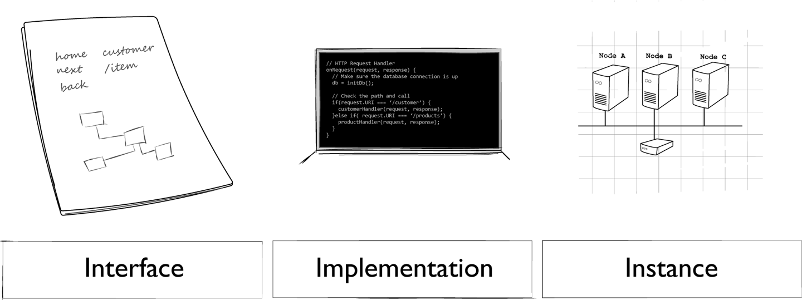

管理首先是一种艺术,科学和技术交汇后的实践.

-- 亨利·明茨伯格(Henry Mintzberg)

Coleman Parkes在2017年发布了一项调查,它显示10家全球企业中近9成有自己的API程序.调查同时也显示了这些企业从它们的API程序中看到了各样的好处.包括平均18%的市场增速.然而,只有大约50%的企业说自己有先进的API管理程序.这指出了一个存在于许多企业级API程序中的关键问题:核心盈利的可操作API和支持盈利API的管理技术和基础设施存在差异.这也正是本书想解决的问题.

好消息是许多企业有了自己成功的API程序管理经验.不太好的是它们的经验和特长不易于分享和推广.原因如下:大多数情况下,有良好API管理程序的组织因业务繁忙,无法分享自己的经验.少数情况下,我们了解到一些企业对API管理特长的分享很谨慎,他们确认API技术是一个竞争优势,并有意降低它的开放性.最后,即使企业对大家分享了他们的经验,这些信息通常也是企业内部可用或者难以转换成通用的机构API程序.

本书试图去解决最后一个问题--将企业内部可用示例转换为通用经验.为此,我们访问了数十家公司,采访了许多API技术专家,并试图找到公司已经分享的示例之间的共同点.有一小部分主题贯穿本书,我们将在这里分享这个介绍性章节。

要认识API,一个关键点是弄清人们所说的API是什么.首先,术语"API"可以指接口(如:HTTP请求URL,JSON响应).它也可以引用需要在生产环境中放置可访问服务的代码和部署元素.最后,我们有时使用API去引用一个正在运行的API实例(如:运行在AWS云或者Azure云上的第三方API).

管理API的另一个重要挑战是设计、构建和发布单个API和支持,管理多API（我们称之为API景观）之间的差异.我们在这本书里花了大量的时间处理这两个方面.像API即产品概念和需要被创建,维持API的技术(API核心)是处理单API挑战的例子.我们还讨论API成熟度模型的作用和将处理时间变化的工作作为管理API的重要方面.

另一个方面是管理API景观.你的景观是涵括了你的公司中所有业务域的,运行在所有平台的,被所有API团队管理的的API.这种景观的挑战有几个方面:包括规模和范围是如何改变API的设计和实现,以及大生态系统是如何因为大小而产生波动性和脆弱性.

最后,我们谈谈在管理API生态系统时的决策过程.根据我们的经验,这是为你的API程序创建一个成功的管理计划的关键.事实证明,你做出决策的方式需要根据你的景观变化而变化.保持旧的管理模型会限制你的API程序的成功,甚至会向已存在的API中引入更多的风险.

在我们深入讨论如何学习处理这两个挑战(单API和API景观)的细节之前,让我们先看看这两个重要的问题:什么是API管理?为什么它这么难搞?

** API管理是什么? **

如前所述,API管理不仅仅涉及管理API的设计,实现和发布,还包括API生态系统的管理,组织内的决策分配,甚至包括迁移已有API到不断增长的API景观中的过程.在本节中,我们将花时间讨论以上每一个概念.但是首先,先简单解释一下我们所说的"API"是什么意思.

- API是什么?
有时当人们使用术语"API"时,他们不仅谈论接口,而且还谈论功能(接口后的代码).如,一些人可能会说:"我们需要尽快发布已更新的客户API,这样其他团队可以使用我们已实现的新的查询功能".有时,人们可能用API仅仅去引用接口的细节.如,你的团队有人会说:"我想为已存在的支持我们客户管理工作流的SOAP服务设计一个新的JSON API".这两种说法都对,而且他们似乎很清楚这两种情况的含义,但是有时它们会让人困惑.

为了明确区别,使我们更容易的讨论接口和功能,我们将介绍一些额外的术语:接口,实现,实例.

** 接口,实现,实例
API是应用程序编程接口的缩写.我们使用接口来访问API后面的东西.如:你可能有一个API来公开管理用户的任务.这个接口可能允许开发人员去:
- 创建新账户.
- 编辑已存在账户的配置文件.
- 改变账户状态(激活或停用).
这个接口通常的表现形式是使用HTTP,Thrift,TCP/IP等共享协议,并且依赖于像JSON,XML或HTML之类的标准格式.

但这知识接口.有时它需要去执行请求任务.我们把其他的东西成为实现.实现是提供实际功能的部分.这些实现经常被像JAVA,C#,Ruby,Python等编程语言书写.继续以用户账户为例,一个用户管理实现可以包含创建,添加,编辑和移除用户的能力.这个功能可以通过上面提及的接口进行对外暴露.

接口与实现的解耦
注意,所描述的功能实现是一组使用创建,读取,更新,删除模式的简单操作.但我们描述的接口有三个操作:新建账户,编辑账户,改变账户状态.实现和接口之间的不匹配似乎很常见而且可以被扩大.它将每一个服务的的具体实现与访问服务的接口解耦,使它更易于随着时间而不中断的改变.

我们的列表中第三个术语是实例.一个API实例是接口和实现的组合.这是讨论已经发布到生产中的实际运行API的简单方法.我们使用一些指标去管理实例已确保他们的健康.我们注册和记录实例,以便于开发人员通过查找和使用API去解决实际问题.并且我们确保实例的安全,以确保只有认证后的用户可以执行这些操作和读写操作所需的数据;

图1-1阐明了这三个元素的关系.通常在本书中,"API"指的是API实例:一个接口和实现的完全操作组合.只有我们想突出接口或者实现时,我们才会在文中声明它.

图 1-1. API三要素

不仅仅是API
API本身--接口和实现的技术细节--也是故事的一部分.当然传统的设计-构建-发布元素决定了你的API的生命.但是实际管理API也意味者测试,记录,发布它们到一个门户,使得目标受众(内部开发者,伙伴,第三方匿名应用的开发者等)可以发现和学习如何正确的使用它们.你同时也需要保证你的API安全,进行运行监控,在它的生命周期中维护它们(包括处理更改).所有这些API的附加元素就是我们称呼的API核心:所有API需要和所有API程序管理需要去处理的元素.我们将在第四章深入研究这些核心因素,其中我们将遍历对于创建和维护健康API至关重要的十个关键实践.

这些实践领域的好消息是它们超越任何单API.如:记录API技术可以很好的从一个API团队迁移到下一个API团队.学习适当的测试技术,安全模式等也是如此.这也意味着即使每一个单独的团队(销售团队,产品团队,后台团队等)都有自己的API域,你依旧有交叉点可以绑定不同团队的人.这也是管理API的另一个重要的方面--支持和设计构建它们的团队.我们将在第七章讨论它们如何在不同的组织中工作.

- API成熟期
了解和理解API核心并不是这个图片的全部.你程序中的每个API都有自己的"生命周期"--一系列可预测的和有用的阶段.了解你的API所处阶段可以帮助你确定当前API需要投入的时间和资源.理解API是如何成熟的有助于你识别各种API相同的阶段,帮助你准备和响应每个阶段不同的时间和能源需求.

表面上,在设计,构建和发布API时处理所有API核心是有意义的.但事实却相反.在API早期时,更多关注的是设计和构建方面,减少记录方面的工作.如:在其他阶段(验收测试人员获取到原型)花费更多的时间在监控API的使用和保护它不备滥用更重要.理解成熟阶段将帮你最大限度的分配有限的资源.我们将在第六章让你们了解这个过程.

- 不止一个API
许多读者可能已经知道,当你开始管理大量的API时,情况就会发生改变.随着时间的推移,我们的客户需要构建,监控和管理数千个API.在这种情况下,你将更少的关注单个API的实现细节,而是更多的关注在不断增长的动态系统中如何保持这些API的和平共处.正如前面提到的,我们将这个生态系统称为API景观,在本书的后半部分中,我们将花几个章节介绍这个概念.

这里的大部分挑战是如何确保一定程度的一致性,不会因为集中化管理和检查所有API细节而造成瓶颈和降速.这一般通过向各个API团队扩展这些细节的责任,将核心管理和统治致力于API间交互方式的标准化,确保存在一组核心共享服务或者基础设施(安全,监控等)对于所有API团队是可用的,并且通常为更自主的团队提供指导和训练.也就是说,远离通常的集中式命令控制模型是必要的.

One of the challenges when working toward distributing decision making and autonomy deeper in the organization is that it can be easy for those higher up in the organization to lose visibility into important activities happening at the team level. Whereas in the past a team might have had to ask permission to take an action, companies that extend additional autonomy to the individual teams will encourage them to act without waiting for upper-level review and permission.

Most of the challenges of managing a landscape of APIs have to do with scale and scope. It turns out that as your API program grows, it doesn’t just get bigger; it also changes in shape. We’ll discuss this in more detail later in this chapter (see “Why Is API Management Difficult?”).

The Business of APIs
Beyond the details of creating APIs and managing them in a landscape, it is important to keep in mind that all this work is meant to support business goals and objectives. APIs are more than the technical details of JSON or XML, synchronous or asynchronous, etc. They are a way to connect business units together, to expose important functionality and knowledge in a way that helps the company be effective. APIs are often a way to unlock value that is already there in the organization, for example through creating new applications, enabling new revenue streams, and initiating new business.

This kind of thinking focuses more on the needs of API consumers instead of those producing and publishing the APIs. This consumer-centric approach is commonly referred to as “Jobs to Be Done,” or JTBD. It was introduced by Harvard Business School’s Clayton Christensen, whose books The Innovator’s Dilemma and The Innovator’s Solution (Harvard Business Review Press) explore the power of this approach in depth. For the purposes of launching and managing a successful API program, it serves as a clear reminder that APIs exist to solve business problems. In our experience, companies that are good at applying APIs to business problems treat their APIs as products that are meant to “get a job done” in the same sense that Christensen’s JTBD framework solves consumer problems.

One way an API program can help the business is by creating a flexible set of “tools” (the APIs) to build new solutions without incurring a high cost. For example, if you have an OnlineSales API that allows key partners to manage and track their sales activity and a MarketingPromotions API—that allows the marketing team to design and track product promotional campaigns, you have an opportunity to create a new partner solution: the SalesAndPromotions tracking application.

Another way APIs can contribute to the business is by making it easy to access important customer or market data that can be correlated to emerging trends or unique behaviors in new customer segments. By making this data safely and easily available (properly anonymized and filtered), APIs may enable your business to discover new opportunities, realize new products/services, or even start new initiatives at a reduced cost and faster time to market.

We cover this important aspect of AaaP in Chapter 3.

Why Is API Management Difficult?
As we mentioned at the beginning of this chapter, while most companies have already launched an API program, only about 50% consider themselves to be doing a good job managing their APIs. What’s going on here? What are the challenges, and how can you help your company overcome them?

As we visit with companies all over the world, talking about API lifecycle management, a few basic themes emerge:

Scope
Just what is it that central software architecture teams should be focusing upon when governing APIs over time?

Scale
Often, what works when companies are just starting out on their API journey doesn’t scale as the program grows from a few small teams to a global initiative.

Standards
What we find is that, as programs mature, management and governance efforts need to move from detailed advice on API design and implementation to more general standardization of the API landscape, freeing teams to make more of their own decisions at a detailed level.

Essentially, it is the continued balance of these three elements—scope, scale, and standards—that powers a healthy, growing API management program. For this reason, it is worth digging into these a bit more.

Scope
One of the big challenges of operating a healthy API management program is achieving the proper level of central control. And, to make it even more challenging, the proper level changes as the program matures.

Early in the program, it makes sense to focus on the details of designing the API directly. In cases where APIs are in their infancy, these design details might come directly from the team creating the API—they look at existing programs “in the wild,” adopt tooling and libraries that make sense for the style of API they plan to create, and go ahead and implement that API.

In this “early-stage” API program everything is new; all problems are encountered (and solved) for the first time. These initial experiences often end up being chronicled as the company’s “API Best Practices” or company guidelines, etc. And they make sense for a small team working on a few APIs for the very first time. However, those initial guidelines may turn out to be incomplete.

As the number of teams working on APIs at the company grows, so does the variety of styles, experiences, and points of view. It gets more difficult to maintain consistency across all the teams—and not just because some teams are not adhering to the published company guidelines. It may be that a new team is working with a different set of off-the-shelf products that constrain their ability to follow the initial guidelines. Maybe they don’t work in an event-streaming environment and are supporting XML-based call-and-response-style APIs. They need guidance, of course, but it needs to fit their domain, their customers’ needs.

There are certainly some guidelines that all teams need to share, but that guidance needs to fit their problem domains as well as their API customers’ needs. As your community widens, your diversity increases, and it is essential that you don’t make the mistake of trying to eliminate that diversity. This is where your lever of control needs to move from giving orders (e.g., “All APIs MUST use the following URL patterns…”) to giving guidance (e.g., “APIs running over HTTP SHOULD use one of the following URL templates…”).

In other words, as your program’s scope expands, your collection of guidelines needs to expand appropriately. This is especially important for global enterprises where local culture, language, and history play an important role in the way teams think, create, and solve problems.

And that leads us to the next key element: scale.

Scale
Another big challenge for creating and maintaining a healthy API management program is dealing with changes in scale over time. As we discussed in the previous section, growing the number of teams and the number of APIs created by those teams can be a challenge. The processes needed to monitor and manage the APIs at runtime will also change as the system matures. The tooling needed to keep track of a handful of APIs all built by the same team in a single physical location is very different from the tooling needed to keep track of hundreds or thousands of API entry points scattered across multiple time zones and countries.

In this book we talk about this aspect of API management as the “landscape.” As your program scales up, you need to be able to keep an eye on lots of processes by lots of teams in lots of locations. You’ll rely more on monitoring runtime behavior to get a sense of how healthy your system is at any one moment. In the second part of this book (starting with Chapter 8) we’ll explore how the notion of managing the API landscape can help you figure out which elements deserve your focus and what tools and processes can help you keep a handle on your growing API platform.

API landscapes pose a new set of challenges. The processes you use to design, implement, and maintain a single API are not always the same when you need to scale your ecosystem. This is basically a game of numbers: the more APIs you have in your system, the more likely it is that they will interact with each other, and that increases the likelihood that some of those interactions will result in unexpected behavior (or “errors”). This is the way large systems work—there are more interactions and more unexpected results. Trying to remove these unexpected results only gets you part of the way. You can’t eliminate all the bugs.

And that leads to the third challenge most growing API programs encounter: how can you reduce unexpected changes by applying the appropriate level of standards within your API program?

Standards
One of the key shifts that happen when you begin managing at the landscape level instead of the API level is in the power of standards in providing consistent guidance for teams designing, implementing, and deploying APIs in your organization.

As groups grow larger—including the group of teams responsible for your organization’s APIs—there is a coordination cost that is incurred (see “Decisions”). The growing scale requires a change in scope. And a key way to deal with this challenge is to rely more on general standards instead of specific design constraints.

For example, one of the reasons the World Wide Web has been able to continue to function well since its inception in 1990 is that its designers decided early on to rely on general standards that apply to all types of software platforms and languages instead of creating tightly focused implementation guidance based on any single language or framework. This allows creative teams to invent new languages, architecture patterns, and even runtime frameworks without breaking any existing implementations.

A common thread that runs through the long-lived standards that have helped the web continue to be successful is the focus on standardizing the interaction between components and systems. Instead of standardizing the way components are implemented internally (e.g., use this library, this data model, etc.), web standards aim to make it easy for parties to understand each other over the wire. Similarly, as your API program grows to a more mature level, the guidance you provide to your API community needs to focus more on general interaction standards instead of specific implementation details.

This can be a tough transition to make, but it is essential to moving up the ladder to a healthy API landscape where it is possible for teams to build APIs that can easily interact with both the existing and the future APIs in your system.

Managing the API Landscape
As mentioned at the start of this chapter, there are two key challenges in the API management space: managing the life of a single API and managing the landscape of all the APIs. In our visits to many companies and our research into API management in general, we find many versions of the “managing a single API” story. There are lots of “lifecycles” and “maturity models” out there that provide solid advice on identifying and mitigating the challenges of designing, building, and deploying an API. But we have not found much in the way of guidance when it comes to an ecosystem (we call it a landscape) of APIs.

Landscapes have their own challenges; their own behaviors and tendencies. What you need to take into account when you design a single API is not the same as what you must consider when you have to support tens, hundreds, or even thousands of APIs. There are new challenges at scale that happen in an ecosystem—things that don’t happen for a single instance or implementation of an API. We dive deep into the API landscape later in the book, but we want to point out three ways in which API landscapes present unique challenges for API management here at the start of the book:

Scaling technology

Scaling teams

Scaling governance

Let’s take a moment to review each of these aspects of API management with regard to landscapes.

Technology
When you are first starting your API program, there are a series of technical decisions to make that will affect all your APIs. The fact that “all” your APIs is just a small set at this point is not important. What is important is that you have a consistent set of tools and technologies that you can rely upon as you build out your initial API program. As you’ll see when we get into the details of the API lifecycle (Chapter 6) and API maturity, API programs are not cheap, and you need to carefully monitor your investments of time and energy into activities that will have a high impact on your API’s success without risking lots of capital too early in the process. This usually means selecting and supporting a small set of tools and providing a very clear, often detailed set of guidance documents to help your API teams design and build APIs that both solve your business problems and work well together. In other words, you can gain early wins by limiting your technical scope.

This works well at the start, for all the reasons we’ve mentioned. However, as your program scales up in volume (see “Volume”) and its scope widens (e.g., more teams building more APIs to serve more business domains in more locations, etc.). the challenges also change. As you grow your API program, relying on a limited set of tools and technologies can become one of the key things that slow you down. While at the beginning, when you had a small set of teams, limiting choices made things move faster, placing limits on a large set of teams is a costly and risky enterprise. This is especially true if you start to add teams in geographically distant locations and/or when you embrace new business units or acquire new companies to add to your API landscape. At this point variety (see “Variety”) becomes a much more important success driver for your ecosystem.

So, an important part of managing technology for API landscapes is identifying when the landscape has grown large enough to start increasing the variety of technologies instead of restricting them. Some of this has to do with the realities of existing implementations. If your API landscape needs to support your organization’s existing SOAP-over-TCP/IP services, you can’t require all these services to use the same URL guidance you created for your greenfield CRUD-over-HTTP APIs. The same goes for creating services for new event-driven Angular implementations or the legacy remote procedure call (RPC) implementations.

A wider scope means more technological variety in your landscape.

Teams
Technology is not the only aspect of API management that surfaces a new set of challenges as the program grows. The makeup of the teams themselves needs to adjust as the landscape changes, too. Again, at the start of your API program, you can operate with just a few committed individuals doing—for the most part—everything. This is when you hear names like “full-stack developer,” or “MEAN” [MongoDB, Express.js, Angular.js, Node.js] developer or some other variation on the idea of a single developer that has skills for all aspects of your API program. You also may hear lots of talk about “startup teams” or “self-contained teams.” It all boils down to having all the skills you need in one team.

This makes sense when your APIs are few and they all are designed and implemented using the same set of tools (see “Technology”). But as the scale and scope of your API program grows, the number of skills required to build and maintain your APIs gross, too. You can no longer expect each API team to consist of a set number of people with skills in design, database, backend, frontend, testing, and deployment. You might have a team whose job is to design and build a data-centric dashboard interface used by a wide range of other teams. Their skills may, for example, need to cover all the data formats used and tools needed to collect that data. Or you might have a team whose primary job is to build mobile apps that use a single technology like GraphQL or some other query-centric library. As technological variety grows, your teams may need to become more specialized. We’ll have a chance to explore this in detail later, in Chapter 7.

Another way in which teams will need to change as your API landscape grows is the way in which they participate in day-to-day decision-making processes. When you have a small number of teams and their experience is not very deep, it can make sense to centralize the decision making to a single, guiding group. In large organizations this is often the Enterprise Architecture group or something with a similar name. This works at smaller scales and scopes but becomes a big problem as your ecosystem becomes less homogeneous and more wide-ranging. As tech gets more involved, a single team is unlikely to be able to keep up with the details of each tool and framework. And as you add more and more teams, decision making itself needs to be distributed; a central committee rarely understands the realities of the day-to-day operations in a global enterprise.

The solution is to break down the decision-making process into what we call decision elements (see “The Elements of a Decision”) and distribute those elements to the proper levels within your company. A growing ecosystem means teams need to become more specialized on a technical level and more responsible at the decision-making level.

Governance
The last area that we want to touch on in regards to the challenge of API landscapes is the general approach to governance of your API program. Again, as in other cases mentioned here, it is our observation that the role and levers of governance will change as your ecosystem grows. New challenges appear, and old methods are not as effective as they were in the past. In fact, especially at the enterprise level, sticking to old governance models can slow or even stall the success of your APIs.

Just as in any area of leadership, when the scope and scale are limited, an approach based on providing direct guidance can be the most effective. This is often true not just for small teams, but also for new teams. When there is not a lot of operating experience, the quickest way to success is to provide that experience in the form of detailed guidance and/or process documents. For example, we find early API program governance often takes the form of multipage process documents that explain specific tasks: how to design the URLs for an API, or which names are valid for URLs, or where the version number must appear in an HTTP header. Providing clear guidelines with few options makes it hard for developers to stray from the approved way of implementing your APIs.

But again, as your program grows, as you add more teams and support more business domains, the sheer size and scope of the community begin to make it very difficult to maintain a single guidance document that applies to all teams. And while it is possible to “farm out” the job of writing and maintaining detailed process documents for the entire enterprise, it is usually not a good idea anyway—as we mentioned in “Technology”, technology variety becomes a strength in a large ecosystem, and attempting to rein it in at the enterprise governance level can slow your program’s progress.

That’s why as your API landscape expands, your governance documents need to change in tone from offering direct process instructions toward providing general principles. For example, instead of writing up details on what constitutes a valid URL for your company, it is better to point developers to the Internet Engineering Task Force’s guidelines on URI design and ownership (RFC 7320) and provide general guidance on how to apply this public standard within your organization. Another great example of this kind of principled guidance can be found in most UI/UX guidelines, such as the “10 Usability Heuristics for User Interface Design” from the Nielsen Norman Group. These kinds of documents provide lots of options and rationales for using one UI pattern over another. They offer developers and designers guidance on why and when to use something instead of simply setting requirements for them to follow.

Finally, for very large organizations, and especially companies that operate in multiple locations and time zones, governance needs to move from distributing principles to collecting advice. This essentially reverses the typical central governance model. Instead of telling teams what to do, the primary role of the central governance committee becomes to collect experience information from the field, find correlations, and echo back guidance that reflects “best practice” within the wider organization.

So, as your API landscape grows, your API governance model needs to move from providing direct advice to presenting general principles to collecting and sharing practices from experienced teams within your company. As we’ll see in Chapter 2, there are a handful of principles and practices you can leverage in order to create the kind of governance model that works for your company.

Summary
In this opening chapter, we touched on a number of important aspects of API management that appear within this book. We acknowledged that while APIs continue to be a driving force, barely 50% of companies surveyed are confident of their ability to properly manage these APIs. We also clarified the many uses of the term “API” and how these different uses may make it harder to provide a consistent governance model for your program.

And, most importantly, we introduced the notion that managing “an API” is very different from managing your “API landscape.” In the first case, you can rely on API-as-a-Product, API lifecycle, and API maturity models. Change management for APIs is also very much focused on this “an API” way of thinking. But this is just part of the story.

Next, we discussed managing your API landscape—the entire API ecosystem within your organization. Managing a growing landscape of APIs takes a different set of skills and metrics; skills in dealing with variety, volume, volatility, vulnerability, and several other aspects. In fact, these landscape aspects all affect the API lifecycle, and we’ll review them in detail later in this book.

Finally, we pointed out that even the way you make your decisions about your API program will need to change over time. As your system grows, you need to distribute decision making just as you distribute IT elements like data storage, computational power, security, and other parts of your company’s infrastructure.

With this introduction as a background, let’s start by focusing on the notion of governance and how you can use decision-making and the distribution of decisions as a primary element in your overall API management approach.

1 At music streaming service, Spotify, they call these cross-cutting groups “guilds.” See “Scaling Up Your Teams” for more on this topic.
