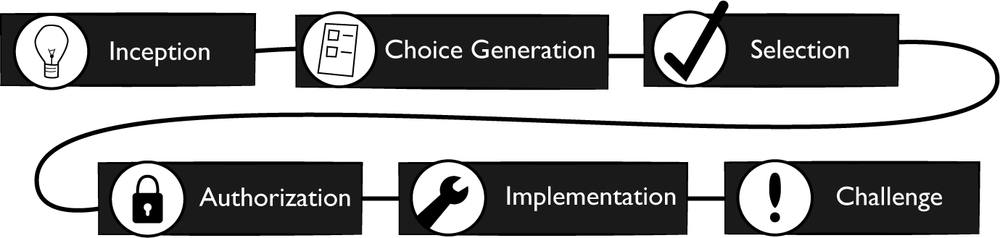

> 嘿,规则就是规则,让我们面对它,没有规则就有混乱.
> 
> 科斯莫 克莱默(Cosmo Kramer)

治理不是让人们兴奋的事情.这也是带有一些情歌包袱的话题.毕竟,很少人愿意被治理,而且大多数人都有糟糕治理策略和无意义的规则的经历.糟糕的治理(如"糟糕的设计")让生活更加艰难.但是在我们的经验中,对于API管理我们很难只说不做.

事实上,我们甚至会说:没有API治理,你就不可能去管理你的API.

有时,API治理虽然发生在你的公司,但是你从来没有使用过"治理"术语.这是一个好现象.命名确实很重要,但是在一些组织,治理往往按时这高度集中化和命令式的期望.这可能与去中心化和权利下放的文化背道而驰,所以在那些地方,治理是个贬义词是有道理的.无论管它叫什么,即使在这种去中心化的文化中,某种形式的决策治理正在发生,但是它看起来可能与传统的自上而上的组织的治理系统完全不同.

对于"你应该治理API吗?"这样的问题,有点乏味.因为在我们的观念里,答案总是肯定的.相反,问你:"哪些决策需要被治理?",以及"哪里需要被治理",决定这些问题的答案是设计治理系统的工作.不同的治理风格会产生非常不同的工作文化,生产率,产品质量和战略价值.你选哟设计一个适合你的系统.本章的目标是为你提供实现此目的的构建区.

我们将首先探讨良好API治理的三个基本元素:决策,治理和复杂性.有了这种理解,我们将进一步研究如何将决策分配到你的公司,以及它们是如何影响你的工作的.这意味着要进一步研究集权,分权和做出决策的要素.最后,我们将看一下构建治理系统的影响,并了解三种治理风格.

治理是API管理的核心部分,它将贯穿本书的其他部分.所以,API治理的实际含义和它如何帮助你构建更好的API管理系统值得你去花时间理解.

## 理解API治理

事实上,大部分需要做出的决策都是技术活.一些决策是及其重要的,但是其他则是微不足道的.所有这些决策使得技术团队的工作是有技术含量的.一个好开发的核心技能是一遍又一遍的做出许多高质量的决策.这个相当明显的观点,但在管理API时总是很容易被人遗忘.

无论你引进哪种技术,如何进行架构设计或者选择哪家公司去合作,决定你生意命运的都是每个人的决策能力.这也是为什么治理重要的原因.你需要用有利于实现组织目标的方式制定所有的决策.

听起来容易,做起来难.你需要深入的理解治理的基本概念,以及他们之间的相互关系,才能加大成功的可能.让我们从快速查看API决策开始.

- 决策

你和大多数人主要的工作就是决策.这也是为什么治理如此重要的原因.总的来说,如果你能做出一个好的决策,就会有一个好的结果.但是决策并不仅仅是技术选型.你还需要在API领域上做出更广泛的决策.API团队可能会面对如下的选择:

1. 我们API的URI应该是/payments还是/PaymentCollection格式?

2. 我们应该将API托管给哪个云服务商?

3. 我们有两个客户信息应该舍弃哪个?

4. 如何选择开发团队成员?

5. 我应该如何命名java变量?

从上面这些问题中,我们可以得出一些简单的结论.第一,API管理的决策涉及复杂的人和关系,做出这些决策需要人和团队之间的密切合作.第二,人做出的不同选择有不同的影响,云服务商的选择对于API管理决策的影响远远大于对于Java变量的命名.第三,量变会引起质变.如果有10000个命名奇葩的Java变量,会极大的影响API实现的可维护性.

所有这些跨领域的选择,都是在大量的协调下做出,需要结合在一起才能产生好的结果.这是个繁复的工作.在本章的后面,我们将针对这个问题,给你一些适合你决策系统的指导.但是首先,让我们进一步了解这些决策治理的含义,以及为什么治理如此重要.

- 决策治理

如果你曾经独立完成过一些小项目,你会知道这些工作的成功与否完全取决于你.如果你坚定的做出好的决策,你可以得到好的结果.一个大神可以让你惊讶.但是这样的工作方式无法很好的推广.当你开发的东西上线,新功能和新需求也将不断增加.这就意味着你需要短时间内做出许多决策,即你需要更多的决策者.这样的规模式决策需要谨慎.参与决策的人越多,你越无法保证决策的质量.

这就是治理的来由.治理是管理决策制定和执行的过程.注意,我们并不是说控制和权力就是治理.治理与权利无关.它是提高人决策质量的方式.在API领域,高质量的治理往往意味着构建的API有利于组织取得成功.这个过程你可能需要一些控制级别和权力去实现,但这并不是目的.

在API中应用治理有很多方式.例如,你可以提出一种策略,要求公司中所有团队必须使用标准的技术栈.或者要求所有API在发布前必须要通过一系列标准质量检测.策略可能有松紧,但是殊途同归.实际中,你将同时管理大量不同类型的决策,同时你的治理系统将混合许多不同的约束,奖励,政策和流程.

应当谨记治理是有成本的.它需要沟通,强制和维持才能形成约束.对于遵守的决策行为的奖励需要保值,并且有吸引力.标准,政策和流程需要记录,教导,并持续更新.除此之外,还需要研究这些信息对于系统的影响.你甚至需要雇佣更多人维护治理成果.

除了这些维护治理机制的常规成本外,还有一些隐形成本.这些是当你开始在系统中进行治理时产生的成本.例如,如果你强制统一技术栈,那么在这期间技术创新的组织成本又是多少?同样,员工幸福感的代价又是多少?它是否会加大吸引人才的难度?

事实证明,这种成本很难预测.因为现实中,你治理的是由人,流程和技术组成的复杂系统.为了API系统治理,你首先要学习通常管理复杂系统需要什么.

- 治理复杂系统

好消息是,在组织内获取良好的治理结果并不需要你控制每一个决策.坏消息是,为了好的结果,你需要指出哪些决策你需要控制.这个问题比较难,并且在本书中你也无法找到确切答案.因为不可能有针对特殊情景和目标的通用答案.

如果你只想烤一个枣糕,我们给你十分确切的配方.我们会告诉你需要多长时间,多少鸡蛋,烤箱的温度是多少.甚至可以告诉你如何检查蛋糕是否做好.那是因为现代烘培几乎没有变化.无论你从哪购买,配料都基本相同.烤炉也被设计成在特定,标准温度下烘培.最重要的是,目标是一致的--获取指定的类型的蛋糕.

但你不是在做蛋糕,也没有所谓的食谱.你需要处理大量的可变性.例如,你公司里的人决策能力参差不齐.你所在的行业和地区特有的监管约束.还有就是你服务的不断变化的消费市场,有它自己消费文化.最重要的是,你的组织目标和策略对你来说是完全独特的.

这些可变性使得很难给API治理开出一个通用的"配方".同时小问题的连锁反应,加剧了它的实现难度.当你每次引入规则,创建新标准或者应用任何形式的治理,都需要处理它意外的后果.这是因为组织的各个部分都是相互联系的.例如,为了保证API代码的一致性和质量,你可以引入标准技术栈.随着程序员开始添加更多的库和框架,新技术栈可能产生更大的代码包.同时它还可能造成部署流程的改变,因为现存的系统无法支持更大的部署包.

有了正确的信息,你可能预测和预防这种结果.但是你不可能每次都能这样,尤其在适当的时间内.相反,你需要面对这个事实--你正在处理一个复杂的自适应系统.事实证明,它是一种特性,而不是漏洞.你只需要弄清楚如何利用它使你获益.

- 复杂的自适应系统

当你我们说你的组织是一个复杂的自适应系统时,我们的意思是:

- - 它有许多相互依赖的部分(如:人员,技术,流程,文化).

- - 这些部分可以改变自我行为,并且适应系统变化(如:当引入容器化时,改变部署惯例).

宇宙中充满了这样的系统,复杂性研究已成为一个已设立的科学学科.甚至你自己也是一个复杂的自适应系统.你可能认为自己是一个单独的个体--自我,但是"自我"只是一种抽象.实际上,你是一个有机细胞的集合,虽然只是一组细胞,但它具有令人惊叹的壮举:作为一个自然的整体"人"去思考,移动,感觉和对外部事件做出反应.在细胞层面,每个细胞各司其职,老的,濒临死亡细胞被替换,同时细胞群在你的身体里一起工作以产生具大的影响.这个复杂的生物系统使你身体具有高度的弹性和适应能力.你可能无法长生,但是你能平等的承受大量的环境变化,甚至身体的损害,这要归功于你复杂度生物系统.

通常,当我们在技术上说到"系统",我们关注的是软件系统和网络基础架构.这些类型的系统确实会变的复杂.如:web是一个系统级复杂性和突发性的完美例子.我们将单独运行的服务器相互依赖和互联后形成的自然整体称为"web".但是大多数软件并不是真正的自适应.

你曾经编写的API软件现在相当愚蠢.并不意味着你的代码质量不高或者它无法完成设计功能.事实恰恰相反.大多数你实现的API将完全按照它们应该做的去做.这恰恰是问题所在,你可以让API足够智能,以适应不断变化的交易模型和越来越多的错误,但是还无法做到让API在没有人为干预的情况下增加新功能,正确的自我修复漏洞,更新文档使其更易于学习.

在未来一切都可能改变.但是就目前而言,还是人为驱动软件系统.好消息是人的适应性很强(尤其和软件相比).你的API组织是一个复杂的适应性系统.组织内的所有人都会许多(有时集体,有时单独的)局部决策.当这些决策在量和时间上越来越多时,一个系统就产生了.就像你的身体,这个系统能够适应很多变化.

但是处理复杂系统要求一种特殊的方法.当你修改一部分时,可能造成另一部分意外的结果,使得很难预测复杂系统变化的影响.这是因为组织内的人在不断适应环境的变化.如:禁止使用"容器"部署软件将产生广泛的影响:它会影响软件的设计,人员,发布流程,以及文化.

所有这些都说明:你无法通过实现大的更改,以及等待结果的方式从系统中获取所需的输出.相反,你需要通过小的修改和评估它们的影响来慢慢"推动"系统的发展.它需要一种不断跳转和改进的方法,就像照料花园一样,修建枝条,播种,浇水,同时不断观察和调整你的方法.在第5章,我们将更详细地探讨持续改进的概念.

## 决策治理

在最后一节,我们介绍了复杂系统内决策治理的概念.希望它有助于你理解API治理的基本规则:如果你想有效的治理系统,你需要更好的管理决策.我们它最好的实现方式是关注决策在哪发生以及由谁来做决定.事实证明,没有一种最好的方法能够将这些决策制定出来.如:思考如何在以下两个虚构的公司中进行API设计治理:

公司A: Pendant Software
> 在Pendant Software中,所有API团队都可以访问"Pendant API设计指南"电子书.这些指南由Pendant启卓API中心(公司内的API专家工作的小团队)每季度发布一次.这些指南包含了API设计中高度的规范性和非常具体的规则.所有团队都要遵守这些指南,并且在发布API之前进行自动化一致性测试.
> 由于这些政策,Pendant已经能够发布一组行业领先,高度一致,有利于开发的API.这些API已经帮助Pendant从同市场上的对手中脱颖而出.

公司B: Vandelay Insurance
> 在Vandelay中,给API团队设立了API产品的公司业绩目标和期望结果.这些目标和结果由执行团队定义并定期更新.每个API团队都可以自由地选择执行方式处理总业绩目标,并且多个团队可以设立相同的目标.API团队可以根据自己的喜好设计和实现API,但是每个产品必须遵守Vandelay的企业测量和监控标准.这些标准由Vandelay系统公社定义,这个公社由来自于各个API团队的自愿加入的人组成,并定义大家都需要遵守的一系列标准.

> 由于这些政策,Vandelay已经能够构建高度创新的,自适应API架构.这个API系统使得Vandelay在它的技术平台,可以通过快速交付的创新业务实践在竞争中更胜一筹.

通过上面的虚构案例可以发现,Pendant和Vandelay都很成功的管理了决策.但是它们治理的方式却完全不同.Pendant的成功取决于高度集中化,军事化的方法,但是Vandelay倾向于面向结果的方式.两种方式虽然都称不上"正确",但它们的治理方式都有可取之处.

为了有效的治理决策,你需要解决三个关键问题:

1. 哪些决策需要被管理?

2. 需要在哪里(以及由谁)做出这些决策?

3. 你的决策管理策略将如何影响系统?

我们在本书的后面再深入讨论"哪些决策需要被管理"和"这些决策对于系统的影响".现在,我们先看第二个问题:系统中最重要的决策需要在哪做出.为了帮助你解决决策分配的问题,我们将深入研究决策治理的主题.我们将权衡集中式决策和分散化决策,更仔细的研究分配决策的含义.

- 中心化和去中心化

在前面,我们以人体为例介绍了复杂自适应系统的概念.这种类型的系统在自然界非常多,可以说你的周围都是这种系统.如:小池塘里的生态系统就可以被认为是一个复杂自适应系统.生活在里面的动植物的活动和相互依赖,给予了池塘持续的活力.由于这里的生物的局部决策,赋予了生态系统适应环境变化的能力.

但是池塘没有管理者,也没有证据证明青蛙,蛇和鱼会每季度举办管理会议.相反,这个系统里的每一个代理都单独做决策,以及展示独立的习性.这些独立的决策和行为整合在一起形成了一个共同的,自然的整体,使得这个整体即使在部分系统变化或者随着时间兴衰交替仍然可以生存.与大多数自然世界一样,池塘系统的成功取决于分散的系统级决策.

正如我们之前确定的,你的组织也是一个复杂自适应系统.它是所有员工做出个人决策后的共同产物.就行人体和池塘生态系统,如果你赋予员工完全的自由和自主,整个组织将变得更有弹性和适应性.由于员工的个人决策,这个无领导,去中心的组织可以发现自己的路.(见图 2-1).

图 2-1. 一个去中心化组织

你可以像上面那样做,但是你可能会遇到一些问题.主要是因为复制自然界复杂系统成功的方式很难应用在自由市场的组织中.池塘的生物系统是自然选择的结果.系统中的每个生物都为了种族延续而进化.它们的系统级目标只是活着.除此之外,在自然中,系统故障是正常现象.如:如果引入外来物种,整个池塘系统可能会被摧毁.在自然界中,这是可以的,因为外来生物会取代原来生物的位置--对于系统来说依旧富有弹性.

然而,企业领导不希望这种不确定和失控的局面出现.你需要将系统引导到的特定目标,这可能超越了生存的目的.而且,你可能不愿意为了让更好的公司取代你而冒着让公司倒闭的风险.你完全希望降低因个人的错误决策而毁掉整个公司的风险.这意味着你需要约束个体决策制定的自由,并引入一些职责.一种实现方式就是决策中心化.(图 2-2).

图 2-2. 一个中心化组织

由上可知:做出决策的往往是你组织内的部分人或团队.中心化团队做出的决策公司其他人都要遵守.去中心化恰恰相反:自己遵守自己做出的决策.

事实上,没有纯粹的中心化或者去中心化组织.相反,在组织内不同类型的决策会被分配不同的实现方式--一些更集中,一些则更分散.你需要决定如何分配对你系统影响最大的决策.那么,哪些应该更集中,哪些又应该更分散那?

记住,决策治理的主要目的是帮助你的组织成功,并活下去.这意味着什么,完全取决于你的业务背景,但是通常来说,它意味着:决策需要足够及时,以实现业务的敏捷性,需要具备足够的质量来改进业务(或至少避免损害业务).影响决策能力的因素有三个:

信息的可用性和准确性
> 如果根据错误或者残缺的信息,很难做出好的决策.这可能意味着误解决策目标或背景,也可能意味着决策会对系统造成意外的影响.大多数情况,相对于决策者,我们负责收集决策制定信息.但是为了决策分配,我们还需要思考集中或分散决策是如何影响可用的信息的.

决策人才
> 通常来讲,如果决策者擅长做出高质量的决策,那么决策的质量也会提高.简单来说,就是老油条的牛人会比没经验的菜鸟做出更好的决策.当涉及分配决策时,难点在于如何进行最有效的人才分配.

协调成本
> 复杂决策无法及时做出,除非你分散决策.但是当你分散决策工作时,你将发生协调成本.如果协调成本太高,你就无法快速的做出决策.决策的集中和分散会对协调成本产生很大的影响.

根据这些因素来考虑决策,有助于你判断决策应该集中还分散.为了帮你理解时如何做到这一点的,我们将从两个角度分析它:优化范围和运营规模.让我先从规模和它与决策信息关系开始.

- 优化范围

中心化决策和去中心化决策最大的不同与它们的规模有关.当你做出中心化决策时,你是在为整个组织做决策.所以,你的决策范围涵盖了整个系统,你的目标是做出改进系统的决策.换句话说,就是你所做的决策是为了优化系统范围.如:一个中心化团队可能决定整个公司的开发方法.它还可以决定系统中哪些API应该停用.这两项决策的目的都是为系统做出最好的事情.

相反的,去中心化决策的主要特征是它针对局部范围进行优化.当你进行本地优化时,你将做出改善本地环境(一组只与本地情况相关的信息)的决策,虽然决策可能对更广泛的系统产生影响,但是你的目标只是改善本地成果.如:API团队可以做出使用瀑布流开发流程的决策,因为他们正在和其他已经使用它的公司共同工作.

分散决策的好处是它可以帮你从整体业务的效率,创新和敏捷性方面获得巨大收益.这是因为去中心化的决策者可以把信息范围限制在他们理解的本地环境中.这意味着他们可以根据问题范围内的准确信息做出决策,从而帮助他们做出更好的决策.对于任何想通过敏捷性和创新的方式获取成功的现代企业,去中心化决策方式应该是默认的选择.

但是,只专注于优化局部范围做出的决策是有问题的,尤其是当这些决策对系统有潜在的不可逆转的负面影响时.亚马逊CEO杰夫·贝佐斯在谈到决策的影响时,将其分为两类:一类是错误的决策很容易被推翻,另一类是几乎是不可能恢复的决策.如:许多大公司在API安全配置上选择中心化决策,以防止本地优化造成的系统漏洞.

除了对系统的危害之外,有时系统间的一致性比局部优化更有价值.如:单个团队可能会选择对问题领域内最有意义的API样式.但是如果每个API团队都有自己的API样式,由于缺少一致性,学习去使用每个API将变得更加困难,尤其是当多个API需要公共完成一件事时.在这种情况下,优化系统范围上的API样式决策可能更好.

当你规划应该在哪里进行决策时,你需要仔细考虑优化范围.如果决策对你的系统有潜在的不可逆转的影响,那么首先对它进行中心化决策,以便它在系统范围进行优化.如果局部环境信息有利于提高决策质量,那么应该先对它进行去中心化决策.如果去中心化决策在系统层面会造成不可接受的不一致性,那么考虑中心化决策.

- 运营规模

如果你有无限的资源支持做出好决策,那么你只需要考虑做出决策的范围.但是你没有.所以,除了范围之外,你还需要考虑做出决策的规模.这是因为如果这是更大的决策需求,你的决策人才供应将面临更大的压力,协调成本的压力也将会增大.如果你想API工作随着组织的发展而发展,则需要仔细的规划决策分配模型.

当你大规模经营时,去中心化决策会产生巨大的人才需求.当分散一个决策时,你会将它分配到多个团队.如果你想所有决策都是高质量的,你将需要每个团队都充满有才干的决策者.如果你无法承担这些,那么你最终会做出很多错误的决策.所以,在你的公司里,为每个决策职位雇佣最好的决策者是值得的.

不幸地,招聘优秀人才并不是行业秘密.可供选择的有才能并且有经验的人是有限的,同时还有大量公司在抢着雇佣他们.还有一些公司不惜代价去确保可以获取这些顶尖人才.如果你足够幸运在这种情况下得到他们,你可以尽可能的分散你的决策,因为你有牛人去做出它.相反,你需要在决策分配上更加务实.

如果你可提供的顶级决策人才有限,你可以选择将这些人才集中在一起,并由这些人做出最重要的决策.这样,你就有更多的机会更快地做出更好的决策.但是决策需求规模的增加,还会对这个模型造成破坏.因为随着决策需求的增加,中心化团队的规模也需要跟着增加.随着团队的扩大,决策的协调成本也将会增加.无论员工多么有才,随着人员的增加,决策协调成本也会增加.最终会到一个决策无法承担的数字.

所有这些都意味着,决策分配会涉及许多的权衡.如果决策像杰夫·贝佐斯"类一"描述的那样有效,你将需要将它中心化,并以低决策吞吐量为代价.相反,如果速度和局部优化更重要,你可分散决策,要么招聘更优秀的人或者接受决策质量的下降.

也就是说,有一种方法可以更细致,更灵活处理这种权衡.它涉及到分配决策的各个部分,而不在决策之间,这也是我们下一节将重点谈论的内容.

- 决策元素

目前用上面我们描述的方式很难去分配决策,因为它们都是一些极端的处理方式.开发方法的选择是团队自己决定还是你来决定?你是让团队决定他们的API什么时候停用还是你来决定?实际上,治理要求的更精细.这本节中,我们将探索一种通过决策分解来更灵活的分配他们的方法.

你可以分配部分决策,而不是整个分配.这种方式可以让你同时从系统级优化和其关联的局部优化中获得好处.决策的一部分可以集中,其他部分可以分散.为了帮你完成这种类型的决策分配,我们将API决策分解为6种你需要分配的决策元素(见图2-3).

图 2-3. 决策元素

这并不是权威的,通用决策模型.相反,它是我们开发的一个模型,用来区分对系统影响最大的中心化或去中心化的决策部分.这些部分是基于业务管理领域中大量存在的五步,六步和七步决策模型.虽然我们描述的步骤可以应用于个人做出的决策,但是它应用于一群人协商做出的决策时是最有效的.

首先,让我们看一下决策的初始分配是如何影响你的系统的.

- 开始

决策的出现是因为有人认为需要做出决策.它意味着有人已经从多个可能的解决方案发现了存在的问题或机会.有时候这是显而易见的,但是大多数时,发现决策机会需要人才和专业知识.你需要考虑哪些决策可以自然出现,哪些需要特殊处理才能确保它发生.

在日常解决问题的过程中,API工作的启动决策很常见.如:对于一个典型的实现人员来说,选择用于存储持久化数据的数据库将是一个难以忽视的决策.这个决策的出现是因为没有它就无法工作.但是也会有需要强制启动的情形,这通常有两个原因:

决策惯性
> 随着时间的推移,如果团队总是做出相同的决策,那么这个决策可能会消失.也就是说,不再考虑各种可能性,而是假设工作将以它一贯的方式进行.如:如果每个API的实现都使用Java语言,其他人可能就不再考虑选择不同的语言.

决策盲区
> 有时候,团队可能错失做出有力决策的机会.这可能由于习惯,也有可能是由于信息,经验和能力的限制.如:团队可能关注选择哪一种存储数据库,但是他们并没有看出,API可以设计成不需要持久化存储的方式.

并不是每个决策都需要实施,并且当决策被错失或者文化习惯让做出的决策更含蓄时,那就再好不过了.如果错失决策会对你从API获取的结果产生负面影响,这是一个问题.但是片面的要求做出更多决策,可能对生存率产生毁灭性的影响.相反,API治理的作用是产生更多的有益决策,较少的低价值的决策.

- 生成选项

如果没有选项,你很难有选择.这就是"生成选项"元素的意义所在."生成选项"的工作是识别各供选择的选项.

如果你在做出决策的领域拥有丰富的经验,那么生成选项会很容易.但是如果了解很少,你将需要花费更多的时间去确定选项.如:一个有经验的C语言程序员当他决定选择一个循环结构时,他已经有了好的选项.但是一个新手可能需要一些研究,去学习for循环和while循环,以及他们的不同.

即使你很了解的领域,如果决策的成本和影响很高,你也可能在生成选项上花费更多的时间.如:你可能对不同的云主机环境非常熟悉,但是在与其中一个云服务商签合同时,你依旧会尽职调查.是否你不知道的新的供应商可选?价格和条款是否和你记忆中的一样?

从治理的角度来看,生成选项很重要,因为它是决策制定的边界所在.当提出选项的人和做出选择的人不同时,这一点尤其有用.如:你可以对一组可能的API描述格式进行标准化,但是让团队从中选择他们最喜欢的格式.如果采用这种方式,你则需要注意提供"菜单"的质量.如果选项过于严格或质量不佳,你就会遇到问题.

- 选择

选择是从可能的列表中进行选择的行为.选择是决策的核心,同时他也是大多数人关注的步骤,但是选择元素的重要性很大程度上取决于可用的选择范围.如果这个范围很广,那么选择过程是保障决策质量的必要的步骤.但是如果这个范围被限制在安全且差异很小的选项上,那么选择步骤会很快,影响也会很小.

让我们看一个实际的例子.假设你负责为HTTP API配置安全传输层协议(TLS).这就需要决策服务器应该支持哪些密码集(加密算法集).这个决策很重要,因为如果你选了安全性低的密码集,随着时间的推移它会变得很脆弱.同样,如果你选的密码集,用户的客户端不支持的话,那么你的API就无法使用.

在一种场景中,可能会给你一个公认的密码集清单,让你从中选择服务器应该支持的密码集.在这种情况下,选择应该特别小心.你可能做大量的调查,并收集尽可能多的资料后,你才会对决策感到舒服.事实上,如果你没有丰富的服务安全经验,你可能会找有经验的人帮你做出决策.

但如果给你的密码集不是所有的可能集,而是关于它们的策划列表那?这个选择列表可能包含每个密码集的支持程度和已知的漏洞等相关信息.拥有了这些信息你可以尽快做出决策.同样,你的选择可能更安全,因为你的选择范围仅限于被认为足够安全的选择.在这种情况下,你将根据客户端使用API情况,API的灵活度和业务重要性做出决策.

最后,你可能只有一个选择:只支持一个密码集.单选项决策使得选择无足轻重,因为决策已经做出来了.在这种情况下,决策的质量完全依赖于生成选项的人.希望它能很好地满足你的特殊需求.

因此,选择的重要性很大程度上取决于所提供的选择范围.在这里可以根据工作情形进行取舍.决策投入越多,生成选项的时间就会越短,反之亦然.这暗示着你如何分配决策元素,以及谁应该对它们负责.无论哪个决策要素变得更重要,都需要一个适当的有能力的决策者进行决策.

这也意味着你可以通过分配生成选项和选择来整合系统范围和本地范围.如:你可以基于系统环境集中化生成开发方法选项,同时依旧允许每个团队根据本地环境选择自己的实现方式.这对于大规模地治理大型API景观,并保持安全性和迭代速度是一个特别有用的模式.

- 授权

仅仅做出选择并不意味这完成了决策.在选择实现之前,还需要被授权.授权是确认选择有效性的工作.做出的选择是否正确?是否可实现?是否安全?在已经做出的决策中,它是否有意义?

授权分为显式和隐式.显示授权意味着,某人或某团队必须明确授权该决策才能继续执行.它成为决策过程中的一个批准步骤.我们确信你参与了很多需要批准的决策.如:在很多公司中,员工可以从工作日中选择休假时间,但是具体执行取决于经理根据时间表做出的最终批准决定.

隐式授权意味着当条件满足时,授权自动发生.这方面的例子包括:决策人的角色,决策成本,坚持特定政策.特别是,当做出决策的人也是授权选择的人时,授权可变的隐式.实际上,他们成为自己的认证者.

显示授权非常有用,因为它可以进一步提高决策的安全性.但是如果需要做出大量的且需要集中授权的决策,那么决策速度可能会降低.许多人会处于等待决策的批准状态.隐式授权通过授权选择可以极大的提供决策速度,但是会伴有更大的风险.

在治理设计中,如何进行授权分配将是一个重要的决策.你需要考虑决策者的品质,错误决策的业务影响,以及提供选项中包含的风险.对于高度敏感的决策,你可能需要更明确的授权.对于时间敏感的大规模决策,你需要了解如何引入隐式授权系统.

- 执行

当选择被授权后,决策流程并没有结束.直到有人执行或实现做出的选择,决策才会实现.实现是API管理工作重要的组成部分.如果决策实现太慢或者质量太差,那么所有的决策都将是徒劳.

通常,决策并不是由做出选择的人去执行.在这种情况下,重要的是认识到收集可用的精确信息的含义.如:你可能选择将API的超媒体类型引入你的景观中,但是如果超媒体API的实现对于设计师和开发来说太困难,你将需要重新评估你的决策.好的治理设计必须考虑到实际情况.决策管理只在理论上优化,并不是一个好现象.当你判断决策质量时,还应该包括决策的可实现性.

- 挑战

决策并不是一成不变的,并且你为API管理系统所做的每一个决策都应该面向挑战.通常,我们并没有考虑我们做出的决策会将来被重顾,改变,甚至重构.定义挑战元素可以让我们为决策级别的持续变化指定计划.

如:如果你为API团队定义了可供选择的"菜单",那么明智的做法是再定义一个"退出菜单"的流程.这种方式让你可以维持良好的创新水平,且可以阻止做出错误决策.但是如果每个人都可以挑战约束这些选择的决策,那么就没有任何限制了.所以,你需要确认谁可以挑战决策,并且说明在什么情况下.

随着时间推移,允许决策被挑战也非常重要.随着业务策略和背景变化,决策系统也需要变化.为了规划这种适应性,你需要在系统中构建挑战功能.这意味着你需要思考你的组织中谁将拥有"拉响警报"并挑战已存在的决策的权力,

### 决策映射(决策与二元化对应关系)

我们现在知道决策由许多元素组成.明白了决策具有原子元素,它允许我们分配决策的各个部分,而不是整个决策流程.这在组织设计上被证明是一个强大特征,并将在效率和完整性的平衡上发挥更大的影响.

如:对于API样式的决策是一个非常重要的.在粗略的二元化(中心化vs去中心化)讨论中,API管理设计师可能会考虑API团队是应该拥有API样式决策(去中心化),还是中心机构应该保持对它的控制(中心化).将决策权分配给API团队的优点是每个团队可以在局部环境做出决策.由单独的战略团队集中决策的优点是减少API样式变化,并维持和控制API样式选择的质量.

这很难去做出取舍.但是如果分配决策元素,它就可能设计出一个位于这个二元化选项中间的API管理系统.如:你可以为API样式决策做出下面的决定:研究和生成选项元素归属于中心化的,战略上的API管理团队,而选择,授权和实现元素归属于做出它们的团队.通过牺牲一些来自分配生成选项局部创新的方式,以获取公司内的一组众所周知的API样式.与此同时,API样式的选择和授权元素的分配使得API团队可以继续以最快的速度运作(即:他们不需要征求许可就可以选择合适的样式).

为了最大限度地利用决策映射,你需要基于所处背景和目标分配决策.让我们通过两个相当常见的决策场景,看看决策映射如何成为一个有用的工具的.

#### 决策映射示例: 选择一种编程语言

你已经确定了选择哪个编程语言的决策对于API实现有巨大的影响,并且你希望管理这个语言.你的组织已经采用了微服务架构,并且自由选择实现语言已成为一种要求.但是做了一些尝试后,你发现多语言环境让开发者在团队间调动更加困难,安全和运营团队对于应用的支持也更加困难.

因此,你决定尝试表2-1的决策分配方式选择编程语言.

表 2-1. 编程语言决策映射

<table>
    <tr>
        <td>开始</td>
        <td>生成选项</td>
        <td>选择</td>
        <td>授权</td>
        <td>实现</td>
        <td>挑战</td>
    </tr>
    <tr>
        <td>中心化</td>
        <td>中心化</td>
        <td>去中心化</td>
        <td>去中心化</td>
        <td>去中心化</td>
        <td>去中心化</td>
    </tr>
</table>

将编程语言约束为一组选择的方式是针对整个系统的优化,但是它允许每个团队在这些约束下进行局部优化.你还允许API团队挑战这个决策,以便你能适应新的语言选择和不断变化的情况.

#### 决策映射示例: 选择工具

你的CTO试图提高软件平台的敏捷性和创新水平.作为计划的一部分,他们决定允许API团队选择自己的技术栈,包括使用开源软件.然而,你的采购和法律团队基于法律风险和供应关系风险提出了担忧.为了开始这种文化过渡,你已经决定在试验的基础上实现表2-2中的技术栈决策映射.

表 2-2. 工具选择决策映射

<table>
    <tr>
        <td>开始</td>
        <td>生成选项</td>
        <td>选择</td>
        <td>授权</td>
        <td>实现</td>
        <td>挑战</td>
    </tr>
    <tr>
        <td>去中心化</td>
        <td>去中心化</td>
        <td>去中心化</td>
        <td>中心化</td>
        <td>去中心化</td>
        <td>中心化</td>
    </tr>
</table>

局部优化是CTO策略的关键之一,所以你选择完全的去中心化开始,生成选项和选择.然而,为了降低选择的系统级风险,你将授权元素映射到中心化的采购和法律团队.虽然现在已经可以工作,但是你意识到随着时间的推移和规模的扩大,这可能成为系统的一个瓶颈,所以你记录了持续的流程测量数据,并适当的调整它.

## 设计治理系统

我们在决策分配细节上花费了很多时间,因为我们认为它是治理系统的基本概念.但是如果你想引入有效的API治理,你需要注意的不仅仅是这一点.一个好的API治理系统应该具备以下特征:

- 基于影响,范围和规模进行决策分配

- (对于中心化决策)实施系统约束和实现校验

- (对于非中心化决策)激励具体决策

- 通过影响测量和持续完善增强适应性

如果组织的其他人不遵守决策,就很难发挥中心化决策的优势.这也是为什么强制和校验是API治理系统的特征的原因.到目前为止,我们都有意避开治理的授权部分,但是最终你需要在系统中至少设置一些约束.即使是最分散的组织也需要遵守一些规矩.当然,校验和强制需要一定程度的服从.如果中心化决策团队没有权威,那么决策也将无足轻重.

如果你没有权利,你可以采用激励替代强制.当你采用去中心化决策,但是仍然想对所做的决策进行定型时,这一点尤其有效.如:架构团队可以修改部署流程,以使得不可变的容器部署比其他类型的部署更便宜,更容易.这里的目标是激励拥有权利的API团队,通过他们的实现决策更多的选择容器化.

事实上,无论是"胡萝卜"激励还是"棍子"强制,都不足以引导系统独立运行,你需要结合使用两种方法.通常来讲,如果决策授权元素是去中心化的,如果你想给它定型,就必须使用激励.如果选择和授权是中心化的,实现是去中心化的,你需要确保已经建立了某种级别的强制或校验.表2-3根据你的决策映射设计突出了什么时候你应该强制或激励决策.

表 2-3. 何时强制和何时激励

<table>
    <tr>
        <td>强制或激励?</td>
        <td>开始</td>
        <td>生成选项</td>
        <td>选择</td>
        <td>授权</td>
        <td>实现</td>
        <td>挑战</td>
    </tr>
    <tr>
        <td>强制</td>
        <td></td>
        <td>中心化</td>
        <td>中心化或去中心化</td>
        <td>中心化或去中心化</td>
        <td></td>
        <td></td>
    </tr>
    <tr>
        <td>激励</td>
        <td></td>
        <td>去中心化</td>
        <td>去中心化</td>
        <td>去中心化</td>
        <td></td>
        <td></td>
    </tr>
</table>

无论如何分配你的决策或者改变决策制定的行为,衡量你对系统的影响都是至关重要的.理想情况下,你的组织应该有一些已有的流程指标和尺度,你可以使用它们评估修改的影响.如果没有类似的情况,你的首要任务就是制定组织的尺度.稍后,在第六章,我们将讨论API的产品尺度模式.虽然我们将专门关注API的产品尺度,但是你仍可以使用该部分,作为你的系统设计治理尺度的介绍性指南.

为了将所有这些联系在一起,让我们看一下三个API治理模式.这些模式汲取了API治理的不同方式,但是它们都使用了决策分配,强制,激励和度量的核心原则.请记住,我们并没有想你提供菜单--你不能只能选择它们中的一个作为你的治理系统.我们向你提供这些模式,以说明如何在概念上实现API治理系统.

对于每种被描述的治理模式,我们将识别一些关键决策,以及它们是如何被映射的,期望的行为是如何被强制和激励的,人才是如何分配的,以及这种方法的成本,收益和指标.

### 治理模式#1: 接口监管

这个模式强调了API接口模型的重要性.接口监管集中了所有接口设计的相关决策,以确保所有接口是一致,安全和高可用的(见表2-4).

表 2-4. 决策映射

<table>
    <tr>
        <td>决策范围</td>
        <td>开始</td>
        <td>生成选项</td>
        <td>选择</td>
        <td>授权</td>
        <td>实现</td>
        <td>挑战</td>
    </tr>
    <tr>
        <td>API设计</td>
        <td>中心化</td>
        <td>中心化</td>
        <td>去中心化</td>
        <td>中心化</td>
        <td>去中心化</td>
        <td>去中心化</td>
    </tr>
    <tr>
        <td>API实现</td>
        <td>去中心化</td>
        <td>去中心化</td>
        <td>去中心化</td>
        <td>去中心化</td>
        <td>去中心化</td>
        <td>中心化</td>
    </tr>
    <tr>
        <td>API部署</td>
        <td>去中心化</td>
        <td>去中心化</td>
        <td>去中心化</td>
        <td>去中心化</td>
        <td>去中心化</td>
        <td>中心化</td>
    </tr>
</table>

强制和激励
> API implementation and deployments are reviewed by the centralized interface design team. Although teams have the freedom to make their own implementation and deployment decisions, the central team can flag and remove an API if it doesn’t conform to the interface model.

Talent distribution
> Interface design talent is pooled in the central team, while programming and operations talent can be decentralized.

Costs and benefits
> The segregation of design and implementation teams means that there is a risk of making designs that are difficult or costly to implement. But this separation also benefits from a “pure design” perspective for the interface design team, which can produce more user-centric designs. At scale, there is a very high risk of a bottleneck due to the resource constraints of a centralized interface design team. This may especially be a problem when small changes to many interfaces are required.

Impact measurements
- API usability measurements
- Product and project schedule metrics
- Implementation and operational issues

### 治理模式 #2: Machine-Driven Governance

Machine-driven governance uses the machinery of standardization and automation to constrain decision making. In this pattern, the centralized team tries to maximize control of the system with machinery, but limit the impact on decision-making throughput. This is done by only centralizing the decision space of API work (i.e., the choice generation element). Teams have the freedom to make decisions as long as they conform to the choices that have been codified into the standards (see Table 2-5).

Table 2-5. Decision map
Decision space	Inception	Choice generation	Choice selection	Authorization	Implementation	Challenge
API design

Decentralized

Centralized

Decentralized

Decentralized

Decentralized

Decentralized

API implementation

Decentralized

Centralized

Decentralized

Decentralized

Decentralized

Decentralized

API deployment

Decentralized

Centralized

Decentralized

Decentralized

Decentralized

Decentralized

Enforcement and incentivization
Because the choices have been implemented in a standardized way, all aspects of design, implementation, and deployment can be validated automatically with tooling. For example, API teams must document interface designs in a machine-readable language, which is validated using a “lint” tool.

Talent distribution
The central team needs to be populated with highly experienced designers, implementers, and architects to ensure that the centralized choices are the best ones. If the centralized choices have been made holistically and are of good quality, there is less of a talent requirement for designers and implementers in the decentralized teams.

Costs and benefits
Machinery is always expensive to design, create, maintain, and tune. There will be a large initial investment to create the best set of standards for this type of system and a consistent challenge in keeping the choices and tools up to date as contexts change. But the payoff comes in the form of a reduced need for distributed decisions and an improvement in decision-making throughput thanks to automation. One possible system impact of this pattern is unhappiness within API teams due to a loss of freedom—if the choices are too constrained, it may be difficult to attract good people.

Impact measurements
Product and project schedule metrics
Choice popularity (tracking when and how standardized choices are used)
API team metrics
Governance Pattern #3: Collaborative Governance
In the collaborative governance pattern, API decisions are made individually, but a shared understanding of system impacts is developed collaboratively. The goal is to create a “shared brain” in terms of the system-level view, but maintain the speed and local optimization scope of a decentralized system (see Table 2-6).

Table 2-6. Decision map
Decision space	Inception	Choice generation	Choice selection	Authorization	Implementation	Challenge
API design

Centralized

Decentralized

Decentralized

Decentralized

Decentralized

Decentralized

API implementation

Decentralized

Decentralized

Decentralized

Decentralized

Decentralized

Decentralized

API deployment

Decentralized

Decentralized

Decentralized

Decentralized

Decentralized

Centralized

API measurement

Centralized

Centralized

Centralized

Centralized

Decentralized

Decentralized

Enforcement and incentivization
In collaborative governance most of the decisions are completely decentralized, with the exception of an API’s inception and its measurement. This creates a “results-oriented” view of APIs in the system. It follows that enforcement is entirely results-oriented—if the API doesn’t achieve the expected result it is retired and the team may be disbanded. Although design, implementation, and deployment decisions are decentralized, those decisions are typically influenced through incentivization. For example, if a team’s decisions produce favorable results and those decisions are shared with the organization, they can be financially rewarded. The combination of a reward and transparency can influence the decisions of other teams in the organization.

Because most of the work is decentralized, collaboration between teams will need to be encouraged. That means that collaboration should be incentivized (or enforced) at the system level.

Talent distribution
A collaborative governance pattern is talent-intensive. This level of decentralization requires a suitable level of talent distributed amongst the teams. It doesn’t mean that every single worker has to be a star employee, but it does mean that each team needs enough talent to produce safe, high-quality decisions consistently.

Costs and benefits
Highly skilled decentralized teams can produce innovative APIs of high quality. The main costs to achieving this are in talent and support for collaboration. As the scale of work increases, so too will these costs.

Impact measurements
API product metrics
API team metrics
Usability metrics
Summary
In this chapter we gave you our definition of governance: managing decision making and decision implementation. From that definition, we took a closer look at what it means to make a decision and what it means to govern a decision. You learned that API decisions can be small (“What should my next line of code be?”) or big (“Which supplier should we partner with?”) and can range massively in scope. Most importantly, you learned that the system you are trying to govern is a complex adaptive system, which means it’s difficult to predict the results of any decision management strategy you apply.

Next, we took a closer look at decision distribution and compared centralization and decentralization. To help you understand the differences, we compared them in terms of the scope of optimization and scale of operation. Then we discussed how you can break decisions down into their essential elements of inception, choice generation, selection, authorization, implementation, and challenge. By putting all of these concepts together, along with some enforcement and incentivization, you can build an effective API governance system.

Governance is at the heart of API management, so it’s not a big surprise that it’s a core concept for this book. Our goal in this chapter was to introduce the major concepts and levers of governance. In the rest of the book we’ll dive deeper into the domain of API governance by tackling the specific challenges of which decisions matter the most, how to manage the people involved, and what to do as APIs mature and the scale of the APIs grows. In the next chapter, we’ll start that journey by investigating how product thinking can help you identify the API work decisions that matter the most.