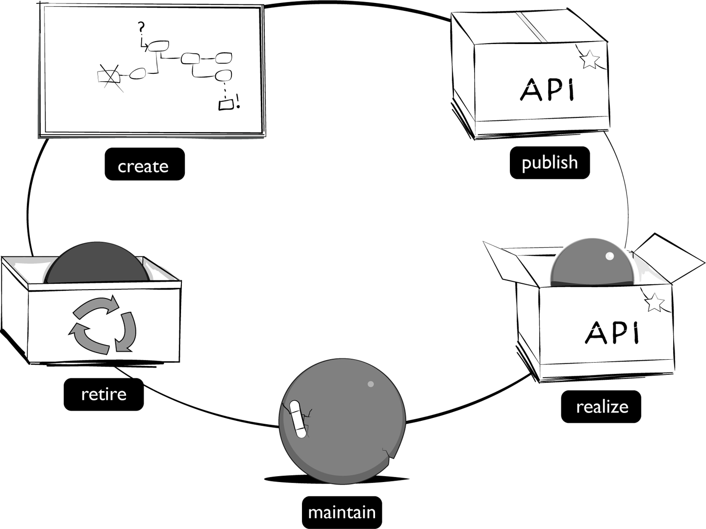

Growing old is mandatory; growing up is optional.

Attributed to Chili Davis

When it comes to API management, understanding the impact of changes is vital. As we discussed in the previous chapter, there are different types of costs associated with changes to your API: work costs, opportunity costs, and coupling costs. The overall cost of change depends upon the part of the API you are changing.

What’s more, the costs of change for an API aren’t static—as the context of the API changes so do the costs associated with changing it. For example, the coupling cost of an unused API is near zero, but, the coupling cost for the same API with hundreds of consumer applications depending on it would be massive by comparison.

In truth, the reality of API change management is even more complex than that example suggests. What if your API only has a single consumer that happens to be owned by a major partner of your business? What if you have hundreds of registered developers, but none of them are driving revenue to your core products? What if you are managing an API that is profitable but doesn’t fit your business model anymore? In each of these cases the cost of change is completely different. In fact, there are probably thousands of contextual permutations to consider. All this variation makes it difficult to create a blanket assessment of API maturity for all API products.

Although it’s a challenging prospect, it would still be nice to have a universally applicable model of API maturity. Firstly, it would give us a generic way of measuring the success of the API. Secondly, it could give us a framework for managing an API in each stage of its life, particularly in terms of its changeability costs. So, we’ll try our best to come up with a model that works for everyone.

In this chapter we’ll introduce an API product lifecycle that provides you with a maturity model for APIs. We’ll describe the five stages of maturity that are relevant to all APIs. To make it fit your context, we’ll also introduce a method for defining milestones that match your own business and product strategies. Finally, we’ll explore how each product lifecycle stage impacts the pillars of work you perform on your APIs. But before we dive into the product lifecycle, we need to develop a method for measuring API products.

Measurements and Milestones
The API product lifecycle that we’ve promised to introduce in this chapter has five stages, each of which is delineated by a milestone. The lifecycle stage’s milestone defines the entry criteria for an API. As your API matures from creation to value generation to retirement, it will progress through these milestone gates. In order to define your product milestones, you’ll need a way to measure and monitor your API.

In Chapter 4 we introduced the API management pillar of monitoring. Establishing a data gathering system is an important first step for measuring the progress of an API product. You can’t chart your progress if you don’t know where you are. Gathering the data is a technical challenge that can be overcome with good design and good tooling, but identifying the right set of data for product lifecycle measurements requires a different type of approach.

You’ll need to define product milestones that make sense for your API, your strategy, and your business. If you define your own milestones, we can build a generic set of lifecycle stages that can be applied to your unique context. To build those milestones, you’ll have to define a set of objectives and measurements that make sense for your product. In this section, we’ll introduce two tools that can help you with these definitions: OKRs and KPIs.

OKRs and KPIs
Throughout the book we’ll use the term key performance indicator (KPI) when we talk about measuring the value or quality of something. A KPI isn’t magic—it’s just a fancy term for describing a specific kind of data collection. A KPI describes how well a measured target is performing. The hard part about this is identifying the smallest number of measurements that provide the most insight. That is why these measures are called key performance indicators.

KPIs are useful because they represent purposeful measurement. In contrast to generic data collection, KPI data is carefully selected. KPIs should provide insight for the management team about a team or product. They provide clarity about the performance of the thing they are measuring, to aid in optimization. For example, two KPIs for a call-center team might be the number of abandoned calls and the average wait time for callers. Frequent evaluation of these call-center metrics, combined with a desire to improve them, would have a big impact on management decisions.

If management decisions are heavily influenced by performance indicators, then careful data selection is vital. Poor measures will lead to poor decisions, so selecting the right set of KPIs is important. This means that someone has to identify the most critical success factors for the organization and develop metrics accordingly. But how does this happen?

Some companies use OKRs to identify their objectives and the key results needed to achieve them. OKRs force management teams to answer “Where do we want to go?” and “What will it take to get there?” Depending on whom you listen to, OKRs either have a strong relationship with KPIs or are meant to replace them entirely. Either way, OKRs are useful because they represent a purposeful attempt to marry cascading objectives in an organization with the results and performance needed for progress.

OKRS AT LINKEDIN
Some organizations have found OKRs to be incredibly helpful in their drive to succeed. For example, LinkedIn CEO Jeff Weiner credits OKRs as being an important tool for aligning team and individual strategies with organizational objectives. He holds that OKRs should be about “something you want to accomplish over a specific period of time that leans toward a stretch goal rather than a stated plan. It’s something where you want to create greater urgency, greater mindshare.” For Weiner, OKRs are only useful when the objectives are thoughtfully crafted and continuously broadcast, cascaded, and reinforced.

When we use these terms in the book, our intention isn’t to create an OKR or KPI requirement. You don’t need to hire a KPI or OKR consultant in order to successfully manage your API. OKRs and KPIs are useful tools, but it’s the culture and perspective of objective setting and performance measurement that are most important. We chose to use these specific terms because we know that they represent the keys to a wealth of information, advice, and tooling for those of you that want to dive deeper. But the most important thing is to have clear objectives and measurable data to chart your product’s progress.

FURTHER READING
If you want to learn more about KPIs and OKRs, we suggest starting with Andy Grove’s High Output Management (Vintage), the book that started the OKR movement. If you want something more instructive, take a look at Objectives and Key Results (Wiley) by Ben Lamorte and Paul R. Niven.

Defining an API Objective
The objective that you set for an individual API needs to reflect the strategic goals of your team and organization. Your API’s objective doesn’t need to be exactly the same as your organization’s overall goal, but it should be aligned with it. That means, realizing your API’s goal will also help your organization move closer to its goal. If your API fulfills its promised value, the organization should benefit. This relationship between your API’s goal and the organization’s goals should be clear and easy to understand.

Achieving this kind of goal alignment requires that you understand something about your organization’s strategy. Hopefully you do; if not, that should be your first step. In the OKR world objectives can be cascaded down, with each part of the company defining objectives that align with a greater goal. For example, the CEO’s team sets a strategic objective and identifies the key results, which allows a business unit to create objectives that foster those results; within the business unit the divisions can create objectives aligned with the identified results, and so on, down the line. In this way, OKRs can cascade through various teams and individuals in the company.

OKRs aren’t the only way to achieve this kind of goal alignment. For example, Robert Kaplan and David Norton’s “balanced scorecard” system has a similar method of cascading performance objectives; it and other systems like it have been in use since at least the 1960s. We’ll leave it to you to determine how to align your API objectives with the wider organization. The most important thing is for the objectives to exist and for this definition of success to provide value to your company and sponsors.

There are no rules about what can or can’t be a goal for an API, but Table 6-1 provides examples of some common API goal types.

*Table 6-1. Examples of API objectives*
Goal type |	Description
----|----
API usage | Reach a number of invocations per period.
API registration | Reach a number of new or total registrations.
Consumer type | Attract a specific type of consumer (e.g., a bank).
Impact | Produce a positive business impact driven by the API (e.g., % increase of product purchases).
Ideation | Harvest a number of new business ideas/models from third-party API users.

You can also mix and match these goals—for example, you may want to set objectives for both usage and consumer types—but, keep in mind that adding more objectives reduces your ability to optimize the design for a specific goal. The API’s goal drives the work that you’ll perform for it, but that doesn’t mean it will never change. You’ll need to reevaluate your objective if the organizational goals change or if it turns out your goal isn’t providing real value.

Identifying Measurable Results
A goal is only useful if you have an accurate measure for it. Otherwise it’s not a good goal; at best it’s an aspiration. Managing an API means establishing a clear set of measurable goals and adjusting your strategy based on your progress toward them. Achieving this requires thoughtful design of the measurements or KPIs of the API.

Good measures should enable good objectives. This means that our measurable results are the results that will enable the objectives we’ve defined already. Defining clear, measurable objectives makes it much easier to determine the key results or key progress indicators. But even with this direction, you’ll still need to define those measurements.

If you are at all interested in defining good data measurements, you should read Douglas Hubbard’s book How to Measure Anything (Wiley). It’s a great starting point for understanding the whys and hows of measuring. Hubbard tells us that the goal of measurement is to aid in decision making in domains of uncertainty. That’s certainly the sort of thing that we are after—we may know what our objective is but remain uncertain about our progress toward it or how to measure the desired results.

In his book, Hubbard defines a set of questions that you can ask yourself to figure out what type of measurement “instrument” you need. Let’s use those questions and apply them to the API measurement domain:

“What are the parts of the thing we’re uncertain about?”
Most things can be decomposed into smaller pieces. Hubbard tells us that there is a big benefit to decomposing measurement targets. When the thing you want to measure has a high level of uncertainty, look for ways to decompose it into smaller, easier-to-measure pieces. For example, you may want to measure developer satisfaction for your API. That is a measure that is full of uncertainty—but can it be decomposed into smaller, more measurable pieces? It probably can: support requests, referrals, and product ratings are all quantifiable measurements that could be used to determine happiness levels.

“How has this (or its decomposed parts) been measured by others?”
Whenever possible, learn from the measurements done by others. If you are lucky and the problem domain is the same, you may be able to lift and replicate those measurements—but, even if you can’t do that, seeing how others have done measurements is highly instructive and will help you with your own. A good place to start is with API strategist John Musser’s “KPIs for APIs” talk, but unfortunately there aren’t many API measurement examples in the public domain.

However, most of the measures that apply to APIs have equivalent measures in other fields. Any measures for developer experience can draw inspiration from the general domain of user experience measurement. Measures for business impact can draw from the OKR and KPI world generally. Measures for registration, usage, and activity have parallels in the product management word. So, it shouldn’t be difficult to find how others have solved similar problems.

“How do the observables identified lend themselves to measurement?”
After decomposition and identification of secondary sources you should have a better idea of what you want to measure. To answer this question, you’ll need to determine how you should measure it. For example, measuring support requests would require you to track all the channels that support requests are made in: email, social media, telephone, and face-to-face interaction. This is the step where you begin designing the data gathering system.

“How much do we really need to measure it?”
With an unlimited budget, your data collection system could be perfect. But does it need to be? Hubbard wants us to consider how important perfect information is for our API product decision making. Context is king here. How important is this API to your business? How impactful will the management decisions be to the organization? For example, if you are developing an API only for yourself to use, you may care very little about managing it carefully, and your investment in accurate measurements will be small.

“What are the sources of error?”
At this point you should consider how misleading these measurements might be. Are there biases and inconsistencies? Does the method of observation influence the results? The goal here is to identify potential problems and try to address them. In the API domain, problems can arise from technical challenges (are the tools reporting data correctly?), missing data (are we tracking all of the support requests?) and flawed decompositions (are these the right measures for developer happiness?).

“What instrument do we select?”
When Hubbard talks about an “instrument,” he means a process or system for continuously gathering measurement data. In our API domain, this means the type of KPI that should be measured along with the monitoring implementation that you will have developed for it.

Armed with the answers to these questions, along with examples from secondary sources, you should be able to define the right measurements. With the measurements defined and the work we described in Chapter 4 for the monitoring pillar done, you are ready to build KPIs for the product lifecycle.

The API Product Lifecycle
A general model for understanding the maturity of a product already exists. It’s called the product lifecycle, and it defines the four stages of development, growth, maturity, and decline that all products go through from a market demand perspective. We’ve taken the concept of the product lifecycle and applied it to APIs in order to come up with an API product lifecycle. It consists of five stages: create, publish, realize, maintain, and retire (Figure 6-1).

As we mentioned at the beginning of this chapter, the API product lifecycle is a model that can help you chart the progress of your API and adapt your management as it matures.

Figure 6-1. The API product lifecycle

In Chapter 5 we described the release lifecycle of an API. The product lifecycle is a superset of those releases. Each stage of the API product lifecycle may contain many individual releases. Releases or changes don’t cause the API product to reach the next stage of maturity, but those incremental improvements will indirectly help the API to mature to the next stage.

In the following sections, we’ll go through each of the product lifecycle stages in detail. We’ll identify what happens during each stage, and the kinds of milestones you’ll need to define to reach it.

Stage 1: Create
An API in the create stage has the following characteristics:

- It is a new API or a replacement for an API that no longer exists.

- It has not been deployed in a production environment.

- It has not been made available for reliable use.

Every API starts with an inception point—somehow, someone, somewhere in the organization decides that an API should be published when the right API doesn’t exist already. There are many reasons to build APIs, but in this stage it’s critical to pin down exactly what those drivers are. Are you hoping to sell access to the API? Will it enable faster application development? Is it just a dumb pipe for data access? Getting a better understanding of why your company needs this particular API is essential to identifying the goals, values, and audience for it.

When APIs are in this early inception stage, they have a high degree of changeability. As we learned in Chapter 5, the interface model becomes more difficult to change when applications are actively using it. When your API is in the create stage you have an opportunity to make intensive changes without having to worry too much about coupling costs. Your effort costs can also be minimized at this early stage, since there is little impact when bugs or defects are introduced.

A hidden cost of work in the create stage, however, is the rising opportunity cost of not progressing your API product to the next maturity stage. This can happen when you avoid publishing your API to users because you want to spend more time working on design aspects while it is safe to make changes. But if there are other teams, organizations, or people depending on your API in order to perform their own work, the absence of that published API can become a real problem. It often turns out that publishing a good API today is better for your business than publishing a great API tomorrow.

The length of time your API spends in the create stage becomes an important product management decision. You’ll need to weigh the value of design freedom and its rising opportunity cost against the increased coupling and effort costs that are associated with later product stages. A good rule of thumb is to sort out those parts of the API that offer the least changeability first. For example, if you are building a CRUD-style HTTP API, you’ll want to design, test, and improve the interface model as much as possible in the create stage because the coupling costs grow so high later on.

The create stage of your API product is also the time when you’ll need to put the team together that will help the API mature. You can always add and remove people as the product grows in complexity, but designing the initial product team is an important foundational step for your API. As we’ll discuss in Chapter 7, the size, quality, and culture of your team will have a big impact on the product you create. It’s important to get these qualities as correct as possible early on in the life of your product.

MILESTONES FOR THE CREATE STAGE
Every API begins life as a new creation, but you’ll need to decide when exactly that creation point happens. How do you define the beginning of an API product journey? Of course, all of this can happen organically. It’s perfectly fine to decentralize the creation decision and let individual teams create competitive API products. But you may still want to define some minimum level of diligence before API product work can begin.

For example, you could decide that every API product needs to have a strategic goal defined before design and develop work can commence. This would require some form of centralized decision distribution, probably in the form of centralized authorization. Or you could make a rule that anyone in the organization can invent an API product, but work can only begin if they find three other people willing to invest three months of effort.

How you define the creation milestone depends a lot on your context, but, it’s important to have a shared understanding of what it takes to kick off an API product lifecycle. That will help to avoid wasted investment in products that aren’t worth the effort.

Stage 2: Publish
An API in the publish stage has the following characteristics:

- An API instance has been deployed to a production environment.

- It has been made available to one or more developer communities.

- The strategic value of the API is not yet being realized.

Publishing your API is an important product milestone and represents the entry point into the second stage of API product maturity. Your API has been published when you’ve made an instance of it available to consumers. This is the point at which you have officially opened the doors to the API and are welcoming interested users.

Publishing can’t happen without deployment—the act of moving the API implementation into one or more instances—but, deployment alone doesn’t automatically qualify as publishing. For example, you can deploy a prototype of your API design in the create stage without declaring it ready for real use. Publishing happens when you signal to your API’s user community that the API is open for business and ready to use.

If you are building a public-facing API for third-party developers, this is the stage at which you make the API discoverable and usable by developers who have needs that your API fills. For an internal API, this could be the point at which your interface is added to an enterprise catalogue and made available for other project teams to use. For an API that supports a single application, this might be the stage where you email the development team and let them know the API is stable and ready to be used in their code.

Making the API available to consumer applications is the first step toward realizing its strategic value. But in the publish stage of an API product, this is only a potential value, not an actual realized one. Using the metaphor of a shop, it means you’ve opened up your doors, but you haven’t sold your profitable items yet. You can’t realize the value of an API without publishing it, but publishing doesn’t guarantee you’ll get value from the API. Building it doesn’t mean that your target audience will come.

The distance between publishing an API and realizing its value depends on the API’s strategy. If the realization goal for the API is unrealistic, it will languish in the publish stage. If the goal is trivial, it might be realized on its first use. Context is also a big factor. If you are developing the API for your own application you have greater control over its fate, while a public API developed for third-party developers requires patience and investment. But no matter the factors, your goal should be to move the API into the realize stage as soon as possible.

One caveat to the principle of realizing value as quickly as possible is the changeability impact for a published API product. While you have the potential to impact dependent consumer applications at this stage, these are consumers who are not yet returning realization value to your business. This means there will be no short-term loss of value if you introduce an impactful change. For some organizations this is seen as an opportunity to perform more experiments, gather data, and take bigger risks.

However, you’ll need to temper your desire to make changes in the publish stage with awareness of the long-term effects these changes might have. Existing consumers may have the potential to deliver value with continued use, but too many changes might drive them away before that can happen. If your API product exists in a competitive market, it may also hurt your ability to attract the types of consumers who are most desirable for your realization target.

The API is generally changeable at this point because your primary users have not been activated. But keep in mind that changing the quality of the API at this stage can have unintended consequences and prevent you from acquiring the level of investment you want from your target user base. An API instance that is frequently out of service or often changes its interface model in ways that break clients will send a strong (and not positive) signal to a prospective user base.

The degree to which you change your API in the publish stage should be governed by your APIs, core changeability, the scope of its availability (public, private, or partner-facing), and the types of users you are trying to reach.

MILESTONES FOR THE PUBLISH STAGE
The milestones you define for the publish stage should identify when the API is ready for active usage. You’ll need to decide what kind of trigger constitutes being ready for real use. Here are some examples:

The API has been promoted to a production environment.

The API website has gone live.

The API has been registered in the corporate registry.

API availability has been announced by email.

In addition, you may want to define some measures that indicate if the API is actually being used. This will help you determine the potential impact of changes that you want to make early in the publish stage. For example, user registrations, API invocations, and documentation views may be helpful metrics.

Stage 3: Realize
An API in the realize stage has the following characteristics:

A published API instance exists and is available.

It is being used in a way that realizes its objective.

Its realized value is generally trending upward.

Thinking of your API as a product means continually improving it in support of a business objective. Up until this point, your API product has offered a potential to provide value. But when the target audience actually begins using the API in a way that meets your strategic objective, you can finally consider its value to be realized.

Realizing the value of the API is the ultimate goal. Getting to the realize stage as quickly as possible and continuing to realize value for as long as possible is the hallmark of a high-value API. The challenge for the API owner is to decide what realization means. This is a difficult stage to create a measure for because it requires the API product owner to have a good understanding of the objectives for the API.

Properly defining the objectives for an API then becomes the critical step in realizing value—or at least in being able to measure and manage your ability to produce a valuable API. The visibility and observability of the products you are creating are essential to managing a group of APIs together, so this realization measure is important.

For example, a payments API that is being marketed to third-party developers as a pay-to-use API product may define an objective of processing 10,000 paid payments per month as a realization goal. From this measure an API product owner can clearly identify that even with 6,000 developers registered to use the API, a measure of 5,000 payment requests per month means the value of the API has not been realized.

However, an API that is only used by internal groups in an organization would have a vastly different realization target. For example, a payments API used internally within a bank’s software architecture might have a realization goal of processing online banking payments in production. In this example, as soon as the online banking system begins using the API for payment processing the API is considered realized, regardless of the actual volume of requests.

To make things more complicated, not only should the realization goal reflect the context of the API, but it must also continually be reviewed and revised as that context changes. For example, the payments API that you release for profit to third-party developers will need to change its realization target if the underlying business strategy changes—say, if you decide that long-term sustainability requires you to market primarily to the enterprise market. The corresponding milestone objective for realization could then change to something like “handle 500 payment requests for a Fortune 500 organization.”

MILESTONES FOR THE REALIZE STAGE
To build a KPI that identifies when you’ve reached this stage, you’ll need to have a very good idea of who you are building the API for. The audience for your API should be pretty easy to identify if you’ve been able to define your objectives with a reasonable level of clarity. That doesn’t mean that your target API user will necessarily be very specific user persona—lots of APIs are launched to be as flexible as possible with the goal of serving anyone and everyone. The important thing is to be certain about the type of user access that means you’ve realized the API.

At this point it’s also useful to measure the level of engagement that users have with your API. In fact, the primary goal for your API at this stage is to build engagement levels to the point that the API is being used legitimately—whatever that may mean in your case.

When an API enters the stage of realization, your job isn’t done. The best success will come from continuing to reap value from this product. That means having a set of measures that help you track progress and make product management decisions accordingly. The kinds of OKRs and KPIs we discussed earlier in the chapter have their greatest applicability for APIs in this stage.

Stage 4: Maintain
An API in the maintain stage has the following characteristics:

It’s being actively used by one or more consuming applications.

Its realized value is stagnant or downward-trending.

It is no longer actively being improved.

While an API is generating realized value, it stays in the realize stage of its lifecycle. But eventually the pace of growth will subside and the API will enter into a steady phase, or even experience a decline in value-generating usage. When this happens the API is in the maintain stage.

An API in this stage will still need to have a degree of changeability, but the goal of change in the maintain stage is slightly different from in the realize stage. Now changes are being made to keep the API in its steady state for as long as possible. These may include bug fixes, modernization improvements, and changes due to compliance, but very few changes will be made with the goal of acquiring new users.

Making changes in the maintain stage requires special care, because you’ll need to ensure that the consumers of the API who are still providing value will not be negatively impacted by the changes you make. It’s best to be risk averse with regard to the types of changes that are applied to APIs in this stage. If a large, impactful change is required, the API may need to transition back to the publish stage and try again to realize value that has been lost (this is sometimes done by releasing a new version of the API).

MILESTONES FOR THE MAINTAIN STAGE
The milestones for the maintain stage will be dependent on the milestones for the realize stage and are primarily trend-based. For example, if you already have a measure for user growth defined for the realize stage, a corresponding measure of growth over the last six months might help for maintenance. If growth stagnates or declines, this could be an indication that the API has entered into the maintain stage. You’ll need to define which measures are the key indicators, what the period should be, and what the threshold for stagnation is.

Stage 5: Retire
An API in the retire stage has the following characteristics:

A published API instance exists and is available.

Its realization value is no longer enough to justify continued maintenance.

An end-of-life decision has been made.

Everything has to end, and chances are that your API product will eventually need to be retired. There are many reasons why an API might enter the retire stage, including loss of demand, changes to operational costs, the rise of newer and better alternatives, and shifts in objectives and goals for the business. All of these scenarios can be summarized as either an inability to sustain a realized value or a fundamental change in the objective for the API product.

When an API enters the retire stage of product maturity, it is an indication that it needs to be removed, not that it is already gone. The API product team must plan and perform the work of removing the API from the team’s offering of live, available API products. The product team can decide what retirement for an API actually means, but the goal is usually to eliminate as much of the cost associated with the product to be retired as is possible. In some cases, this may mean removing all API instances from production servers, while in others it may mean simply marking the API as “deprecated” and refusing to make any further changes or offer any support for it.

This decision about what retirement means is often driven by the cost associated with retirement stage, including taking away something useful from the people who were using the API product. Removing an API that others depend on can be a difficult decision to execute. For APIs that are used internally within an organization’s technical architecture, the API owner might be forbidden from removing the instance for fear of the unplanned work that will arise from its removal. In the case of a public API, an organization may be wary of damage to its brand and its credibility with the user community if it removes a function that previously existed.

From an API product perspective, retirement of an API should not be deemed failure or a mistake. Product retirement is a natural part of the cycle of continuous improvement for the overall landscape of APIs.

MILESTONES FOR THE RETIRE STAGE
Just like the other stages of API maturity, it is important for the API product team to define the milestones that would indicate the API is in the retire stage. These milestones might be performance-related (for example, the number of API messages processed over a timespan) or cost-related (for example, the estimated cost of improving an API to meet some future business objectives).

Google is famous for retiring products and projects that don’t meet specific measurable targets within a given amount of time. At Google, those targets could be active user numbers in the hundreds of thousands and the expectations of user growth can be quite aggressive. These types of measures make sense for a product strategy that seeks massive user growth, but wouldn’t be great for an internal user authentication API.

Milestones for the retire stage represent either a floor or ceiling threshold. For example, you may set a minimum number of requests that an API in the maintain stage must serve, or you could set a maximum cost level before the product enters the retire stage. The cost of retiring a product varies wildly based on the type of applications it supports and the scale of developer users. So, you’ll need to set these limits based on your API’s unique situational context.

Applying the Product Lifecycle to the Pillars
The API product lifecycle that we’ve just described is a useful way of understanding the maturity of your API product. This understanding can be helpful for thinking about the changeability cost of the API in each stage. The product lifecycle can also help you manage the work you need to do for your API. In this section, we will use the ten pillars of API product development that we introduced in Chapter 4 to highlight how your work might change depending on the lifecycle stage of your product.

The pillars of API management work we’ve defined will have significance in every lifecycle stage. You’ll never be able to unreservedly ignore any of them. However, some of the pillars hold more importance in certain stages than others. These are the pillars that deserve more of your focus and possibly more investment during specific stages of the API product lifecycle.

Table 6-2. Pillar impact by lifecycle stage
Create	Publish	Realize	Maintain	Retire
Strategy

✔️

️

✔️

Design

✔️

✔️

Development

✔️

✔️

️

Deployment

✔️

✔️

Documentation

✔️

✔️

Testing

✔️

✔️

Security

✔️

Monitoring

✔️️

✔️

Discovery

✔️

✔️

Change Management

✔️

✔️

WORKING ON THE PILLARS
The pillars that we highlight in these sections aren’t the only aspects you need to work on. You’ll be making changes and improvements to your API throughout its lifecycle. Chances are that you’ll be doing work accross all of the pillars in every stage of life for your API. Our goal is to show you which pillars have the biggest impact in each stage, so you can plan your investment of time and effort accordingly.

Create
In the create stage, the focus is on developing the best API model before you take on active users. That will require a special focus on strategy, design, development, testing, and security work.

STRATEGY
The create lifecycle stage is when the strategy needs to be developed in the first place. Once it’s established there will be very little real feedback about actual API product usage, since most of the work in this stage will be design and implementation effort. This lack of data about the strategy means that you should expect very little change to the strategy during this stage. One exception to this is when the cost of executing your strategy is too high. For example, you might find that it’s impractical to create a design and implementation that aligns well with your strategic goal. If that’s the case, you’ll need to make some strategic changes.

In the create stage, you:

Design your initial strategy.

Test it for design and implementation practicality.

Update your goals and tactics based on feasibility.

DESIGN
In Chapter 5 we described how API interface models become harder to change when the API gets actively used. This is why interface model design work is so important in the early stages of an API product’s lifecycle. If you can come up with the best design during an API’s create stage, you’ll have the greatest freedom to increment, improve, and innovate early.

A big challenge to designing in the create stage is that you’ll be making a lot of assumptions. You’ll be assuming that the design decisions you’ve made for the interface model are the ones that make sense for developers. You’ll also be assuming that your design will be practical to implement. Unfortunately, these types of assumptions are often wrong.

To get the best interface design this early in the life of the product you’ll end up having to perform some validation of your model. You’ll need to get feedback from the implementation team that the design you’ve come up with is feasible—ideally this validation includes the development of prototypes that can be called. You’ll also need some feedback from developers who represent your target audience.

In the create stage, you:

Design the initial interface model.

Test the design from a user perspective.

Validate the implementability of the interface model.

DEVELOPMENT
In the create stage, development work is focused on implementing an interface model to be published. As we described earlier, that work can also include prototype development for testing the design. The primary development goal in this first stage of life is to create an implementation that works and that provides all the functionality described in the interface model. But to really get long-term value from development, the implementation should also be designed to reduce the maintenance and changeability costs of the code, data, and infrastructure.

In the create stage you:

Develop prototypes.

Test the interface design from an implementation perspective.

Develop an initial implementation of the API.

TESTING
In the create stage you’ll need to test the interface design and initial implementation. This is your chance to expose usability problems and improve the design of the API early in its life. Like with all quality assurance, the cost of usability testing can vary. A high-investment version could involve lab-based usability tests, focus groups, surveys, and interviews. A low-investment version could be as simple as writing code for your API.

The right investment level will be determined by the value you’ll get from improving quality. If you are operating in a highly competitive API market and your audience has many product choices, investing in better usability quality might make sense. If you are designing the API only for yourself, you’ll probably perform only enough testing to validate your design assumptions. But in all cases, testing those design assumptions is necessary to avoid the rising cost of interface model change.

You’ll want to test the implementation too, but in the create stage the implementation quality isn’t as vital. The API hasn’t been published for use yet, so you can afford to defer an implementation testing investment to later. That doesn’t mean testing your code in the create stage is a bad thing. In fact, adopting practices like test-driven development will probably improve the quality of your implementation in the long run. The point here is just that it’s a decision you can make based on your own context.

In the create stage you:

Define and execute a testing strategy for the interface model.

Define a testing strategy for the implementation.

SECURITY
When it comes to security work, the safe play is to invest in it heavily throughout the life of the API. The amount of actual diligence required will be dependent on the constraints imposed on you by your industry, government, and competitive marketplace, but it’s difficult to imagine a scenario where no security work is required at all. You will always need to do some work to protect yourself, your system, and your users.

A lot of this work needs to happen before the API is published. It’s no good to open up the doors to your API instances and only then consider how to keep things safe. That’s why we’ve identified the create stage as the most significant one for the pillar of API security. That might seem counterintuitive, but we believe that the security work you perform during this stage is the most significant and gives you the best chance of success. Security is most relevant for a live API instance, but the foundations for security are laid while it is first being designed and implemented.

During the create stage, your security work should be focused on applying security policies to your proposed design. If your industry or organization doesn’t have any defined requirements, you’ll need to come up with some yourself. At this stage it is important to make security a first-class concern within the interface design and implementation.

The implementation work in the create stage should include designing and building an appropriately secure infrastructure for your API. That includes access control functions as well as a design for handling overuse that might take your service away from legitimate users. No API is too small or unimportant enough to risk being vulnerable. In fact, great exploitation targets in any large system are those components that were deemed trivial and not worth the investment of a secure implementation.

In the create stage you:

Define your security requirements.

Validate the interface model against your security requirements.

Define a strategy for securing the initial implementation and instances.

Publish
The publish stage is the “door opening” moment for your API product—it marks the point where you officially open your API up for use. In this stage, other people will begin to depend on your API and will write code based on the interface model you’ve advertised. The pillars that matter the most in this stage are design, development, deployment, documentation, monitoring, and discovery.

DESIGN
Although most of the design work will happen in the create stage, interface design work remains important in the publish stage. That’s because this is your opportunity to improve the design of your interface based on actual usage. When you publish your API, you’ll find out if the assumptions you made about the design are correct. Some of that will come out during testing in the create stage, but you’ll learn a lot of new lessons once users get their hands on your API for real.

In truth, you’ll be making changes to the interface throughout its lifetime. Whenever you need to add a new feature, enhance an existing operation, or improve usability, you’ll be changing the interface model. But those changes will be easier to make during the create and publish stages. The publish stage is your last opportunity to make invasive design changes with a minimal amount of harm, or at least without impacting users who are delivering realized value.

In the publish stage you:

Analyze the usability of the interface.

Test design assumptions you made in the create stage.

Improve the interface model based on your findings.

DEVELOPMENT
If you change the interface, you’ll end up having to make changes to the implementation. But that’s not the interesting part of the development pillar in the publish stage. We are highlighting this pillar because the publish stage is the best time to optimize the implementation independent of the interface model. It’s your chance to improve the implementation such that it is more performant, and easier to change and scale.

You can certainly do this kind of work during the create stage, but the publish stage gives you the benefit of having real usage to base your optimization on. Unlike the interface model, you have the freedom to change the implementation in small, iterative steps. In this way, you can avoid having to do too much big design of the code up front. Instead, you can optimize it in small pieces as you learn more about what needs to be improved. In truth, you’ll continue to optimize your implementation throughout the life of the API, but the publish stage presents a great opportunity to do the most with the least risk.

In the publish stage you:

Optimize the implementation for scalability and performance.

Optimize the implementation for changeability.

Make these optimizations based on observed usage.

DEPLOYMENT
An API can’t be considered published if an instance hasn’t been deployed. So, deployment is a core pillar for the publish stage. At the very least you need to make sure an instance is available to users, but it’s a good idea to start building a deployment infrastructure that will support later growth. This is especially important if your API’s strategic goal involves increased usage. For example, reaching a revenue or innovation target will probably need a deployment architecture that can handle a lot of demand.

One aspect of deployment work is to develop a release pipeline that will allow you to make changes to the API (recall that it’s important to achieve velocity for your API changes). The work of designing and constructing this pipeline should ideally start during the create stage of the product, but the publish stage is when it becomes more urgent to get one in place.

Another aspect of deployment is the work of operationalizing your API instances. This means building and maintaining a system that will address scale, availability, and changeability requirements for your product. A good operations system will keep your API available and performant even as the demand on system resources grows. Keeping your API instances in good health is an essential part of building a good developer experience. An API that is frequently unavailable or unreasonably slow will have trouble moving to the realize stage.

In the publish stage you:

Deploy the API instance.

Focus on making the API available.

Plan and design your deployment for future demand.

DOCUMENTATION
You’ll need to perform documentation work throughout the lifecycle of your API, but the documentation pillar becomes particularly important during the publish and realize stages of the API product lifecycle. During the publish stage you’ll be trying to increase the realized value of the API by attracting the right kind of usage. This is your chance to experiment with the documentation design and come up with something that helps you get the usage you want.

That means you can start with a low level of documentation maturity and keep building it up as you learn more about your API’s usage. For example, you might start by offering only a technical reference, but add tutorials and examples based on observed usage. In particular, this allows you to focus the documentation on the trouble spots or learning gaps of your API. You can find those by investing in user testing during the create stage, or in the publish stage from the questions that your users will ask.

In the publish stage you:

Publish documentation.

Improve documentation based on actual usage.

MONITORING
Getting product feedback is most important in the publish and realize stages of the API lifecycle. In the publish stage you need good measurements to determine if you’ve hit your realization milestone. In the realize stage, you’ll need data to ensure that your API is still trending upwards in terms of demand and realized value. Monitoring is useful throughout the entire product lifecycle, but it’s essential for these particular stages. You’ll usually use the same metrics in both the publish and realize stages, so if you invest in good monitoring here, you can reuse that solution later.

In the publish stage you:

Design and implement strategic measures for your API.

Design and implement system monitoring for your API.

Build a monitoring system that can be used during realization.

DISCOVERY
Discovery is the most situationally dependent of our ten pillars. The work of discovery is the effort you expend to promote the API product, engage with developers, and generally increase the traction your API has with your target audience. If you are developing an API for your own team, discovery can be as simple as sending an email. If you are building an API for a large enterprise, discovery could mean following an intake and registration process for new services. If you are building an API for the general public, it could mean hiring a team of ten people to build and implement a marketing strategy. That’s quite a wide spectrum of effort and investment.

But in all of these cases, regardless of the effort expended, the value of discovery is highest during the publish stage of the API’s life. This is when you’ll want to maximize engagement with your API, because you have instances available to use and the right usage can help you generate realized value from your product. But as we said earlier, how you do this discovery and how much you invest is highly dependent on your context.

In the publish stage you:

Invest in marketing, engagement, and findability for the API.

Realize
Getting to the realize stage is the goal of any API product. The main objective now is to increase the value you get from the API and avoid impacting the users who are helping you the most. The most impactful pillars in this stage are deployment, documentation, testing, discovery, and change management.

DEPLOYMENT
When the value of your API is realized, it’s imperative that you keep the system available and running for your users. That means that your deployment architecture becomes very important. While you will have performed your initial deployment design during the publish stage, in the realize stage you’ll focus on maintaining and improving it. That means taking the necessary steps to keep your service running even as the demand profile changes in unexpected ways. Making these kinds of changes may even require you to redesign the implementation. That’s perfectly fine as long as you can protect your high-value users from being negatively impacted.

In the realize stage you:

Make sure that the API’s instances remain available.

Continually improve and optimize the deployment architecture.

Improve the implementation as necessary.

DOCUMENTATION
The realize stage is your opportunity to continue to improve the developer experience of your product. In particular that means improving the documentation and learning experience. While it becomes more difficult to change the interface model at this point, changing the documentation is much less impactful. Humans are much better at adapting to change than software, so you have some freedom in experimenting with new formats, styles, tools, and presentation. The goal here is to continue to drive realized usage by reducing the learning gap for new users.

In the realize stage you:

Continue to improve the documentation.

Experiment with additional supporting assets (e.g., API explorers, client libraries, books, and videos).

Drive new usage by reducing the learning gap.

TESTING
In the realize stage, testing work prevents changes to any part of the API from having a negative impact on users. At this stage, usage of your API is directly contributing to the value of your product. Changes will be necessary, but you need to mitigate the risk that changes will cause undesirable effects. The level of investment you make in this type of testing work should be based on the impact of things going wrong.

Ideally, the kinds of tests you run in the realize stage already should have been created in the publish and create stages of the API lifestyle. But as your API approaches and enters the realize stage, your testing strategy should be evaluated to make sure it is giving you the best levels of risk mitigation. As the API matures into maintenance and eventually retirement, the demand on testing will decrease. During these stages you should be able to leverage the assets you’ve already created.

In the realize stage you:

Implement a testing strategy for interface, implementation, and instance changes.

Continually improve your testing solution.

Build a testing solution that can be used in future stages.

DISCOVERY
Discovery in the realize stage is broadly similar to the discovery work from the publish stage. The only difference is that the discovery work here can be more precise. You’ll have a better idea of which user communities provide the most value, so you can invest more in fostering those ones.

In the realize stage you:

Continue to invest in API marketability, engagement, and findability.

Invest more in high-value user communities.

CHANGE MANAGEMENT
The heart of the API product lifecycle is the evolving impact of changes to the API. In fact, we’ve been describing change management throughout this section, for each of the other pillars of the API product. But in general, when it comes to change management as a work pillar itself, it becomes most important during the realize stage of a product’s life.

In Chapter 5 we described the four types of changes that you’ll need to manage with an API product: changes to the interface model, implementation, instances, and supporting assets. Within each pillar, you’ll find yourself making changes to many of these API parts, often at the same time. All these changes need to be managed to reduce their impact, but this impact reduction is most important when you have active, realized usage. This is when a good change management system and versioning strategy will provide the most value.

In the realize stage you:

Design and implement a change management system.

Carefully communicate changes to users, maintainers, and sponsors.

Support change activities with a goal of minimizing impact to realized value.

Maintain
In the maintain stage you aren’t getting new value, but you don’t want to harm the usage you already have. The goal here is to keep the engine running and maintain it. There’s a lot of work involved in doing that, but we think the most important is the work involved in the monitoring pillar.

MONITORING
If your API is in a state of maintenance, your only objective is to keep the status quo. That means less emphasis on design, development, or change and more emphasis on support and availability. You may not need to make monitoring improvements at this point, since a lot of that work will have taken place during the publish and realize stages. But it’s still the most important pillar in the maintain stage, so you’ll need to invest some time and energy to make sure you are getting the right kind of system- and product-level data.

One objective is to have a system that lets you know when something out of the ordinary happens. That will be an indication that you have some work to do. Another goal of monitoring in the maintain stage is to keep an eye on the value that your API is providing. When it drops too low, it may be time for the API to be retired.

In the maintain stage you:

Ensure that the monitoring system is operational.

Identify patterns that will require special care.

Observe metrics that could trigger a retirement decision.

Retire
While this is the final lifecycle stage, remember that an API in the retire stage isn’t gone yet. This is the stage where you’ve identified that an API product needs to be deprecated. The most important pillars in this stage are strategy and change management.

STRATEGY
When it’s time to retire your API, you’ll need to address a special set of strategy issues. How will existing users be supported, compensated, or placated? Is there a new API that users should be migrated to? What is the timeline and set of steps that will need to be in place for the API to be retired? How will the impending retirement be communicated to the user base? Regardless of the scale, context, and constraints of your API, you’ll need to form some type of retirement strategy, even if it’s a minimal, informal one.

That means forming new goals, new tactics, and a new set of actions. The original goal of your API that you have set in the create stage is no longer your target. Instead, you need a goal that fits the retirement of your product. For example, you may have a goal to minimize the number of users you’ll lose if you want them to migrate to a new API. Or your goal might be to eliminate the cost of supporting the API as soon as possible. These two very different goals will each require a tactical plan and set of actions to enable them.

In the retire stage you:

Define a retirement (or transition) strategy.

Identify a new goal, tactical plan, and set of actions.

Measure progress toward this retirement goal.

CHANGE MANAGEMENT
Managing change in the retire stage means managing the impact of retiring the product. This isn’t the time to introduce enhancements or improvements to the API, so the focus here isn’t on versioning or managing a big rollout. Instead, the work here involves assessing the impact to your users, brand, and organization of an impending deprecation and managing that change effectively. This work should align with your retirement strategy.

In the retire stage you:

Assess the impact of retiring your API.

Design and implement a plan of communication and deprecation.

Manage implementation and instance changes to support that deprecation.

Summary
In this chapter we introduced an API product lifecycle that describes the five life stages of a successful API product. We also described how well-designed objectives and measures are needed to determine your API’s maturity level. Finally, we described how the work of managing a single API product is impacted by its lifecycle stage. In the next chapter, we’ll take a look at the API product lifecycle from the perspective of the people and teams that do the work.