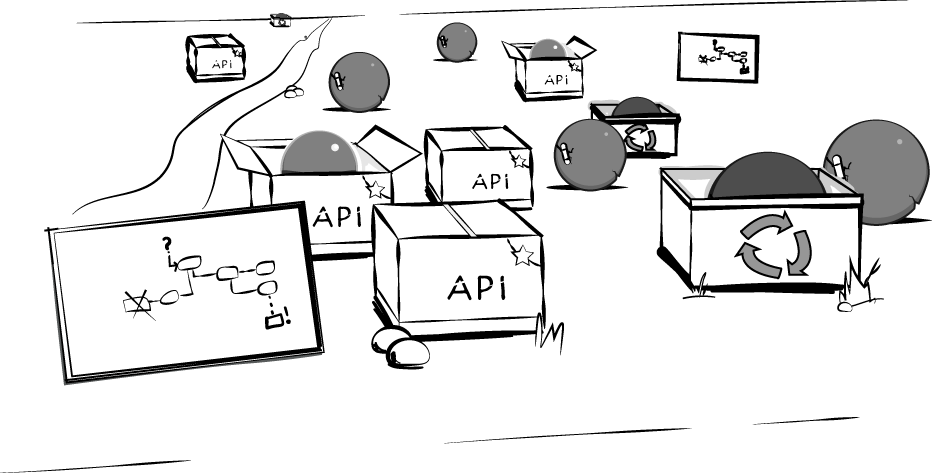
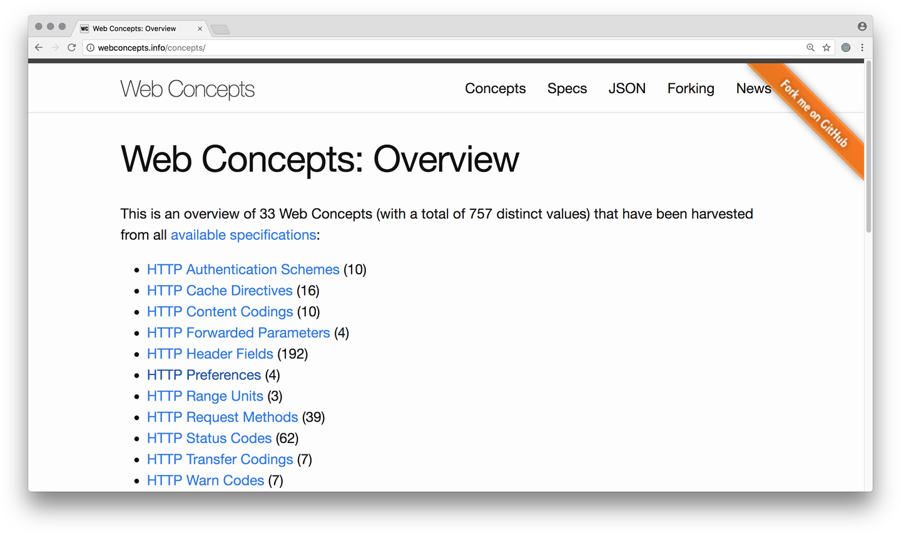

The theory of evolution by cumulative natural selection is the only theory we know of that is in principle capable of explaining the existence of organized complexity.

Richard Dawkins

As the number of capabilities exposed through APIs grows, it becomes important to manage this evolving set of APIs in a way that maximizes the utility and value of the overall set of an organization’s APIs. This is an important balancing act to keep in mind, because what may be the best (or a relatively good) way to expose an individual service through an API may not be as useful when looking at it through the lens of how easy it is to use that service as part of the overall landscape.

API LANDSCAPE DEFINITION
An API landscape is the complete set of APIs published by an organization (see Figure 8-1). The APIs in an API landscape can be in different maturity stages (create/publish/realize/maintain/retire), and can be intended for different audiences (private/partner/public). The APIs may also differ in other aspects, such as style or implementation method.

The goal of an API landscape is to provide an environment that helps improve the effectiveness of designing, implementing, and operating APIs. As a result, the API landscape should also help the organization to meet business goals such as faster product cycles, easier ways to test and change products, and providing an environment where business ideas and initiatives get reflected in IT as quickly as possible.

Figure 8-1. The landscape of API products

Modern API landscapes are constantly growing, in terms of API count and the numbers of APIs that are used by new services. With this increasing number of dependencies, it is clear that for the developer of a new service, it is useful to not have to understand and use various completely different API designs. These differences can be fundamental—for example, whether the APIs are using the REST style or an event-based style (see “Design”)—but even when the style is coherent, there may be differences such as APIs that use JSON representations versus those that use XML representations.

It also would be useful from the API consumer’s point of view if vocabularies were aligned. For example, when using multiple APIs that expose customer data in some shape or form, it makes it easier for a consumer if all these APIs share the same fundamental customer model (even if it may be represented slightly differently, it would be useful to have some shared model across services).

This observation of the usefulness of standardization seems to clearly point us in the direction that more standardization is better. That is true to some extent, but on the other hand, it is well known that standardization takes time and effort, typically does not deliver “the one true and best model” (it simply produces a model everybody can sort of live with), and thus fundamentally has to be looked at as an investment that has risks and advantages.

For example, it probably would not be a good decision for each API to invent its own representation format, meaning that it is better to use existing ones such as JSON or XML. In this case, it seems that what’s gained by reusing existing standards outweighs the possible benefits of customized representations. On the other hand, it could potentially be an expensive process to standardize on certain entities that appear across various services, such as the customer model mentioned earlier; in that case it may make sense to avoid the overhead of trying to define the one true model of the customer and simply settle for domain models.

Generally speaking, what we ideally want is for each service to not reinvent the wheel when it is not necessary, and instead to reuse those design elements that reduce the effort of creating the design, the effort of understanding the design, and the effort of implementing the design. If we can hit or at least approach that ideal rate of reuse, we allow service creators to focus on those aspects of their designs they need to focus on, without being distracted by solving problems for which solutions already exist.

What we see is that an increasing number of organizations are doing exactly this. The most important aspect of getting this right is to understand and make sure that the guidelines informing service designers are continuously evolving themselves: new practices get evaluated and established, established practices get deprecated, and the main force behind these changes is the ever-evolving set of practices of APIs in the organization.

Because of this inherent dynamic, it is essential to see the API landscape as a fluid and continuously changing environment, and in order for this to work over time, architecture needs to follow the same continuous evolution path. This landscape then becomes very similar to a really large-scale system like the web, which on the one hand is always up and running but on the other hand continuously changes, with new standards and technologies entering the picture all the time.

API Archaeology
While we do see a fair amount of organizations that are just getting started with their API programs, it is important to keep in mind that in any organization with some IT history, it is almost impossible that there aren’t already APIs in place that have been in use for a long time.

API ARCHAEOLOGY
Archaeology is the practice of unearthing artifacts and understanding them in the context of their origins in time and location. That exact concept can be applied to APIs as well. API archaeology thus is the practice of finding integrations, understanding why and how they were created, and documenting them as a way to better understand the history and structure of complex IT systems. Practicing API archaeology in organizations can be extremely valuable in terms of finding out about existing ways in which IT components interact (in some way or form).

Looking at it from the standpoint of definition, an API is any kind of interface that allows two programmatic components to interact; when we restrict the definition to today’s focus on “network/Web APIs,” then it is any kind of interface that allows two programmatic components to interact across a network.

In many organizations, these interfaces may not have been called “APIs,” and they may not have been designed for reuse (remember the story about Jeff Bezos’s famous “API mandate” that we told in “The Bezos Mandate”). But in most cases, these interfaces are there, even though they have been created and used for one-to-one integrations (thereby undermining one of the main value propositions of APIs, which is to be reusable).

Finding and understanding these “proto-APIs” can be a rewarding activity because it shows where integration needs appeared (even if they were addressed in ways that don’t meet the goals of APIs). Not all of these existing proto-APIs may be worth replacing with actual APIs, but by simply understanding the integration history, one can already gain some insight into how integration needs were observed and met, and where it therefore may not be unlikely that additional integration needs will materialize.

PROTO-APIS
The need for components to interact exists in all complex systems that are made up of individual components. APIs are one specific way of doing it, but there are many other ways. From the API perspective, any mechanism that is used to allow components to interact, and that is not an API, can be considered a proto-API. In an ideal landscape, all component interactions happen through APIs, with no exception. With this ideal image in mind, any non-API interaction becomes a candidate for modernization, to be replaced by an API. This is the reason why any non-API interaction mechanism between components can be considered a proto-API.

In summary, practicing API archaeology can help you to better understand the API landscape, even if there are mostly proto-APIs in it at present. It provides a starting point for understanding the integration needs of the past, and also provides a foundation to better understand which API investments may be the best candidates to disentagle a potentially problematic network of many custom integrations. With practice, over time it becomes easier to replace the pre-API integrations with more modern API-based models.

API Management at Scale
API management at scale is a balancing act between imposing some sort of landscape-level design and maximizing the freedom of individual API-level design. It is the classic complex-system struggle between centralized integration for coherence and optimization potential, and decentralization for agility and evolvability:

Centralized integration is what brought us the typical enterprise IT architectures of the past. The main driver was to standardize on the delivery of capabilities, so that they could be provided in an optimized and cost-effective way. High levels of integration do facilitate more potential for optimization, but they also impact the changeability and evolvability of the resulting system.

Decentralization is the opposite approach, with the web being the most widely deployed example available. The main driver is to standardize on the accessibility of capabilities, so that capabilities can be delivered in a large and evolving variety of ways, but they remain accessible because access is based on a shared set of agreements about how capability interaction works. The main goal of decentralization is to improve loose coupling, meaning to make it easier to change individual parts of the overall landscape without making it necessary to change any other parts.

DECENTRALIZATION AND DELIVERY
If we can learn anything from the not-quite-realized promises of the days of SOAP-based service-oriented architecture (SOA), it is that carefully managing delivery is a key aspect of realizing the prospects of service orientation. SOAP delivered on the promise of making capabilities accessible, but it failed to address the equally important issue of how capability delivery is managed. This meant that while SOAP did provide some value (previously inaccessible capabilities were exposed as services), it did not address the need for increased agility and evolvability of the overall landscape.

The promise and the challenge of API landscape management is to take this issue into account, and to avoid the trap of SOAP. SOAP said that the only thing that matters is the accessibility of services. That was an important first step, but it failed to address the aspect of loosely coupling capabilities. APIs and, with a specific focus on implementation and deployment techniques, microservices1 allow us to reconsider what matters in large-scale service ecosystems, and how to design landscapes that avoid the SOAP trap.

The Platform Principle
Many people talk about “platforms” when discussing both APIs and general business goals. However, they may be referring to vastly different things. It is important to keep in mind that what may be a good idea to design as a platform on the business level is not always a good indication of how to build it on the technical level.

On the business level, a platform provides something that others can build on, and it really doesn’t go any deeper than this relatively abstract way of framing the principle. Often, the attractiveness of the platform is influenced by two major factors:

What is the reach of the platform?
That is, how many users can I reach when building on that platform? This is usually determined by the number of people using or subscribing to the platform. Very often, this is the most important metric, either by sheer quantity or through qualitative factors that identify desirable users that can be reached through the platform.

What are the capabilities of the platform?
If I am building something on top of the platform, how does it support and/or constrain me in generating value? Also, how easily can I change the platform to add new capabilities, ideally without disrupting existing platform users?

While these business metrics are essential, there is a factor that is often overlooked when it comes to platforms: platforms always force the people using them to adhere to specific constraints, but they can do it in strikingly different ways. For example:

Web applications can be used by anyone and anything that supports basic web standards. In the simplest case that may be a modern browser with scripting support. Anybody can build them and make them available, and anybody can use them; there is no central entity involved that controls a making the web platform work.2

Apple App Store applications can be similar in look and feel to web applications, but are provided and used in very different ways. They can only be downloaded from the App Store, meaning that Apple has the exclusive rights to decide what can be installed by users. They also can only be used on iOS devices, meaning that Apple has the monopoly on selling devices capable of using these applications. App Store applications are specifically built for the iOS environment, meaning that the investment in building one is constrained exclusively to that platform. For the application to be used on any other platform (including the web), it needs to be recreated in a different development environment, and even with a different programming language, meaning that the client side of the application needs to be rebuilt almost from scratch.

Following this pattern for API landscapes, and the idea of “providing an API platform for applications,” the same thinking can be applied.

Sometimes, an “API platform” is perceived to be a concrete environment in which APIs are made available. Quickly, this can start looking quite a bit like the traditional enterprise service bus (ESB), where the “ESB platform” is supposed to provide the infrastructure, and the APIs made available through it can use this infrastructure.

In other cases, an “API platform” is perceived to be a shared set of principles that services use and provide, and becoming part of the platform has nothing to do with where or how the individual services are made available. As long as they follow the same principles, protocols, and patterns, they are providing their API on the platform and thus become part of the API landscape.

The second type of “platform” is a more abstract but also a more powerful one. By decoupling the “what” and the “how” of capabilities, it makes it easier for people to contribute to the platform. It also allows more avenues of innovation, enabling applications to experiment with implementation practices without compromising their ability to contribute to the API landscape.

Once again, we can look to the web for an example. By focusing on APIs only, the web allows many different things to change over time. For example, the idea of a Content Delivery Network (CDN) is not something that is built into the web itself. Instead, the sophistication of web content and the flexibility of a web browser to render a web page based on many resources retrieved from potentially different sources made CDNs possible. One could argue that the potential for a CDN was already present in the principles and protocols of the very first web pages, but that the pattern of the CDN only emerged when it became necessary for them to exist.

This is the exact quality of adapting to new challenges that we want in our API landscapes as well. We are architecting the landscape to be based on open and extensible principles and protocols, but we are able and willing to change things when the need arises. We also help applications with supporting patterns that help them to solve their problems more effectively, and we are willing to evolve those patterns over time as well.

Principles, Protocols, and Patterns
The main takeaway of the previous section is that a platform should not require one specific way (how) to do things, or one specific place (where) to do them. Instead, a well-designed platform is designed for continuous architecting, meaning platform architecture (and not just product architecture) continuously evolves, and is not designed up front and then assumed to be stable from that point on.

CONTINUOUS ARCHITECTING
Continuous architecting is the practice of continuously evolving the foundations of product architecture. Individual products are built using the existing foundations of the architecture and provide feedback on how these foundations are used, leading to improvements to make the product architecture more effective.

Agile and DevOps are about improving the development process of individual products. They don’t look at how to improve the foundations of that process, so that product architecture can benefit from better landscape architecture. Continuous architecting is architecting on the level of how individual products are built in the context of an existing landscape, and how to create a feedback cycle where the landscape is conducive to products being built more easily, and products help the landscape to identify areas of improvement.

The focus of continuous architecting is on evolving the foundation in a way that doesn’t break existing products and allows the combination of products across time. Ideally, the architectural foundations are always evolved in backward-compatible ways, so that the product landscape gets disrupted as little as possible while the architecture foundations are continuously evolving.

In order to allow continuous architecting, a platform should be built around principles, protocols, and patterns. We can illustrate these ideas with the web platform, which has proven to be both amazingly robust and flexible at the same time. Over the past almost 30 years,3 the fundamental architecture of the web never changed, but of course it has evolved considerably. How is that seeming contradiction possible, while most other systems seem to face challenges much sooner, and after following less radical trajectories?

One of the major reasons is that nothing in the web platform talks about how a service is implemented or used. Services can be implemented in any language, and of course that has changed over the years as programming languages and environments have changed. Services can be provided from any runtime environment, which have evolved from servers in basements to hosted servers and now cloud-based solutions. Services can be consumed by any client, and those too have radically changed, from simple command-line-based browsers to the sophisticated graphical browsers on today’s mobile phones. By focusing exclusively on the interface that determines how information is identified, exchanged, and represented, web architecture has proved to be superior in terms of handling organic growth to any other complex IT system architecture we have seen so far. The foundation of this is surprisingly simple:

Principles are fundamental concepts that are built into the very backbone of the platform. In the web platform, one of these principles is that resources are identified by uniform resource identifiers (URIs), and that the URI-identified protocol then allows interaction with these resources. This means that while we could (at least theoretically) transition to a post-HTTP web (and in a sense we are, because the web is shifting toward HTTPS everywhere), it is really hard to think how that would be possible for a post-resource web. Principles find their reflection in API styles because these have different foundational concepts that they rely on.

Protocols define concrete interaction mechanisms that are based on the fundamental principles. While the vast majority of interactions on the web these days are via the Hypertext Transfer Protocol (HTTP), there still is some share of File Transfer Protocol (FTP) traffic, as well as more specialized protocols such as WebSockets and WebRTC. Agreeing on protocols makes interactions possible, and carefully designing the platform allows the protocol landscape to evolve as well, as we are seeing now with HTTP/2.4

Patterns are higher-level constructs; they are how interactions in (possibly multiple) protocols are combined to achieve application goals. One example for this is the popular OAuth mechanism, which is an HTTP-based choreography to achieve the specific goal of three-legged authentication. Patterns are ways common problems get solved. They may be protocols in their own right (such as OAuth), or they may be practices (such as the CDN example discussed earlier). But as with protocols, patterns will evolve over time; new ones will be added, and existing ones may get deprecated and become historical. Patterns are the shared practice of how to solve problems in the solution space established by principles and protocols.

Often, patterns evolve over time as a response to changing requirements. For example, browser-based authentication was relatively popular in the early days of the web because it could be easily controlled through web server configuration and worked well enough for the relatively simple scenarios of the early web. As the web grew, however, the limitations of this approach became obvious;5 authentication support became a standard function in all popular web programming frameworks, and the greater flexibility of this approach replaced the earlier browser-based practice.

It is important to realize that this feedback loop was instrumental in the success of the web. Platform architecture starts simple. Applications start to get built, and some push the boundaries of what the platform supports. With enough demand, new features and capabilities get added to the platform, allowing more applications using these new features to be built more easily. The platform architects’ role is to observe where applications are pushing the boundaries, help application developers to push and overcome the boundaries more easily, and evolve the platform so that it better suits the needs of application developers.

In API landscapes, the same evolution of practices will happen. Instead of seeing this as a problem, it should be seen as a feature, because practices can be adjusted and improved as teams learn and as new patterns and sometimes even protocols emerge. The secret to a successful API program is to see it as ever-evolving, and to design and manage it so that evolution can run its course.

API Landscapes as Language Landscapes
Each API is a language. It is how service providers and consumers interact when it comes to exposing and consuming a certain capability. For the purpose of this section, it is important to keep in mind that the term language refers to the interactions with the API (i.e., to the design of the API), and not to the way the API works internally (i.e., the implementation of the API).

Certain aspects of an individual API language are decided on fundamental levels:

The API style determines basic conversation patterns (for example, synchronous request/response or asynchronous event-based) as well as primary conversation conventions. For example, in RPC-inspired APIs, conversations use function calls as their core abstraction, whereas in RESTful APIs they are based on the concept of resources.

The API protocol then decides the basic language mechanisms. For example, in HTTP-based APIs, it is clear that HTTP header fields are going to be important when it comes to managing the conversation basics.

Within the API protocol, there often are many more technology “sublanguages” in the form of extensions of the core technology. For example, there currently are around 200 HTTP header fields, even though the core standard defines only a small subset of these. APIs can choose which of these “sublanguages” they support based on their conversation needs.

Certain aspects of the API may be cross-domain and can be easily reused across various APIs (as discussed in more detail in “Vocabulary”). As one example, these reusable parts of APIs may be defined as media types, and then can be easily referenced and reused across APIs to avoid reinventing the wheel.

The main takeaway from this is that language management is an important part of landscape management. Like in all landscapes, managing languages is a delicate task. Try to unify things too much, and people living in the landscape feel stifled and cannot express themselves as they want to. Make no attempts at encouraging some language sharing, and landscapes becomes overly varied with the same problem solved in many different ways, and as a result become overly complicated.6

One pattern that has become increasingly popular for managing API landscapes is to promote language reuse by carrot rather than by stick:

The stick method was characterized by a small team of leaders deciding on the languages that should be used, and then declaring that only those and no others would be allowed. This usually was a top-down decision, and often made it hard to experiment with new solutions and establish new practices.

The carrot method allows any language to be suggested for reuse, provided it has associated tools and libraries to make life easier for people using it. This means that a language has to prove its utility to be among the promoted ones. It also means that adding to the language repertoire can be done by demonstrating a language’s utility.

With the carrot method, the set of promoted languages will and should evolve over time. If new languages emerge, so should new ways to show their utility, and if that’s the case, then those should become new promoted languages.

As a result, languages can fall out of favor, either by being eclipsed by competing, more successful languages or by people simply moving on to a different way of doing things. That is what has been happening in the XML/JSON space for a while now. While there still are many XML services around, the default choice for APIs nowadays is JSON (and a few years from now, we might see another technology gradually replacing JSON).

API the APIs
Scaling the practice of APIs means that when the time comes to scale, there is a plan for how to automate an increasing number of tasks both for individual APIs and in the API landscape. Automation requires that how information is made available and can be used and collected is well defined. Come to think of it, this task of making information available is exactly what APIs are for! This leads to the core mantra of “API the APIs”:

Everything that you want to say about an API, say it through the API.

What this leads to is the idea that an essential part of managing API landscapes in a scalable way revolves around the idea of using “infrastructure APIs” (or rather, an infrastructure part in existing APIs). A very simple example of such an infrastructure API could be a way to expose status information about an API’s health. If each API follows a standardized pattern (more on that in “Vocabulary”), it becomes trivial to automate the task of collecting status information across all APIs. Very simply put, it could look like this:

Starting from the inventory of currently active service instances, visit each of these services every 10 minutes.

Starting from the services’ home pages, follow the link with the status link relation to find their status resources.

Retrieve the status resource for each service and process/visualize/archive it.

In this scenario it becomes simple to write machinery that collects this information on a regular basis, and to build tooling and insights on top of that information. This has become possible because as part of the API, there is a standardized way that certain aspects of the API are made accessible.

Following this line of thinking, it becomes clear that managing and evolving an API landscape now in part becomes a matter of evolving the ways in which APIs can be used for these kinds of automation, when the need arises. By using continuous architecting principles, this information can be added over time, and existing services can be retrofitted as needed.

In this example, exposing status information has become a new pattern, and there is an established practice for what is exposed. This new practice might move from “experimental” to “implementation,” if the API landscape is using these kinds of categories for its API design guidance. It might very well also move to “sunset” and then to “historical,” with some older services still using it, if at some point in time the landscape moves on to another way of representing API health.

In the last paragraph we used “experimental,” “implementation,” “sunset,” and “historical” as possible status values for guidance. We are not proposing that you use this specific set, but it is important to realize that all guidance evolves over time. What was once a good way to solve a problem may be replaced by a faster and more robust way of doing it. Guidance should help teams to make decisions about how to solve a problem. By tracking guidance status, it becomes easier for teams to understand how practices evolve, and therefore it is a good idea to keep track of what currently are good solutions, to start noting what might be upcoming good solutions, and to also keep a record of what you once thought was a good solution. “Structuring Guidance in the API Landscape” and “The Lifecycle of Guidance in the API Landscape” discuss the specific ways in which guidance can be structured and evolved in more detail.

Solving this problem in a way that becomes a design element of an API makes it easier to manage large API landscapes, because certain design elements are repeated across APIs, and these elements can be used for automation purposes.

Understanding the Landscape
API landscapes are no different from other landscapes of products or capabilities, where the goal is to allow these landscapes to evolve easily and with little friction, and to serve as a solid foundation for building new capabilities, either internally or externally. In all of these cases there are trade-offs between optimizing for a single well-known goal, or optimizing for changeability. Optimization for changeability always requires some trade-offs over fixed goals; the key factors for changeability are to keep the landscape open for evolution and to instrument it in ways that allow insights into its current state and into its trajectory over time.

The idea discussed in the previous section that everything that should be said about an API, should be said through the API, plays a key role in this picture. This can be as simple as providing status information, as mentioned previously, or it could be much more comprehensive, going as far as requiring that any API documentation must be part of the API itself, or managing API security aspects through the API itself. In such an approach, APIs become self-serve products, with as much information made available through them as is needed for understanding and using them.

This approach in some cases can be costly. When taken to its extreme, where the idea is to have APIs that potentially millions of developers can use and access, then it makes economic sense to design these API to be as sophisticated as possible, so that it is as easy as possible for developers to understand and use them. In this case, there is one product that is designed for the mass market and thus it is highly optimized for this use case.

In most API landscapes there will be hundreds or thousands of APIs, and it is neither possible nor necessary to invest in polishing each of these into perfect mass-market products. But a little bit of standardization can go a long way, such as making sure that it is easy to find contact information for the API team, some minimal documentation, a machine-readable description, and possibly some examples to get started with.

And when it seems that APIs need a bit more “polish,” the evolutionary model of the landscape will help: API teams will start establishing practices for improving the developer experience, and these can become established and supported practices. Once again, the key is to observe changing needs, to observe solutions that are practiced by APIs, and to support whatever is desirable as a landscape-level practice.

The Eight Vs of API Landscapes
Managing API landscapes can be a daunting task. It requires balancing issues of product velocity and independence with the conflicting issues of coherence and robustness over time. But before we discuss how API landscapes mature in more detail, which we will do in Chapter 9, we first would like to provide a qualitative framework for the issues that matter for the long-term development of API landscapes.

In the following model of the “eight Vs” of API landscapes, we make the assumption that APIs are getting designed and developed in a variety of ways (and following a variety of paths through their individual API lifecycles, as discussed in Chapter 6). These eight Vs are like the controls or dials for your API management system. You’ll need to observe and tune them to get the best results.

Specifically, the assumption is that the design and execution of the landscape strategy follows a platform model (as discussed in “The Platform Principle”) where platforms are open concepts, and adding APIs to a platform means adhering to the principles, protocols, and patterns of that platform.

With such an open API landscape model in mind, it becomes important to consider the following eight aspects, which in some shape or form all interact with how individual APIs get designed and implemented and how the whole API landscape is organized. Keeping these aspects in mind will also help guide observation in the landscape, meaning that insight into them will help you to better understand the continuous evolution of the landscape.

In the following sections, we introduce and describe the eight important aspects to keep in mind for API landscape management. We will use the same aspects in Chapter 9 for our landscape maturity model, which uses risks, opportunities, and potential investments in all these areas as a way to assess and guide the maturity of an API landscape. We will also use them in Chapter 10 to explain how lifecycle management at the landscape level can be guided by and help with the lifecycle of individual APIs.

We have identified these eight Vs—variety, vocabulary, volume, velocity, vulnerability, visibility, versioning, and volatility—as a way to guide and focus the management of API landscapes. We discuss each of them in more detail in the following sections.

Variety
Variety refers to the fact that API landscapes often contain APIs designed and developed by different teams and on different technology platforms, and APIs designed and developed for different users. The goal of APIs is to allow this variability and to provide more autonomy for teams.

For example, it may make sense to have one design guideline that promotes REST APIs as the default choice for core platform services, because for these, consumption should be as easy as possible for the largest possible number of consumers. However, for APIs that are specifically provided to be backends for mobile applications, it may make sense to support query-style APIs using a technology such as GraphQL, because then mobile applications can very specifically get just the data that they need, in just one interaction.

API landscapes have to balance variety. One goal of API landscape management is to manage and constrain the variety so that developers don’t have to learn how to interact with an overwhelming number of different API styles. On the other hand, restricting variety to just one design choice may not be a useful thing to do if there are clusters of design preferences where multiple design choices match those scenarios very well, allowing better products to be delivered to more consumers.

Managing variety in API landscapes thus is a balancing act of constraining choices enough to avoid an unproductive multitude of API flavors, while at the same time being open to identifying choices that allow the API landscape to deliver higher value, thereby allowing a larger set of platform applications to be developed in a productive way.

The most fundamental aspect is to treat “managing variety” as an act of governance over time: do not build anything into your landscape that makes it fundamentally hard to evolve your understanding of the variety that you want to support over time. If one thing is certain, it is that ideal API landscapes in a few years will not look the same as they do today—so keeping paths open to deal with evolutionary variety is essential to avoid painting yourself into a corner.

API PREFERENCES OVER TIME
You might have certain preferences for how APIs should be designed, and use those preferences to inform your governance. You might encourage developers to follow those preferences, because from the landscape perspective they seem to provide the best cost/benefit combination.

But you should not place all your bets on that one set of preferences. Something better might come along that makes you change your mind, or you simply might have API consumers asking for certain APIs and want to make those consumers happy.

One example of this is GraphQL: regardless of what you think about that specific technology, if you work on partner or public APIs, you might get strong preferences for GraphQL from a certain set of consumers. Being able to support these “preference clusters” over time is essential, as they will evolve and will drive the way in which your landscape is evolving.

Never assume you have found the one best way to do APIs: whatever you do is contextual with regard to technologies and consumer preferences, and will change over time.

Allowing and controlling variety is a long-term activity. Allowing it should be built into the landscape from the very beginning. Constraining it by encouraging principles, protocols, and patterns is a balance of understanding how APIs are being used and how much value they deliver, and making choices to maximize that value. With increasing maturity of the API landscape (see Chapter 9), it should be possible to gain better insight into the status, evolutionary path, and usage of the landscape. Variety can then be controlled by balancing the cost of increased variety (which reduces coherence across the full landscape) and more specifically designed APIs (which improves API value for a subset of the APIs in the landscape).

Vocabulary
Every API is a language, as discussed in “API Landscapes as Language Landscapes”. It defines how developers can interact with a service, and it defines these interactions through interaction patterns, underlying protocols, and exchanged representations. Standardizing on API building blocks through shared vocabularies is a powerful way to increase coherence across the API landscape.

For some aspects of that language, it might not be necessary to reinvent the wheel every single time. A simple example is the issue of error messages. Many HTTP-based REST APIs define their own error messages, because they want to expose error messages beyond just using the standardized HTTP status codes. It is possible to define such a format individually, but the “problem details” format of RFC 7807 defines a standard representation for this (as long as the API is using JSON or XML). By re-using this “problem report vocabulary,” two advantages can be realized:

Teams developing APIs do not need to invent, define, and document a new vocabulary for error messages. They can simply adapt the existing vocabulary and maybe extend it to expose specific aspects of their error messages.

Teams consuming APIs do not need to learn a proprietary format, and instead will understand that part of the “API language” after they have encountered that particular vocabulary for the first time. This makes it easier for developers to understand those aspects of the API that are not specific to the API.

The following example is taken from RFC 7807 and shows how such a format can even combine standardized and proprietary vocabularies. In this example, the type, title, detail, and instance members are defined by RFC 7807, while the balance and accounts properties are proprietary members used by a specific API. It is perfectly possible that in an API landscape you might always use RFC 7807 problem reports, but the set of properties is actually evolving over time, as APIs are exposing specific problem details:

{
    "type": "https://example.com/probs/out-of-credit",
    "title": "You do not have enough credit.",
    "detail": "Your current balance is 30, but that costs 50.",
    "instance": "/account/12345/msgs/abc",
    "balance": 30,
    "accounts": ["/account/12345",
                 "/account/67890"]
}
In many cases, this kind of vocabulary reuse can be achieved by using standards. Whether these standards are actual technical standards on the internet/web level or standards of an API landscape does not really matter all that much. The important thing is to avoid reinventing the wheel as much as possible.

In fact, having the ability to treat “official” standards and “landscape” standards in the same way is essential to being able to decide when, for some aspect of the API language, switching to a standard makes sense.

EIMS AND APIS: PERFECTION VERSUS PRAGMATISM
While using official standards is a rather straightforward way of avoiding reinventing vocabularies, in some cases organizations go beyond this. The most extreme case is the idea of an enterprise information model (EIM), where the goal is to have a complete and coherent model of everything that has to be represented in an organization. In many cases (and often in larger organizations), the ideal of the EIM has proven to be elusive: the effort of documenting the complete vocabulary of a complex organization is substantial, and by the time the exercise is completed, reality and systems have already changed, turning the EIM into a snapshot of the past.

As the organization evolves, so should the EIM, but it is very hard to keep both in sync. For example, an organization might have a certain model of a customer and information related to them. That information very likely evolves all the time, and different products will extend/enhance the customer model in ways that work for them. Trying to make sure that these extensions and enhancements are always done in a coherent and coordinated way is likely to slow down service design and delivery. In practice, this means that the choice often is between having an EIM that reflects a static model of the organization, or increasing the organization’s ability to change when needed but giving up on the ideal of a perfectly designed and harmonized model of everything.

A more realistic approach is to assume that the EIM effectively is the union of all capabilities that are accessible through APIs. With this way of thinking, it is still up to the API landscape management to decide how much vocabulary standardization makes sense. For some clear cross-domain concerns (such as the error messages mentioned previously), deciding on a standard vocabulary might be an easy decision to make.

For more domain-specific concepts, the API will expose those concepts in its design, and this design then is the EIM of that domain. The downside of this approach is that this does not produce the one highly aligned and uniform model of everything that EIMs often strive to be.7 The upside of this approach is that the “domain model” now is directly actionable (through the API), and by the very definition of this approach, what is not exposed and/or actionable in the API is not part of the EIM.

Vocabulary management at scale succeeds best if the main focus is on making vocabularies findable and reusable, instead of creating the one true model of a concept. If vocabularies can be easily found and reused, developers are interested in reusing them as long as they fit their purpose, because then they do not have to design their own.

How to define vocabularies is a tricky subject. Without getting into the weeds of UML and XML and how to define and document and compose vocabularies, it is important to keep in mind that one important goal of APIs is to not expose implementation models but instead create an interface for them, which often will be different from the internal model of a service or a domain (as described in Chapter 3, one strategy is to start with that interface model without even considering its implementation initially).

Vocabularies can be managed in a variety of ways, each of them having different advantages and limitations:

When used for complete representations of API interactions, vocabularies become complete models of the meaning and the serialization of domain concepts. Typical examples for this might be XML schemas or JSON document types. How these vocabularies are identified also differs: in some cases, and for web-based APIs, people use media types, but in other cases people might use identifiers for schemas and then associate those identifiers either implicitly of explicitly with an API representation.

Vocabularies sometimes also are used as building blocks within representations, allowing an API to support representations where certain parts of it follow that specific vocabulary. XML has a rather sophisticated mechanism for this with XML namespaces, whereas JSON has no formal way of identifying that a part of a JSON representation uses a standardized vocabulary. And earlier we looked at the example of RFC 7807, which has a vocabulary of built-in properties but also allows APIs to add their own properties to the problem detail format.

Vocabularies may also be essentially shared data types, in which case there often is a pattern of defining and supporting an evolving set of values for the data type through a registry. Registries allow a community to share an evolving set of well-known values for certain data types, and they are a widely used pattern for fundamental technologies of the internet and the web. One example is hypermedia link relations: there is a registry for link relations which makes it possible for developers to find out about existing relations, or to add new ones if necessary.

Picking the right way to establish and manage vocabularies is important, and is a key determinant of how easy it is for API teams to (partly) assemble their APIs from existing building blocks, instead of always starting from scratch. But establishing vocabularies only makes sense if there is a clear model for how they can be easily found and reused. Tooling is an excellent way to use vocabularies so that designers have a well-defined set of choices. When designing RESTful APIs, for example, HTTP has a set of concepts that are open and evolving vocabularies.

As shown in Figure 8-2, HTTP has quite a few vocabularies associated with it (the figure is a screenshot of Web Concepts, an open repository that makes standardized and popular values for these vocabularies available). An API landscape would probably not encourage HTTP API designers to use all ~200 of the existing HTTP header fields, but API design and implementation tooling could be based on a subset of these values, thereby establishing the shared practice of which HTTP header fields to consider within the organization.

Figure 8-2. Web Concepts: HTTP vocabularies

The HTTP vocabularies are an example of a rather technical focus, where it is important to share a set of practices for how to use a certain technology. On a more domain-specific note, the very same principles can apply to domain concepts such as customer types. For example, a company may have an existing vocabulary of five different customer types, which might grow over time to cover additional customer types. Managing this domain vocabulary in a registry is a good way to ensure that the set of shared values is accessible to developers and tooling, and can evolve over time.

Volume
Once an organization gets serious about its digital transformation strategy, the volume of services that exist (or get exposed through APIs) can grow quickly. One reason for this is that as more and more of the organization gets reflected through digital shadows, its “digital footprint,” and thus naturally the number of its APIs, increases. It can easily reach into the hundreds or even thousands, for organizations beyond a certain size and with some history of developing APIs. API landscapes must be able to deal with this scale easily, so that it becomes primarily a business decision how big the API landscape is going to be.

A second reason is that with the API-as-a-Product strategy (Chapter 3), anything and everything that is done in the organization is conceived with an API-first mindset, because only then can it become part of the network effect of the increasing API-enablement of the organization. This might very well mean that quite a number of these AaaP initiatives don’t make it very far, because not only should APIs enable the organization to combine services more easily and more quickly, but they also should help the organization to do this more economically, so that products can be built and evaluated (and possibly discontinued) quickly.

When it comes to the volume of APIs in an API landscape, there often is a difference in preference. Sometimes the approach is to keep the volume down as much as possible (which can be a very relative term in complex organizations) and to attempt to have a carefully curated landscape of APIs. In other cases, the focus is more on making it easy to handle volume, and to gain and provide insights into an API landscape, so that volume is mostly a management problem and can be handled by improvements over time, if required.

Either way, it often is natural that volume goes up over time, as the API landscape matures and new services enter the landscape. This means that it is equally natural that with growing maturity, handling volume becomes something that is based on policy, and not on fundamental problems of having to deal with a growing volume of APIs.

Velocity
One important value proposition of digital transformation is that it becomes faster to design, release, test, and change products, and that is because the organization’s increasing maturity in managing individual APIs and the API landscape allows it to move faster than it could without those skills. What this also means is that the organization becomes a much more fluid network of individual but interdependent services: instead of many building blocks being stable for a long time, and new ones being added relatively slowly, things can change more quickly and be added faster.

While this added speed is one of the key differentiating aspects that organizations are able to benefit from in the marketplace, at the same time it becomes important that this can be done safely. If not, the increased speed comes at the unacceptable cost of threatening the robustness of operations.

For many organizations, velocity is one of the key motivations to start digital transformation initiatives: with markets changing faster and the competition becoming faster, it is essential for organizations to be able to act or at least react quickly. Any factors that drag out the time it takes for ideas to be turned into products, or hinder the management of the constantly growing and evolving product portfolio, also harm the organization’s competitiveness.

In API landscapes, velocity is accomplished to a large degree by giving teams more freedom to design and develop according to their preferences and choices and schedules. The goal is to minimize all parts of the process that potentially slow down API delivery. As mentioned earlier, one key learning from earlier IT approaches is that decoupling delivery (i.e., the ability to change and deploy individual components independently of others) is essential to decreasing delivery time.8 But allowing individual capabilities to be added and changed and delivered independently also means that traditional practices of testing and operations have to be changed.

As discussed in “The Platform Principle”, one of the common approaches to avoid coupling and the resulting loss in velocity is to move away from integration. Using a platform as described means giving up on the idea of integration and embracing the idea of decentralization. The benefit of this is that the loose coupling allows higher velocity of individual parts because there is less coordination effort for making changes. The cost of this approach is that delivery and operations need to adjust to this new landscape and make sure that the overall ecosystem meets the standard of robustness that the organization needs.

Taken to the extreme, looking at the web once again is an interesting exercise. The web changes fast because new services can be deployed, existing ones can be changed, and users might or might not be affected by these changes. At some level, one could argue that the web never “works”: something is always broken, with a service not being available or a user being affected by a service change. But the resulting velocity of the overall system more than makes up for this inherent brittleness, and by managing change well and using appropriate methods for deployment and testing, it is possible to find a good balance of velocity and value in such a system.

Vulnerability
An organization that has no IT is not (directly) vulnerable to IT-based attacks. But with the trend toward more IT, more alignment between business and IT, and the opening up of IT capabilities through APIs, many vulnerabilities are created, and these have to be managed. API landscapes must make sure that the risks of a bigger attack surface are more than compensated by the rewards of increased agility and speed.

One of the value propositions of the API economy is that businesses can react and restructure quicker when they use APIs internally, and when they also can outsource capabilities via APIs. But of course there is a flip side to this, because it creates dependencies. For example, in June 2018, Twitter acquired anti-abuse technology provider Smyte. Many companies used Smyte’s services via its APIs, which offered tools to stop online abuse, harassment, and spam. These companies even had contracts with Smyte. Directly after the acquisition, and without warning, Smyte closed down its APIs, creating problems for companies relying on these APIs.

The lesson of this and similar cases is to always treat external dependencies as brittle, to always build resilience into services to handle potential service interruptions responsibly, and to make this a fundamental development practice. One can even go one step further and make this a rule for any dependency, not just the external ones—because as velocity increases, the likelihood increases that there may be problems with runtime dependencies, and any nonresilient use of a service is a predictable potential problem.

Implementing resilience often is not trivial; in some situations dependencies may be critical, and not much can be done to compensate for them not being available. But even then it is important to handle the situation responsibly: instead of crashing or hanging or going into undefined operational states, services should clearly report the situation so that it can be analyzed and fixed.

Another aspect apart from the technical vulnerability is the fact that more and more services are made available and thus have APIs as attack surfaces. This can be a problem when it comes to malicious attempts to gain access to systems or simply disrupt operations. It can also be a problem when APIs expose information or capabilities that for legal, regulatory, or competitive reasons should not have been made available. This can have a major impact on how organizations are perceived, and thus needs as much attention as the more directly malicious threats.

In summary, vulnerability needs to be addressed by handling APIs safely and securely. Safe practice is to treat all dependencies as brittle and to never depend on the availability or specific behavior of an API. Secure practice is to always make sure that malicious players cannot gain access to or disrupt the operations of APIs in the landscape.

Visibility
Visibility and scale are almost natural enemies. If there are few things, and everybody designing and developing and using and managing them is in a relatively small team, then most things are visible, or at least can be discovered using the very simple discovery process of asking the people around you. They will quickly guide you to find what you are looking for. They also can explain how that thing works. If you need an overview across all of the things, you can manually inspect them to gain insights. None of these assumptions are true anymore for larger API landscapes.

In large and decentralized settings, visibility is a much harder goal to accomplish. However, direct “line of sight” is not a natural requirement for establishing visibility. Typical patterns for large-scale visibility in real life as well as in IT systems often combine two aspects (and we’ll look again at the web to explain that in terms of the biggest visibility scenario there currently is):

Publishing things needs to be done in such a way that they are discoverable. In terms of the web, being discoverable means having a working web server and publishing HTML that can be used to crawl and index content. There are mechanisms such as Sitemaps and Schema.org to improve discoverability, but all these improvements were invented quite a while after the search engines started operating.

Searching things often is a much more contextual task than just discovering them. Search often revolves around the context of the search, and how “useful” and “less useful” search results are delivered. Google revolutionized the web with its PageRank algorithm, by calculating relevance according to popularity. In many cases, search is treated as an extra service after the initial task of discovering and collecting information (an activity that is called “crawling” on the web).

As discussed in “API the APIs”, the prerequisite for API visibility and use in the landscape is to expose information about APIs through the APIs. That was the core of the genius that made the web work: Everything about a web page is in the web page, and there is a uniform way to access all web pages. The visibility aspect therefore means keeping track of “how” users could be aided by making APIs more visible; thinking about whether that is a problem discoverability (can the APIs even be located?), representation (is the necessary information accessible through the API?), or search (are there search services using the exposed information?); and tweaking those factors of the landscape that are needed to improve visibility.

While visibility of APIs is important, it is equally important to make things visible in APIs. For example, aspects such as the standard “problem details” format discussed in “Vocabulary” help visibility inside APIs, because now it is possible to use tooling that understands problem details across APIs. Actually, there is a tight relationship between vocabularies and visibility: the more vocabularies are shared across APIs, the easier it becomes to leverage this shared aspect of these APIs. The “API the APIs” model discussed earlier therefore is one that benefits a lot from visibility through shared vocabularies: if you want to say something about your API say it through your API, and ideally say it in ways that are shared across APIs.

Versioning
One of the challenges when moving from integration to decentralization is that changes also happen in a more decentralized way. That is good because it allows the velocity that often is one of the important benefits that API landscapes provide. But in order to handle changes in the API landscape in a reasonable way, versioning cannot be handled in the same way as in integrated systems anymore.

One important consideration is to avoid versioning as long as possible, or at least to avoid it in the sense in which the term is often used: to describe how different versions are released and then must be used differently by consumers. We can once again look to the web for examples: few sites release “new versions” where users have to relearn the way the site works. Instead, the goal is to improve sites in ways that can be picked up by existing users if they want to use new features, without disrupting established workflows that users rely on to use the services.

The general goal for versioning in API landscapes should be similar to that of websites: avoid breaking existing consumers, and design all APIs for extensibility from the very start, so that there is loose coupling between the “version” that users expect and the “version” that the service provides.9

In such a model, hard “versioning” of the API does not really happen: backward-compatible changes are treated as an improved/extended version of the API that consumers do not need to follow unless they want to learn about and use the new capabilities. Non-backward-compatible changes break the API; a new one has to be released, and consumers must migrate from the old to the new one. In that case, it is a new API, and not a new version of the old API.

So, one might say that versions of the API are not relevant. But the API does evolve over time, and it is useful to be able to talk about the “snapshot” of an API’s capabilities at some point in time, and possibly also to learn what has changed since then. Because of this, version numbers still are a useful concept to use, and can be useful in identifying the capabilities of an API and navigating its history.

SEMANTIC VERSIONING
Semantic versioning is a simple versioning scheme that is based on using version numbers in a structured and meaningful way. Semantic version numbers are structured according to a MAJOR.MINOR.PATCH pattern. These parts are numeric, and have the following meaning:

PATCH versions are bug fixes, not affecting any specified interfaces and instead correcting incorrect behavior or making any other changes that only affect the implementation.

MINOR versions are backward-compatible changes to the interface, meaning that clients can continue using it as is without the need to adjust to the changes in the interface.

MAJOR versions are breaking changes that require clients to update their use of the API; they cannot expect to smoothly transition across major version changes.

When using semantic versioning for API products, version numbers effectively become part of the documentation, because they imply information on what has changed between versions. Usually, it is good practice to also document what exactly has changed, but semantic versioning provides a good starting point for clients to decide whether they want to investigate API updates, or not necessarily.

Volatility
As already discussed for the velocity and versioning aspects, the dynamics of API landscapes are different from integration approaches, and thus services must keep those dynamics in mind. Volatility is a fact of life in large decentralized systems: services can change (avoiding breaking changes can help a lot), services can stop working (decentralized deployment and operations mean a less centralized model of availability), and services can disappear (services do not live forever). Responsible development practices in an API landscape keep those considerations in mind for all dependencies.

Volatility can be seen as the result of decentralizing implementation and operations, and accepting that such a move results in a more complex set of failure scenarios than the binary does/doesn’t work of integrated monolithic systems. This is the unavoidable side effect of radically separating components, and there definitely is a cost to dealing with this added complexity (this is one of the aspects of Jeff Bezos’s famous “API mandate” and its consequences, as told in “The Bezos Mandate”).

For developers, the move from “programming as part of a system” to “developing as part of an ecosystem” can be challenging. Traditional assumptions about robustness and availability are not true anymore, and moving to a model where an application is handling every external dependency as a potential failure point takes development discipline.

On the other hand, techniques for graceful degradation are well known. Once again we can look at the web, where well-designed web apps often do implement graceful degradation in robust ways. This principle applies to runtime dependencies to other services, as well as to runtime dependencies for the execution environment (the browser). Web apps operate in environments that are much harder to control than traditional runtime environments. Because of this, they need to have robustness built in or they will fail to work for too many browsers or too many environments.

Similar development thinking is necessary for applications in API landscapes. The more defensively an application is programmed, the more likely it is to be resilient against variations in the runtime environment. This is the ultimate goal of applications in API landscapes: operating as robustly as possible, and not making any assumptions that depend on the availability of other components.

Summary
In this chapter, we have delved deeper into the idea of API landscapes. We have looked at how existing integration solutions can be regarded as “proto-APIs,” how scaling up the API practice introduces more challenges, and what an API platform should ideally look like.

The most important thing to keep in mind is that for API landscapes to deliver their main value, it is vital to treat them as continuously changing environments, where the change is triggered by observations of the practices of individual APIs, and the landscape’s role is to distill changing practices into principles, protocols, and patterns that help API teams to be more productive.

This chapter also introduced the eight Vs of API landscapes, a set of aspects that are helpful to keep in mind when it comes to considering the specific challenges of an API landscape. Because managing and fostering an API landscape always is an evolutionary and gradual process, we will use these landscape aspects in the following chapter, where we discuss how they can help inform investments in the API landscape and how that translates into increased maturity for all these aspects.

1 For an in-depth treatment of the microservice architectural style, see Irakli Nadareishvili, Ronnie Mitra, Matt McLarty, and Mike Amundsen’s book, “Microservice Architecture: Aligning Principles, Practices, and Culture” (O’Reilly).

2 Actually, that’s not entirely true; there are some clearly centralized aspects, such as how names get managed, and thus who has the opportunity or the right to own valuable real estate in the form of DNS names.

3 The initial proposal for the “World Wide Web (WWW)” project was submitted by Tim Berners-Lee in 1989.

4 HTTP/2 is a good example of how the web platform can transition across technologies, but it was specifically designed to have few semantic differences to HTTP/1.1; most of the changes and improvements target more efficient interactions.

5 Browser support for authentication was not very user-friendly, for example making it hard to log out of services.

6 This is a good example of complexity versus complication. The complexity of an API landscape is determined by the features of various APIs and their reflection in the API. Complication is introduced when the same problem gets solved in different ways in different APIs, introducing language variety that is not necessary from the functionality point of view.

7 Many EIM exercises use the Unified Modeling Language (UML) as their preferred method of representing their models.

8 Earlier, we contrasted this with SOAP, which focused on APIs only, without providing any guidance on how to manage the growing and changing landscape of SOAP services.

9 One way to follow “Patterns for Robust Extensibility” is to use meaningful core semantics, have a well-defined extensibility model, and have a well-defined processing model of interactions with APIs and possible extensions work.