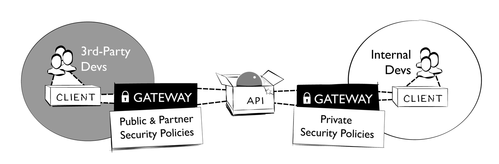

The real problem is that programmers have spent far too much time worrying about efficiency in the wrong places and at the wrong times; premature optimization is the root of all evil (or at least most of it) in programming.

Donald Knuth

In Chapter 8 we looked at API landscapes in depth, focusing on the foundations and key aspects. We will now move on to discuss what it means for API landscapes to become more mature. As we have done so far, we will consider this a journey rather than a destination: an API landscape is never “fully mature,” as it will always continue to evolve, following the evolution of technologies and the maturity journeys of individual API products (as discussed in Chapter 6).

Evoking an analogy that we have used previously, this view of API landscapes is similar to the ongoing evolution of the web. The web is never “fully mature” either: new technology developments, new scenarios, and new usage patterns continuously feed its evolution. While this may seem daunting, it is exactly this continuous evolution that is the reason for the web’s success over time. Without it, the web would have become irrelevant at some point, and a different approach would have taken over.

In the same way as the web is continuously evolving, API landscapes must continuously evolve as well. Continuous architecting lays the groundwork for this, making sure that architecture itself can evolve in response to changing needs and evolving principles, protocols, and patterns.

But even the best continuous architecting has to deal with limited resources that can be dedicated to changing architecture. Furthermore, API teams can only deal with a maximum rate of change: in the end, as long as the current landscape works well enough as a platform for API products, it may be more economical to reuse the established principles, protocols, and patterns, rather than trying to have the perfect platform for each individual problem.

For this reason, understanding maturity at the landscape level means knowing what to observe in the landscape, and where and how to invest to improve the landscape. For this, we will again use the “eight Vs” that we introduced in “The Eight Vs of API Landscapes”. This time, however, we will use these areas to consider the risks of not improving practices in them, and will point out ways to make improvements. To this end, a number of checkpoints are defined that can help you better understand the maturity level in different areas, and where to direct investments to get to a more consistent maturity level across various areas.

Before we get to discussing these maturity measures and methods, however, we will first discuss some of the organizational aspects that go along with increasing the awareness and the proactive management of the API landscape.

Structuring Guidance in the API Landscape
Creating and managing guidance is an important part of API landscape management. It communicates to everybody why certain things are important, what is done to address these issues, and how implementations can follow guidance. The guidance should be managed as a living document that everybody can read, comment on, and contribute to. This way, everybody in the developer community feels that they are part of establishing and evolving the document.

A common theme for improving the effectiveness of an API landscape is to strictly separate the “what” from the “how” when it comes to requirements for APIs, to always provide a “why” story explaining the rationale, and to provide tools and support for specific ways requirements can be satisfied:

“Why” (guidance motivation)
Describes the rationale behind a requirement or a recommendation, making sure that it is not an opaque rule that has been created with no explanation. Documenting the rationale also makes it easier to determine, when alternative ways are being proposed, whether they are really targeting the same rationale.

“What” (design guidance)
Explains the approach that is taken to address the “why,” so that it becomes clear what APIs need to do to address these concerns. This should be done by defining clear requirements for the API itself (and not by defining requirements for the implementation). The most important aspect of describing the “what” is to make sure that it does not get mixed with “how” to do something, which is explicitly addressed separately.

“How” (implementation guidance)
Provides specific ways “what” to do can be implemented. These might use specific tools or technologies, and there can be various “how” approaches associated with a single “what” that they address. Over time, as teams developing APIs discover or invent new ways to solve problems, new “how” methods may get added to existing “what” approaches, allowing new solution methods to get established over time.

These guidelines or guardrails should help everybody to be an effective team player in the overall API landscape. They are established to help the productivity of API teams, and to enable the changing culture and practice of designing and developing APIs to be tracked and managed.

The following is a concrete example of how this works. It uses the common challenge of deprecating APIs, and specifically how upcoming deprecations can be communicated to API consumers. The example we are showing has one “why,” two “whats,” and three “hows”:

“Why” (guidance motivation)
Service users can benefit from learning about the upcoming decommissioning of an API. APIs should therefore have a mechanism to announce that they are going out of service.

“What” (design guidance #1)
APIs can use the HTTP Sunset header field to announce their upcoming decommissioning. They should specify which resources will use the header field (a popular choice is the home resource), and when it will appear (a popular choice is that it will appear as soon as there is a planned time for decommissioning). APIs might also specify that the header field will appear at least a certain amount of time before an upcoming decommissioning (giving API users a guaranteed grace period to manage mitigation or migration).

“How” (implementation guidance #1 for design guidance #1)
One implementation method is to control the HTTP Sunset header field through configuration. As long as there is no configuration present, the header field will not appear in responses. When the upcoming decommissioning is known, the configuration is added, and the header field appears for those resources where the API defines it to be used (a popular choice is the home resource).

“How” (implementation guidance #2 for design guidance #1)
One implementation method is to add the HTTP Sunset header field through an API gateway. Instead of the API implementation itself adding the header field, it is added by the API gateway, as soon as such a policy is configured and enabled. After the policy is configured in the API gateway, the header field appears for those resources where the API defines it to be used (a popular choice is the home resource).

“What” (design guidance #2)
APIs that have registered users may use a channel outside of the API to communicate with them, and to announce the upcoming decommissioning. This guidance only applies when such a list exists and when the associated communications channel is deemed to be sufficiently reliable.

“How” (implementation guidance #1 for design guidance #2)
One implementation method is to use email messages to communicate with all registered users of an API. The email ideally references an available resource (the API change log or part of the API documentation) that contains information about the upcoming decommissioning. That resource should have a stable URI, so that it can be referenced throughout conversations with users.

Many organizations where APIs play a role in their strategy have some form of API guidance. Some are even published openly, which allows you to freely browse them; for example, you can see what organizations like Google, Microsoft, Cisco, Red Hat, PayPal, Adidas, or the White House are using as their API guidance.

THE API STYLEBOOK
The well-known “API Handyman” Arnaud Lauret has compiled a number of published guidelines in his API Stylebook, sourced from (typically large) organizations as different as Microsoft and the White House. It is an interesting resource to explore in terms of what large organizations have created as their API guidelines.

For these openly available API guidelines, without even looking at the content, the publication channel chosen already tells an interesting story of document creation and management (and the general philosophy behind the guidelines and their management):

PDF documents have the clear “smell” of a read-only document. The PDF is published from some invisible source; it’s simply a way of compiling, formatting, and distributing some existing content. There is little feeling of “being involved in the management and evolution of the guidance” in this case.

HTML often is a bit better because in most cases the published HTML is the source, so readers actually look at the source of the document itself, and not at a formatted and detached product as in the case of a PDF. But still, the management and change of the HTML source is not necessarily obvious, so there still is the feeling of detachment from the creation and editing stages.

Many version control systems have some form of publishing feature, and thus can be used to host and publish guidance content. For example, GitHub has simple built-in ways of formatting and publishing content (as Markdown files, in the simplest case), though it’s likely you’ll find that some essential formatting capability is missing.1 On the upside, GitHub has easily usable features for commenting, raising issues, and suggesting changes. In addition, these functions are not something most developers have to learn, because many are already used to GitHub and feel comfortable using it.

There is an additional rule that guidance can follow: there can only be guidance that is testable (i.e., where there is tooling in place that helps developers to determine whether they have successfully dealt with guidance). This not only makes guidance more explicit and following it more objective, but also means that guidance can be tested for in an automated way. While it may not be worth the investment (or even be possible) to test all guidance in a fully automated way, this should be at least seen as an ideal, and therefore we suggest that the more typical “why/what/how” pattern described previously be extended with a fourth element:

“When” describes everything that needs to be done, when it can be said that it has been done. This means that there is a way to test for it being done properly, and there potentially is an automated test in the deployment pipeline that will run this test and make sure that guidance is being followed as intended.

And as with everything in a well-managed API landscape, tests can be improved over time. They may start with simple plausibility tests to give a minimum assurance and positive feedback that guidance has been addressed. If over time it is seen that this feedback is not as helpful as it should be, then the tests might get improved, to provide teams with better feedback and thus make it easier for them to validate their compliance with certain guidance.

The Lifecycle of Guidance in the API Landscape
Since guidance is an evolving set of recommendations, it too goes through a lifecycle: things get proposed and maybe explored for a while, and they might become recommendations for what to do, or how to do it. But like everything in a landscape, they will eventually get replaced with newer and different ways of doing things, so these recommendations will go through a sunset phase and eventually become historical. The lifecycle stages of guidance in the API landscape could therefore be defined as follows:

Experimental
This is the phase where guidance is being explored, meaning that it is used in at least one API product. This is used to better understand whether it makes sense as landscape-level guidance. At this point, the guidance is documented, but there is not investment to make it easier for teams to follow the guidance.

Implementation
When guidance is established at the landscape level, it should be supported (there is at least one “how”), and it might become something teams have to at least consider before opting out. For some guidance, there may be no opting out, and therefore teams have to follow it.

Sunset
Once newer/better ways of doing something are known, guidance may enter the sunset period, where it is still possible to follow it, but where teams ideally should consider following guidance that is in the implementation stage.

Historical
Eventually, guidance may be retired, and it should not be used in new products anymore. Refactoring existing products to migrate to a more modern way of doing things may even be considered. Historical guidance is still useful to keep around for historical reasons, and to document the way in which older products were designed or implemented.

These stages are just one way of managing how guidance may evolve, and you should feel free to define your own. In addition, there might be ways of marking guidance with difference compliance levels, such as marking it as optional or required. Complementing such compliance levels, there also might be a process for granting exceptions, so that, for example, required guidance can be skipped when there is sufficient evidence that following it would create problems.

The important takeaway for the guidance lifecycle is to accept that guidance will be continuously evolving, to have a way to track this evolution, and to have a way of managing in your organization. This is what we discuss in the next section, which introduces a popular way that large organizations tackle the challenge of guidance management.

The Center for Enablement
There are various names that organizations use for teams that have the role of compiling and managing API guidance, and generally helping other teams when it comes to implementing an API strategy. One popular name is Center of Excellence (CoE), but to many this has negative connotations in the sense that anybody outside it seems to lack the excellence of those inside it. For this reason, a name we like better is Center for Enablement (C4E), which also nicely reflects the changing role of today’s IT teams.

While how to manage guidance may seem like a technical detail, in practice it can make a significant difference. The role of the C4E mostly should be that of a collector and editor, with the individual API teams being the main contributors, or at least drivers, of the content that goes into the guidance. It’s also responsible for identifying aspects of the guidance that warrant an investment in terms of supporting infrastructure, so that something that was initially a problem that had to be solved by individual teams can be solved by available tooling.

Another part of the C4E’s role is to ensure that following API guidance does not create any bottlenecks. The ideal picture is that teams know the guidance, have a model of how to follow updates, and have enough internal competence and support from the C4E through tooling that complying with the API guidance does not slow them down. Any bottlenecks should be identified and resolved, so that the “API” part of developing “API products” can be implemented with as little friction as possible.

Of course, this all depends on the constraints of the organization. For example, in some areas, there are regulations or legislation in place that requires organizations to review and sign off on releases. In this case, these processes have to be followed, and cannot be fully automated through tooling. But these cases are typically the exception rather than the rule, so most guidance really should be seen as something that should be followed, and the C4E’s role is to enable the API teams to successfully follow it.

ENGINEERING THE ENGINEERS: CHAOS MONKEY
Another interesting role of the C4E is to determine ways in which nonfunctional requirements can be transferred into the general design and development culture of the organization. An example is that of Netflix’s popular “Chaos Monkey” tool. The story behind it is that as a general developer practice, in an environment like Netflix’s complex and interdependent API landscape, services should be maximally resilient, so that problems with individual services affect as few dependent services as possible.

One problem with “resilient code” as a requirement is that it is hard to test. Netflix’s solution is the ingenious Chaos Monkey, a tool that simulates isolated and controlled failures in the infrastructure and observes the behavior of other services in the light of these outages. This allows engineers to observe the resilience of services in a controlled way. This is an example of an approach that we call “engineering the engineers”: by building tooling that will identify nonresilient code, the landscape managers ensure that engineers are more disciplined when it comes to making their code more resilient. If they fail in this, there is testing in place that will reveal problems before they become critical, meaning that developers have this additional “testing in production” safeguard that makes sure that code behaves in a resilient way.

This approach makes it easier for the C4E to scale the API landscape to more APIs being designed and deployed, and it also makes it easier for individual teams to understand what the requirements are and gives them (at least partially) automated ways to test for them. Some review and discussion might still be required for some of the guidance, but the easier it becomes to focus on those aspects that cannot be tested, the easier it is for the C4E to help those teams that need some assistance with their APIs.

In summary, the role of the C4E is to be the steward of guidance at the landscape level. The goal is twofold: to make it as easy as possible for API teams to create new products, and to make it as easy as possible for API consumers to use APIs across the landscape. Because the C4E has this role of managing the balance between ease of production and ease of consumption, its most important tasks are to constantly gather feedback from producers and consumers, and to figure out a way to continuously evolve the API landscape to best serve both groups.

This constant evolution of the API landscape means that it has to be aware of the landscape aspects introduced in “The Eight Vs of API Landscapes”. It also means the C4E has to decide when to invest in which aspects, by observing for which of the Vs it is acceptable to not provide sophisticated support, and where an investment makes sense. For example, for the volume aspect it might be acceptable that for a little while, not much effort is invested in scaling to hundreds or thousands of APIs, but once more and more teams are building and using APIs, handling the volume in a scalable way becomes critical and requires heavier investment.

The main idea of the C4E is that it helps API product teams to be more effective contributors to the API landscape. We discussed API product teams in Chapter 7. Complementing this discussion, in the next section, we talk about C4E teams, and how managing APIs and the API landscape translates into putting together a team that supports individual API product teams in the best way.

After discussing the C4E team and its context, we move on to look at the team’s responsibilities in more depth. In “Maturity and the Eight Vs” we take a structured look at how the various landscape aspects can be treated as part of an API strategy, and how investment into each of these aspects improves the state of API management in an organization. Investments can come in the form of providing tools, processes, or standards, but in all of these cases, the ultimate measurement of success is how these investments improve the API landscape from the viewpoint of API producers and API consumers.

C4E Team and Context
The role of the C4E is to be the steward of landscape guidance, and to enable teams to follow that guidance more closely. By interacting with API product teams, the C4E gathers feedback on which new patterns may be emerging and can learn about how principles, protocols, and patterns may have to evolve to improve the API landscape.

In order to do this, the C4E needs to evolve alongside with the landscape. Initially, it is likely that it will not even be a physical team with dedicated members, but instead that different API product team members (as discussed in Chapter 7) will take on the roles described here. Over time, however, it is likely that in large organizations with substantial investment in APIs the C4E will develop into an actual team with its own staff. Even then, it is important to always keep in mind that its primary responsibility is to support product teams in their delivery. As Kevin Hickey puts it:

Instead of a centralized [Enterprise Architecture] group making decisions for the development teams, you are now an influencer and aggregator of information. Your role is no longer to make choices, but to help others make the right choice and then radiate that information.

Kevin Hickey

The team roles we identified in “API Roles” in many cases also are relevant for the C4E, or at the very least provide relevant input to the activities happening on the landscape level. But some roles are added at the landscape level that typically do not exist at the team level.

One example is roles related to compliance. In many organizations, there are dedicated roles for making sure that the organization complies with regulations and legislation, tracking changing compliance needs, and ensuring that the organization adjusts accordingly. For the API landscape, this often translates to guidance existing that is mandatory to follow (as discussed earlier in this section). To avoid this becoming a bottleneck, compliance ideally should be something API teams can test for, so that it can become part of the delivery pipeline. In practice, this often may not be entirely possible, and may not even be allowed (somebody may have to sign off after performing a review). Whatever the organization’s exact needs, the important thing is to think about compliance from the API perspective, identify areas where compliance needs to be turned into guidance, and support API teams so that it becomes as easy as possible for them to implement compliant products.

Another role that typically is unique to the landscape level is that of providing infrastructure and tooling. As introduced in “Structuring Guidance in the API Landscape”, typical guidance in an API landscape is structured into “why,” “what,” and “how.” Our recommendation is that every “why” (guidance motivation) should have at least one “what” (design guidance) and one “how” (implementation guidance), as well as possible testing infrastructure and tooling for helping teams to more easily verify their alignment with existing guidance. For each “how/test,” the role at the landscape level is to enable teams to address and verify that guidance as effectively as possible. This may mean providing tooling and/or infrastructure to address and verify that guidance. Creating and maintaining this tooling/infrastructure then becomes an important role at the landscape level. The better assistance and tooling work there is at the landscape level, the more teams can focus on addressing their business and product needs, instead of having to focus on fitting into the landscape. Any friction experienced by product teams should be treated as an important signal that something needs to be addressed with better assistance and tooling.

In the end, the C4E team plays a critical role as supporters and enablers for API product teams. They make those teams aware of the decisions that are necessary by providing guidance about relevant decision-making points and help them by providing infrastructure and tools that enable common API tasks to be solved effectively, so that most of the API product teams’ energy can be spent focusing on solving business problems. In other words, the C4E team is responsible for ensuring each API product team can move its API through its maturity journey effectively, making the right decisions along the way, and that this effectiveness can be scaled up to many APIs.

Maturity and the Eight Vs
The eight Vs of API landscapes introduced in Chapter 8 aren’t yet important areas of consideration when it comes to planning API landscapes and their evolution. They can also serve as guidelines when it comes to determining the maturity level in these areas, reflecting on the motivations and advantages of improving maturity, and deciding on possible investments in these areas.

In the spirit of continuous architecting it is important to understand that investment in these areas should be evolutionary, and should be driven by the concrete needs of an API landscape. If architected well, these investments can be done as needed and incrementally, and will not require a rearchitecting of the API landscape. When done as proposed by continuous architecting principles, this means that the maturity of an evolving API landscape itself is ever-evolving, driving improvements as needed, and the landscape is continuously improved based on feedback from developers and users.

Like evolution, this continuous improvement is not a process leading to some finite or even predictable goal. A landscape’s value is determined by how well it supports the products being developed in it, and how well those products serve consumer needs. Both development practices and consumer needs change over time, making it inescapable that continuous improvement is a permanent process (and will never meet some ideal end stage).

The main goal of landscape architecture is to make this permanent process as simple as possible, by allowing the landscape to adapt to the changing needs of producers and consumers. Landscape maturity can be measured by how much support the landscape can provide. For the eight Vs that we have identified, it is possible to individually look at how maturity can be framed for them, and what a strategy to manage maturity for each of them can look like.

Maturity in this context therefore does not mean a steady end state. It means that the landscape aspect is managed in such a way that it provides the support for API producers and consumers that helps them best, given their current requirements. It also means that support is adjusted continuously, based on changing requirements.

This idea of a “maturing landscape” is a little different from the maturity cycle of API products discussed in Chapter 6. Products come and go, and do so in a journey through their own lifecycle, which has a start and an end. The landscape is there to support products, and should do so by continuously evolving. There is no single linear path, and no end state. Therefore, there are no stages, and we have addressed this by investigating how the eight Vs we identified can serve as guiding principles for continuously improving the landscape, developing your landscape strategy, and deciding what investments to make at the landscape level at different times.

Variety
As described in “Variety”, the variety of a landscape depends on how many constraints are put in place when teams want to design and implement APIs, and how much freedom teams have when it comes to designing API products that they consider good solutions.

Variety is a tricky thing to deal with because variety in ecosystems always is a balancing act between promoting a level of coherence and reuse, while at the same time not overly constraining teams and forcing them to use solutions that are a bad fit for their problem. For this reason, variety has two “bad extremes” in its spectrum:

No variety implies that a chosen pattern becomes the proverbial “Maslow’s hammer” for everything, being the only way a problem can be solved2 (which often ends up being a bad fit for at least some of the problems).

Too much variety results in “precious snowflakes” where diversity means that teams invest effort in solving problems for which adequate solutions already exist, and as a result users have a hard time combining APIs productively because there is no coherent “look and feel” for their design.

This balancing act is not easy, and there is no “one true solution” for how to pick a spot on the spectrum between Maslow’s hammer and precious snowflakes. It is therefore not appropriate to define maturity for variety in terms of how much variety an API landscape exhibits. In many cases, it may actually be the case that the variety is accidental, resulting from either inflexibility in allowing diversity (resulting in very low variety) or inability to promote and manage coherence (resulting in very high variety).

VARIETY MATURITY
Maturity for variety means that variety is consciously managed in an API landscape. The currently used choices and the reasoning behind them are clearly documented.

Those choices should evolve as needed: adding to variety is a process that is managed and driven by a balance between promoting reuse and allowing new solutions if existing ones are inadequate.

Increasing variety can be done without disrupting the landscape. It is possible that some tooling and support in the landscape will need to be adjusted to handle new design patterns, but all tooling and support infrastructure must be designed so that increasing variety can be done incrementally and is part of the underlying architecture.

Variety exists for many different concepts in an API landscape, depending on how the landscape is organized. For example, for landscapes that are HTTP-based and use URI-style APIs, one variety factor may be the choice of serializations. While most of those API landscapes nowadays will probably use and allow APIs to support XML and JSON (or JSON-based HAL as a higher-level format), those are simply the most popular choices of today and the recent past.

It may very well happen that new serializations appear or are considered by API designers—for example, the Resource Description Framework (RDF). The question should be whether the new format is considered to be a potentially valuable addition to the landscape. It should be possible to start with a few APIs and see how they do with the new option. These APIs may not be able to benefit from existing tooling and support, as long as the new format’s use is experimental (there is no investment at the landscape level at this stage).

Once a new variation is considered productive, it may trigger updates in available tooling and support. Mature landscapes can handle these updates as incremental changes that are added as needed, meaning that adding variety is purely a function of assessing the utility of the added variation, and the incremental cost of tooling and support updates.

The most important consequence of this view is that all tooling and support should be capable of these kinds of updates. Any tooling and support not capable of handling increased variety creates limitations that are not driven by the value that variety can bring to the API landscape. Instead, tooling and support then prevents value from being added, and therefore is problematic from the API landscape perspective.

One important consequence of a variety strategy is looking at the API capabilities of tooling and support. As discussed in “API the APIs”, when everything is done through APIs, including interactions of tooling and support, then it becomes easier to extend variety. As long as new variations support the same APIs, they still can interact with existing tooling and support infrastructure.

VARIETY MATURITY STRATEGY
When investing in tooling and support, always consider how these investments translate when variety increases. Try to avoid tooling and support that has no clear evolution strategy. After all, tooling and support should be able to adapt to your choice of the most productive level of landscape variety, instead of dictating it.

Vocabulary
As discussed in “Vocabulary”, many APIs use vocabularies that determine certain aspects of the API’s model. Vocabularies can come into play in many different ways, and in many cases an API may use a certain vocabulary when it is initially released, but also foresee that this vocabulary may change over time. In that case, the vocabulary becomes part of the API’s extension model, and the question then is how this extensibility is designed and managed.

The fact that vocabularies used in an API landscape do evolve is a result of the fact that domain models of APIs, or their domain coverage, tend to evolve over time. Vocabulary evolution in the API simply is a reflection of that reality. Vocabularies often evolve by refining the understanding of the problem domain: for example, adding social media handles to a customer model that previously only had basic personal information. The question then is how to deal with data (existing customer records without social media handles) and code (applications without built-in handle support) that came to existence before the customer model evolved. Managing this vocabulary evolution in a disciplined way is what defines the maturity of how vocabularies are handled in an API landscape.

VOCABULARY CONCEPTS
“Vocabulary” discusses which vocabularies may be used for APIs, such as domain-agnostic concepts (for example, language codes), domain-specific concepts (part of the domain reflected in the API), and the domain of concepts for API design itself (such as typically used HTTP status codes).

VOCABULARY MATURITY
The basic starting point from an individual API point of view is for each API to identify potential vocabularies where the API may evolve. This goes hand in hand with identifying extensibility points of the API: if an API team expects a vocabulary to evolve, then it must identify this in the API itself and provide a processing model for API users.

Once vocabulary evolution becomes a natural part of APIs, it becomes important to manage it responsibly. On the one hand, that means responsible versioning on the API side, and documenting versions across time. On the other hand, it means helping clients to use APIs in a way that handles evolution correctly. What this means depends largely on how individual APIs decide to implement vocabulary evolution.

It can be left to individual APIs to manage the evolution of their vocabularies. However, an alternative model is that the API landscape supports this approach, and allows the vocabularies to evolve independently of the APIs. One typical pattern to do that is through the use of registries, and supporting and managing registries is something that can become part of an API landscape itself.

This last maturity aspect warrants some additional explanation. There are two different ways vocabulary evolution can be “delegated” (i.e., managed outside of the API itself). One is by reference to an external authority that is in charge of managing the vocabulary, and the other is by managing the vocabulary in the API landscape, but in a way that separates APIs from the evolving vocabularies:

External authority
One typical example for this is the use of language tags (i.e., identifiers for human languages, such as “English” or even possibly “American English”). In most cases, APIs probably should not include a static list of these, as they evolve over time. Instead, it makes sense to refer to one of the lists managed by the International Organization for Standardization (ISO) in their ISO 639 standard. Using this pattern, an API can define that a language tag’s value space is whatever the ISO decides are possible language tags at any point in time. The ISO then guarantees that these language tags evolve in non-breaking ways by never removing or redefining existing tags.

API landscape support
Not all concepts have external entities and managers (such as the ISO for the list of language tags), but it is possible to use the same pattern for other vocabularies as well. API landscapes can support registries, allowing APIs to decouple the API definition from the evolving value space of vocabularies. Operating such a registry is not an extremely complex task, but still should not be the responsibility of individual API teams.3 Instead, there should be landscape-level registry support in the same way as, for example, the Internet Engineering Task Force (IETF) manages its registries for its specifications in the over 2,000 registries managed by the Internet Assigned Numbers Authority (IANA).4

The role of architecture for managing vocabularies is the same as for other aspects of nurturing a productive and supportive environment for APIs: monitor the needs and practices of existing APIs, and step in with good practices and support when vocabulary evolution (or the lack of a responsible model for managing it) seems to become a repeating patterns across APIs.

The initial good practice should be to at least identify potentially evolvable vocabularies in APIs and document them, which can be part of a general extensibility good practice. If there are repeating occurrences of APIs evolving simply as an unintended consequence of vocabulary evolution, then this may indicate that API landscape support for vocabulary evolution could help to decrease the need for API updates.

Maturity for the vocabulary aspect might be harder to achieve, because it is not trivial to come up with ideas of how vocabulary use in APIs can be made observable. This may be one of the cases where some up-front investment may help to improve observability. For example, by creating tooling to document vocabularies, it may become easier to observe their use and evolution across APIs. But that’s assuming that API teams find such documentation support useful enough to use it, which in turn might require better observing how teams typically document their APIs. As can be seen, the maturity journey often is not just a question of landscape-level support and tooling: it may start with understanding what should be observed, and then devising methods for observation.

VOCABULARY MATURITY STRATEGY
Promote good practices that decouple API design from the evolution of vocabularies, if possible. Start by promoting the reuse of externally defined and managed vocabularies, such as those defined and managed by standards-defining organizations. Monitor how many API changes may be (mostly) driven by the need to update vocabularies, and consider providing support for managing vocabularies in the API landscape independent of specific APIs by setting up the infrastructure for it.

Volume
“Volume” suggests that having more APIs can be better than having fewer APIs. This of course is not necessarily the case, but it hints at the fact that decisions on whether APIs should be allowed into the landscape or not should not be driven by considerations that the API landscape simply cannot handle the volume. More volume isn’t necessarily better, but it certainly shouldn’t be automatically considered to be worse.

Instead, the overall goal should be that APIs are always allowed to be created, changed, and withdrawn, and that decisions on how that translates into overall value of the API landscape are driven by the level of complexity and dynamics that one thinks creates the most value. The role of the API landscape is to be able to scale to whatever level that is, and the ability to handle the volume should ideally never factor into strategic decisions about landscape size and rate of change.

Managing volume in an API landscape mostly revolves around considerations for economies of scale. Things that may make sense to not support or automate at a smaller scale may be reasonable targets once the landscape starts growing. This is a simple pattern around return on investment (ROI): investing in support or automation makes sense past a certain threshold, when the expenditure to solve problems individually (and over and over again) is higher than the expenditure for support or automation.

Briefly returning to our web analogy, this is the very reason that we see scripting frameworks being created, and changing in nature over time. They get created for certain popular patterns, and increase and decrease in popularity and adoption based on the popularity of these patterns. For example, frameworks such as Ruby on Rails (server-side) and jQuery (client-side) had their time when more traditional web applications were being used. With the advent of the single-page application (SPA) pattern, now we see client-side frameworks like React and Angular being more popular, accompanied by related protocol approaches such as GraphQL. The popularity and availability of these frameworks is driven by the popularity of the underlying patterns, and the resulting effort going into the creation and maintenance of the frameworks.

This analogy from the web highlights that once volume drives certain ways of support or automation, a bit of standardization happens in the landscape, since more APIs will start to use these supported mechanisms. This will make them more similar, thus helping landscape users to more easily understand and consume APIs because they approach certain problems in a certain way.

However, as mentioned in “The Center for Enablement”, one important thing to keep in mind is that support or automation (the “how”) should never be the one and only allowed way to do something. It is something that a C4E should identify and provide as part of the general API platform support, but it should always be something that can be replaced with a better way of solving the same problem once a better solution has been found.

Again, the web can help with an illustration. It might happen that for a while, building web apps will focus on using the general SPA approach (as mentioned earlier). This “what,” however, would be a separate guidance to the possible guidance on “how” to implement the SPA pattern (which might be with React or Angular, or quite possibly other frameworks replacing those because they seem to provide better support for building SPAs). The better guidance is at separating the “what” from the “how,” the more it supports evolution, both at the level of the patterns and the level of the implementation of those patterns.

This once again incorporates the concept of continuous architecting, meaning that handling volume by strategically investing in support or automation should always be treated as an evolutionary change of the API landscape. It is done because it provides good ROI for that particular problem at that particular point in time, but this may change as volume increases even more, or better solutions become available.

VOLUME MATURITY
Monitor how API teams are solving the problems associated with designing, building, and operating their products, and consider investing in support or automation when necessary (i.e., when it becomes useful from the ROI point of view).

For all potential support or automation, consider the value created both for teams producing the API and for consumers of the API. The overall value created by support or automation is the sum of these two values.5

The most important activity from the API landscape point of view is to identify repeated design or implementation activities that teams are doing, and to explore possibilities to improve productivity by investing in support or automation.

As pointed out earlier, the most important aspect of volume maturity is to not let volume get in the way of making decisions about whether and how an API landscape should be allowed to grow. The best way to do this is to monitor the ongoing evolution of the API landscape, track what teams are implementing and how they are implementing it, and invest when it seems that support or automation could step in to help teams be more productive.

This approach implies that the API landscape is actively monitored and thus allows these decisions to be data-driven. One good pattern to enable this in a scalable way is to follow the “API the APIs” principle described in the previous chapter, by making sure that APIs themselves expose information about themselves. That way, it becomes possible to build support and automation into the monitoring of APIs, as a way to decide when to invest in support and automation for the design and development of APIs.

One good way to evaluate maturity for the volume aspect is to reflect on what information about the API landscape is readily available to those assessing the landscape. Keep in mind that this information can be collected in any way, as long as it is available. It can be made available through the APIs themselves (“API the APIs”), through instrumentation of runtime infrastructure (for example, capturing data from API gateways), or through instrumentation of design-time/development infrastructure (for example, collecting data from shared development/deployment platforms of API products). As long as this information is available, it becomes easier to understand the trajectory of the landscape, and manage that trajectory.

VOLUME MATURITY STRATEGY
Handling volume requires a foundation that can be used to observe APIs in a scalable way and thus understand the evolution of the API landscape. Observability should include API information that can be used to make investment decisions based on trends in the API landscape. Managing volume itself can be scaled up to handle larger volumes when the information required to understand the API landscape is part of the APIs themselves. This API the APIs approach will evolve over time, changing the set of observable information that is used to understand the ongoing evolution of the API landscape.

Velocity
As discussed in “Velocity”, velocity refers to the fact that API landscapes are likely to change continuously, and at a relatively fast pace. One the one hand, this is the result of API orientation causing more and more APIs to be created and used, but on the other hand it also results from APIs being treated as products, and as a result being observed and changed in response to user feedback and requirements (as described in Chapter 3). Also, this change in most cases happens in uncoordinated ways, since one of the goals of API landscapes is to allow individual services to evolve individually, instead of having complex coordinated release processes that allow services to evolve only in highly interdependent ways.

Handling velocity in a mature way means that API releases and updates can be done as necessary, and that the API landscape is capable of supporting a high rate of change. Maturity along this axis should be able to evolve itself, in the same way as along all the other axes. While initially an API landscape may be small enough so that even relatively high rates of changes still mean a reasonable number of API changes per day, this will change over time. Particularly, the combination of increasing volume (as discussed in “Volume”) and velocity of API changes means that handling velocity does become increasingly important as an API landscape grows and matures.

VELOCITY MATURITY
APIs should always be designed for changeability. Depending on the API style, that can mean different things, but asking teams about their extensibility roadmap is a good minimal first step to make it part of the API design culture to see API evolution as a natural part of the API lifecycle.

Evolving APIs mean a change in practice for API consumers as well: API consumption needs to be resilient enough to handle API evolution responsibly, so that the evolution of the API and of its consumers are decoupled.

Increasing the velocity of API changes can be helped by adopting microservices, or at least DevOps, as a way of implementing services. Using these approaches, changes can be driven by feedback and requirements, and are not slowed down by highly interdependent and coordinated implementation and deployment processes.

These considerations also make it clear that velocity has an impact on producers as well as consumers. This means that with growing size and popularity of an API landscape (and hence an increasing number of consumers), handling velocity in a mature way becomes more important. Having to coordinate service updates between the service and all consumers becomes increasingly expensive, and quickly reaches the point where the coordination cost becomes prohibitive.

As pointed out in “Versioning”, there can be different strategies for how to deal with changing APIs. They might change transparently, so users are simply seeing changes as they happen and possibly are made visible through the API’s semantic versioning number (see “Semantic versioning”). Another possibility is that APIs promise stable versions, and velocity then translates to an ongoing stream of new versions being released and made available in parallel. This latter pattern implies that it should be easy for consumers to learn about new versions and find information about them, as discussed in more depth in “Visibility”.

While it is important to enable velocity, it is equally important to manage it. With increased velocity, consumers need to be able to keep up. This can be done in various ways, such as promising stable APIs that will remain operational for a certain period of time,6 or continuously evolving APIs and thereby removing the need for keeping older versions operational.7 Whatever pattern the landscape supports, this is an area where individual APIs can benefit a lot from landscape-level support, so establishing practices and supporting them becomes a worthwhile investment relatively quickly.

VELOCITY MATURITY STRATEGY
Enabling agility (i.e., the ability to change things quickly based on feedback and requirements) is one of the main driving factors of API landscapes. On the one hand, designing for change means designing APIs and services so that they can be changed quickly and easily by producers. On the other hand, consuming changing services means that the landscape should provide a consumption model that allows consumers to handle changing services. Anything that makes changing things hard should be carefully identified and examined. This can be an incremental process where the one factor that reduces velocity is identified and improved, and then this process is repeated as needed.

Vulnerability
As discussed in “Vulnerability”, increasing vulnerability is a logical conclusion of a journey toward a bigger API landscape. Having no APIs means having no potential vulnerabilities through APIs, and any API that gets added from there on is a potential vulnerability. Being aware of this simple and inescapable fact is a good first step toward maturity regarding the vulnerability landscape aspect.

Depending on their audience, APIs may just be exposed to internal consumers (private APIs), or they might be exposed to external consumers as well (partner and public APIs). As shown in Figure 9-1, in many cases these two or even three scenarios are secured differently, often even with separate components put in place.

Figure 9-1. Securing APIs with API gateways

From the security point of view, it is understandable that this is implemented in a relatively centralized way, making it possible to observe and manage (and possibly interrupt) traffic to better understand usage and potential problems. On the other hand, this security-driven centralization conflicts with the general decentralization effort, raising the question of how much control individual API products have (and should have) over the control and configuration of the centralized security enforcement point. Balancing speed and safety is a challenge here, but once again it should mostly be driven by organizational and security needs and not by technical constraints of the architecture.

Following the general pattern of how we look at the maturity journey, the same applies to vulnerability: it is important to observe the development of APIs in the API landscape, and to distill common themes and areas where landscape support and tooling can help. The only exception to this general rule is that vulnerability is a higher-risk aspect, which means that landscape observation and taking action in a more prescriptive way may be appropriate.

One example of this is the recent developments around personally identifiable information (PII) being exposed through APIs. The growing popularity of APIs means that there is a higher risk of PII being exposed through APIs. Exposing PII is risky for an organization because of potential legal, regulatory, or reputational problems. These potentials may not always be immediately visible to the teams creating API products. In addition, while information being exposed by one API may look sufficiently anonymized to not be considered PII, the increasing availability of complementary information through other APIs means that de-anonymization is becoming a risk that again often is better seen at the landscape level than on the level of individual APIs.

Another issue is unintended consequences of exposing certain data through APIs. Recently, the European Union (EU) has enacted the general data protection regulation (GDPR). This regulation pertains to processing PII, and requires all organizations in the EU to provide information about the PII in their possession and to make it available on request. This means that creating API products that accept PII has far-reaching consequences for an organization, and depending on the size and maturity of the organization, implementing the required processes for GDPR compliance can be complex.

What these examples show is that even though velocity is beneficial in API landscapes and one of the reasons why organizations switch to API strategies in the first place, it still is necessary to manage the risk—and depending on the business sector of the organization and the APIs being developed (and their intended set of consumers), in many cases vulnerability considerations and vulnerability management are necessary for responsible risk management.

VULNERABILITY MATURITY
APIs by definition expose business capabilities that previously were not (or not as easily) available to consumers. Assessing the risk of every single new API is necessary to avoid scenarios with information leaks or other problems that create major organizational risks.

API products should document all the information they store, and the reason for storing it. Information is potentially valuable, but it also can increase risk; managing information should always be treated as something potentially introducing legal, regulatory, or reputational risk.

Securing APIs is essential to a responsible API strategy, and should be treated as a critical component of the organization’s overall information security strategy.

When compared to other landscape aspects, vulnerability stands out in the sense that it introduces greater risk than the others, because of the inherent problems of APIs providing access to business capabilities and the potential problems arising from that general perspective.

Apart from the issues of security against malicious attackers or potential legal, regulatory, or reputational risk, there also is the issue of service stability and testing. As the quote goes, with great power comes great responsibility—meaning that when API products have more autonomy in terms of how they are designed, developed, and deployed, this also has the potential of adding new failure scenarios. In his famous “Google Platforms Rant” Steve Yegge says, “Every single one of your peer teams suddenly becomes a potential DOS attacker. Nobody can make any real forward progress until very serious quotas and throttling are put in place in every single service.” This quote highlights that robustness and resilience also play a part in the stability of an API landscape, and that it does become vulnerable to failure models that are introduced by decentralization and could be handled more easily in integrated scenarios.

One of the biggest challenges for the landscape aspect of vulnerability is to adjust to the changed reality of more accessible business capabilities. Since API landscapes have the explicit goal of making these available, this is simply a reality that has to be managed. By assessing and managing the vulnerability of every single API, and making it easy for API products to fit into this architecture, vulnerability management can fit into the new decentralized view of an API-focused IT landscape.

VULNERABILITY MATURITY STRATEGY
The transition to API landscapes requires a different way of managing vulnerability. The traditional model of inside versus outside has to be replaced by a model that treats all services as individual and potentially externalized components, and allows us to apply the same security models to all of them. The landscape must make it easy for services to protect themselves from malicious or problematic behavior. There may be “private/partner/public” services, but switching categories ideally should mean nothing more than applying different security policies.

Visibility
One of the important aspects of visibility, as discussed in “Visibility”, is the observability of APIs. It follows the principle described in “API the APIs” which states that “everything to be said about an API should be said through the API.” Following this principle, everything necessary becomes visible through the API, making it accessible to other services in the API landscape so that over time, and when needed, additional services can be built on top of this information.

As with everything in API landscapes, this is an evolutionary and incremental process. Initially there may be not much information about an API that needs to be exposed through the API. Over time, however, this view might change as increasing volume and velocity dictate that certain aspects of the API landscape need better support and automation. If this support and automation can be built on top of APIs, it becomes part of the API landscape itself, meaning that it does not need specific and exclusive ways to interact with services.

After all, one of the fundamental properties of APIs is to provide encapsulation, meaning that an API should encapsulate everything about its implementation, making the API the only resource to interact with. Taking a purist approach, any path around this, even for “internal” purposes, thus could be considered a violation of the API landscape approach.

If APIs are an organization’s chosen approach to make all dependencies explicit, well defined, and therefore visible and manageable, then any practice creating invisible dependencies undermines this approach. This is the reason why Jeff Bezos’s famous “API mandate” (discussed in “The Bezos Mandate”) has the final message that no practice circumventing the API transition will be tolerated: “Anyone who doesn’t do this will be fired.”

One common way dependencies are created without API landscape visibility is through the use of (potentially shared) libraries.8 While many developers might think that using libraries is different from creating “API-level dependencies,” it really is not, in particular when it comes to using libraries that either are shared across API products or that imply runtime dependencies on other components. This means that treating libraries in the same way as other APIs can go a long way toward avoiding scenarios where dependency management problems creep back into the landscape, and not even at the visible and managed level of APIs.

VISIBILITY MATURITY
One important aspect of visibility is to expose everything about an API that is needed to use or manage it in the API landscape. That set of information will probably evolve over time, so being able to change the API easily in response to the changing information needs of users and managers is important.

Another important aspect of visibility is to expose every dependency through APIs, so that APIs become an accurate reflection of dependencies, and there are no hidden dependencies that use side channels instead of APIs.

Once the API landscape grows, API-level visibility needs to be complemented with landscape-level visibility; i.e., with the ability to find APIs based on their visible information.

Finally, visibility also applies to how easily API information can be used. For example, when APIs standardize on certain capabilities such as how to represent error messages or status information, this information can be more easily used and aggregated at the landscape level, which will increase the visibility of these API aspects.

API-level visibility nicely feeds into landscape-level visibility: whatever is made visible at the API level can be used at the landscape level to improve the discoverability of APIs, making them easier to find (and thus more visible) at the landscape level.

For example, if APIs expose their dependencies clearly and visibly at the API level (taking into account the principle we discussed about all dependencies being treated as API dependencies),9 then this information can be used to create a dependency graph and even create higher-level information, such as computing API popularity.10

In a feedback loop, visibility needs at the landscape level might feed into visibility requirements at the API level, and observing the needs of API users and the practices of API providers will allow the landscape to adapt to new visibility needs.

As visibility matures, and gets to the point where APIs are increasingly maturing themselves to be increasingly better landscape citizens (by adapting to visibility requirements that were triggered by visibility issues at the landscape level), it may become a pattern to separate the “landscape-assisting” parts of an API from its functional aspects. This practice may have to be accompanied by robust vulnerability practices, if the “landscape-assisting” part should be restricted to be available to landscape tooling only.

VISIBILITY MATURITY STRATEGY
In order for APIs to provide value they must be useful and findable. In order to be useful to the landscape, they may have to improve the visibility of some of their information. Any problem in the API landscape should trigger the question, “What information would help with solving that problem?” And if there are implications for visibility at the API or landscape level, this should trigger updated guidance (adding visibility to APIs) or updated landscape tooling (adding visibility to the landscape).

Versioning
Velocity—the ability for API products to change quickly in response to feedback or evolving requirements—is an important motivation for moving to an API landscape. Versioning is an inescapable part of that, because every time an API product changes, it becomes a new version. As discussed in “Semantic versioning”, this might not necessarily mean that a consumer has to do something about it (minor-level version number increases indicate backward-compatible changes), or even has to know about it (patch-level version number increases indicate that there are no changes to the interface). But managing this versioning process to minimize negative impact on the landscape is essential to make sure that velocity is not compromised more than necessary.

Versioning applies to APIs of all styles. In RPC and URI/hypermedia designs, it is concerned with changing the interface of the resource that is used for interactions (either procedures for RPC APIs, or interactions with resources for URI/hypermedia APIs). In query-style APIs, versioning is not part of the interface itself (which is the generic query language), but the discipline of managing the schema of the data to be queried in such a way that existing queries keep working. In event-based APIs, versioning applies to the message design, making sure that receivers of new messages have the robustness to treat new messages like old ones instead of rejecting them because of changes to the message schema.

Managing versioning for APIs can follow different paths, and these are in part motivated by different goals for the APIs: promising customers stable APIs that will never change (like Salesforce does) has value for customers and thus may be a good investment, but on the other hand this strategy incurs operational costs in running many different versions in parallel. Another strategy is to follow the path of Google and make no promises of complete API stability, but implement a disciplined API change policy. This strategy carries a greater risk of consumers getting it wrong, but on the other hand reduces operational complexity.

VERSIONING MATURITY
Making sure that every API has a versioning strategy is a first step toward versioning maturity. This might include accepting that APIs make a conscious choice of not supporting versioning, and that any updates will be breaking changes and essentially new products.

Versioning models heavily depend on the API style and usage model of APIs, and the cost/benefit balance of what producers and consumers must invest in these models.

Versioning benefits a lot from being treated consistently, if not across the entire API landscape, at least for certain classes of API and users.

Depending on the versioning model, API landscape support may be able to help API producers and/or consumers to make sure that the landscape’s versioning model is supported and properly used.

Generic models for versioning are still in their infancy, both in standards and in tooling. For example, the popular OpenAPI description standard has no model of “versions” or “differences,” making it hard to use it as a solid foundation for versioning. Instead, the standard encourages code generation from the descriptions, never addressing the question of how to manage this in scenarios where the API evolves and thus has a new description. This in turn raises the question of how to change the consuming code to adapt to the changed API.

It is likely that with increasingly complex and dynamic API landscapes, the importance of versioning will increase, and standards and tools will have to adapt to this development. For now, versioning maturity still requires attention and good management at the landscape level, and individual APIs will be able to benefit substantially from guidance and/or tooling provided at this level.

As with everything at the landscape level, versioning should not be addressed under the assumption that there is one true way of doing it. Having a strategy and supporting it is good, but being open to other models and being able to transition to them is even more important. Versioning might differ substantially across API styles, certain classes of APIs, or certain groups of API consumers, so being able to evolve those strategies and where they apply over time is important.

VERSIONING MATURITY STRATEGY
For versioning to be as nondisruptive as possible in API landscapes, hard versioning should be minimized as much as possible, and soft versioning should be supported as much as possible. Soft versioning approaches come in a variety of flavors, but the most important consideration is that versioning is disruptive enough in itself that a consistent versioning strategy (and possible tooling and support for it at the landscape level) should be in place as early as possible.

Volatility
Programming models are hard to change, especially in the minds of those doing the programming. As we saw in “Volatility”, programming in distributed systems is particularly challenging because many failure modes exist that would not exist in a more integrated environment, where failure models are substantially less complex. Handling the inherent volatility of services in API landscapes requires a change in the mindset of developers.

When initially moving to an API landscape, it is likely that developers will stick to their programming models and write applications that make overly optimistic assumptions about component availability. Particularly in landscapes where there are many dependencies, this can make it hard to even locate the source of problems: when one application exhibits problems, finding the root cause might require a “trace” through various services, a different task from the more traditional approach of being able to instrument and subsequently debug monolithic code.

Ideally, applications will responsibly handle all API dependencies and have resiliency built into them, including approaches such as graceful degradation. In order to better deal with volatility, it also is possible to develop in a style that is more defensive, and that attempts to make the most out of the operational reality of a landscape. Not all dependencies that an application has may be essential, meaning that it is possible to develop an application to have reasonable fallback behavior (and still be operational and provide value) even when some services are not available.

VOLATILITY MATURITY
Locating error conditions is the most fundamental requirement that must be satisfied in an API landscape. The ability to trace traffic and gain insight into the traces often is an essential part of the ability to locate problems.

Changing development practices to better accommodate decentralized failure modes helps with making sure that individual failures do not necessarily turn into cascades along the dependency chain.

The more developers can be helped or nudged toward more resilient development practices, the more robust the API landscape will be.

While volatility is an inescapable fact of decentralization, it should be kept in mind that the move from integrated to decentralized models changes the failure model of the whole system. With individual services now being able to fail, the reliability of the overall system gets impacted by individual service reliability in a more complex way, and the compound effect of these individual failures grows as the API landscape—and the dependency graph between APIs—grows.

Dealing with the potential increase in the overall failure rate means it’s necessary to minimize the propagation of failures. In part, this can be done by making sure that components are resilient against failures, isolating instead of propagating them.

Volatility is one of those aspects that you may think you can put off dealing with for a while, but problems can quickly spiral out of control, in particular when the dynamics of an API landscape start picking up. And of course, the worst possible moment for landscape-wide reliability problems to manifest is when the growth and change rate of the API landscape are increasing. For this reason it is a good idea to start investing in handling volatility early on, and to see it as a necessary first step in the general API-landscape maturity journey.

VOLATILITY MATURITY STRATEGY
Managing volatility in an API landscape requires a change in developer practices to write applications that behave responsibly in a distributed system. It also requires the landscape to provide the tooling that is needed to handle volatility in distributed systems, such as tracing errors. The impact of not handling volatility in a mature way will be felt quickly, in particular when the landscape grows quickly, and/or when services in the landscape start changing quickly, when services in the landscape have different operational stability.

Summary
In this chapter we have explored the API landscape maturity journey, using the landscape aspects (the eight Vs) introduced in Chapter 8, as a way to frame the journey toward a more mature API landscape. For each of the aspects, we looked at individual factors that influence maturity, and we also looked at how investments in maturity improvements will manifest themselves on the landscape level. We have chosen not to show one linear path to “API landscape maturity,” but instead have used the landscape aspects to show this journey as a multifaceted path. The most important thing to keep in mind is that all aspects have an impact on the overall API landscape maturity, and that it is therefore always important to keep all of them in mind when assessing a landscape’s current maturity level and possible paths to improving it.

In the next chapter we will connect the dots, looking at how API landscape maturity interacts with the API product lifecycle as presented in Figure 6-1. After all, the purpose of API landscapes is to provide good conditions for APIs to be developed, used, and improved, and thus we need to understand how the practice of building individual API products is affected by the landscape in which these products get developed and deployed.

1 Markdown content will render directly in the web view of the repository. More ambitious writers/publishers Pages, which is a way to generate a website directly from a repository.

2 The famous quote by American psychologist Abraham Maslow is: “I suppose it is tempting, if the only tool you have is a hammer, to treat everything as if it were a nail.”

3 After all, one of the main motivations of a registry is to decouple the management of a list of well-known values from places where they are used.

4 The IETF’s IANA registry model is a very good one to illustrate how simple and yet effective such an infrastructure can be. It also is a good demonstration of how, by applying this design pattern systematically across its many specifications and API definitions, it was possible to make these specifications more stable, because for many changes only registries need to be updated.

5 One could also consider the creation of “technical debt” as something that should be taken into account. We’ll skip over this here, but taking a proactive approach of always considering how hard it will be to move away from support or automation is an important landscape management aspect as well.

6 In this case, convenience is higher on the consumer side, and the producer has to invest in the operational effort of running various API versions concurrently.

7 In this case, convenience is higher on the producer side, and the consumers have to invest in making sure that the ongoing evolution of the API is handled responsibly by their applications.

8 Ironically, this is the original meaning of the term application programming interface, where an API was conceived as the interface between two colocated running software components (often user code and a library). More recently (and in this book), in most cases people refer to network interfaces when talking about APIs, switching the meaning of the term to something that does not cover the traditional “local API” scenarios any longer.

9 Exposing dependencies can be done in many different ways: it could be done by developers explicitly listing dependency information, or by using tools that do code inspection of the implementation, or by runtime observation at the API level.

10 This dependency graph could be used in the same way as the web’s link graph, as input to computational methods such as the PageRank algorithm mentioned in the previous chapter.